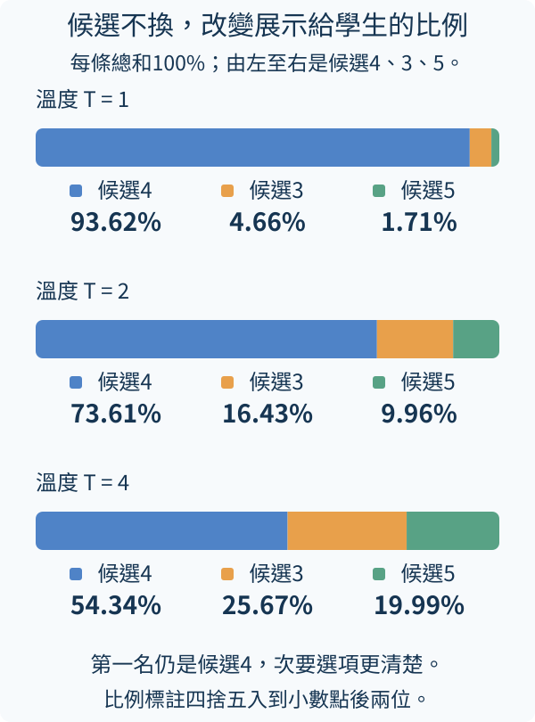
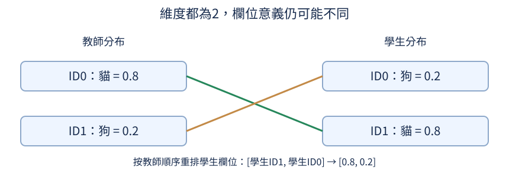
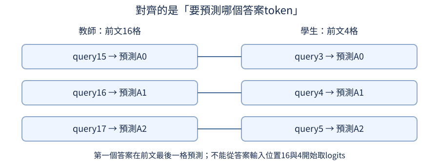

# 第 18 章：蒸餾，讓小模型向教師學習

較小模型的容量有限，我們希望它除了學標準答案，也能從教師取得額外指導；教師是否較有能力，先用同一任務檢查。本章先分清[教師能提供的訊號](18.md#18.1)，再選真正較小的學生，逐步追蹤軟目標、溫度、詞表對齊與KL誤差。後半段檢查教師風格與錯誤、不同架構與模態的對齊，以及蒸餾後再量化的成本。小程式用固定數字或隨機結構核對機制；完整實跑則保留沒有改善的屬性題、數字不正確的風格答案與仍然重複的故事續寫，讓「成功接上教師」和「學生變好」各有證據。

## 18.1 教師能提供什麼學習訊號？

想讓較小模型學會較大模型的做法，教師究竟要交給學生什麼？最容易取得的是完整回答文字；若能取得模型每個位置的候選機率，還能提供「最終沒選的候選有多接近」。這兩種訊號包含的資訊不同，不能只因它們都來自教師就使用同一個誤差公式。蒸餾（distillation）指讓學生透過教師提供的訊號學習，教師本身不一定是真值。

前置是[下一字分數與機率](04.md#4.6)與[對話訓練](07.md#7.11)。logits是候選分數，softmax把它們轉成總和為一的機率分布；普通SFT則用回答文字作目標，讓模型增加每個標準答案token的機率。只能看到教師生成文字的方式常叫黑盒蒸餾；可讀取教師分布的方式常叫白盒蒸餾。這些名字描述能拿到的訊號，不表示教師是不是可靠。

[MiniLLM原文的導論](https://arxiv.org/abs/2306.08543v6)也按可取得的文字或分布區分這兩類訊號。本章的正式對照使用普通CE與固定前文上的forward KL，沒有採用該論文的reverse KL或policy-gradient方法。教師來源則是[直接SFT](../training.md#T.4)、[條件式風格](../training.md#T.5)與[MoE的固定top-2支線](../training.md#T.8)，都載入實際訓練權重。它們的完整檔案SHA、架構與步數保存在[蒸餾實報的`teacher_provenance`](https://github.com/birdhackor/tiny-perceptron-vlm/blob/main/docs/course-experiments/results/distillation.json)。屬性教師留出題只有5/10，風格教師內容只有3/27；「已訓練」沒有保證能教對新題。

對問題「2+2=?」，教師可能回答「4」。假設候選是 `[4,3,5]`，分布 `[0.8,0.15,0.05]`的第一名是4，`[0.4,0.35,0.25]`的第一名也相同。只取得「4」無法分辨這兩種情況：它沒有記錄第二名與第一名的差距，也沒有記錄5的相對位置。

```python
import torch

candidates = ["4", "3", "5"]
probabilities = [torch.tensor([0.8, 0.15, 0.05]), torch.tensor([0.4, 0.35, 0.25])]
for prob in probabilities:
    answer = candidates[prob.argmax().item()]
    print("回答", answer, "分布", prob.tolist())
```

輸入是人工指定的兩個分布，用來隔離資訊差別，不是呼叫真的教師。`argmax`選最大機率索引，再查候選文字，兩行回答都應為4；分布欄卻不同。實際回答是一串token，黑盒資料保存整串文字；白盒通常要保存或即時讀取每個有效回答位置的一整列詞表分布，資料量和計算需求可能更大。

取得文字後，可由學生自己的tokenizer重新切分，所以黑盒方式能搭配不同詞表。逐欄對機率則必須確保兩邊同一欄代表同一個token，這是[詞表對齊](18.md#18.6)會處理的問題。白盒能提供更多候選關係，也可能把教師的錯誤偏好一起交給學生；多一份資訊不等於保證更好。

練習將程式只改成 `print("回答", answer)`，先預測兩行完全相同，再執行核對。接著問自己：還能從留下的文字還原0.15、0.35這些數字嗎？答案不能，因為不同分布映成了同一個最大候選。這會決定後續哪些蒸餾方法有足夠輸入，哪些只能使用文字答案。

## 18.2 怎麼讓學生本身更小？

把模型取名student，再讓它向教師學習，權重檔就會自動縮小嗎？不會。蒸餾改變學習目標，不會直接刪掉模型的參數。要得到較小學生，必須先選較少層、較窄特徵，或不同結構，再看教師訊號能否幫它彌補容量減少。前置是[教師提供的訊號](18.md#18.1)與[層深度](04.md#4.8)；「小」要有實際參數與成本記錄，不是模型名稱。

用相同詞表264項，教師寬度16、兩層，學生寬度8、一層。width是每個位置的特徵數，layers是重複處理特徵與注意力的層數。詞表相同讓兩者的每個輸出候選能對上，內部特徵卻可以不同。較窄學生的查字表、矩陣與中間特徵都會縮小；較少層則減少重複處理的次數。

```python
from tiny_perceptron.model import TinyLM, ModelConfig

configs = [("教師", ModelConfig(width=16, layers=2)), ("學生", ModelConfig(width=8, layers=1))]
for name, config in configs:
    model = TinyLM(config)
    parameters = sum(p.numel() for p in model.parameters())
    print(name, "寬度", config.width, "層數", config.layers, "參數", parameters, "FP32數字bytes", parameters * 4)
```

`ModelConfig`描述架構，`TinyLM`按它建立模型；`parameters()`列出可學權重，`numel`逐一數元素。兩個模型仍然是隨機初始化，沒有教師能力，也沒有訓練學生；這段只確認所選的學生真的較小。FP32是32位元浮點數的儲存格式，每個數占32位元；一byte是8位元，所以每個FP32數占32/8=4bytes，程式用參數數量乘4。輸出應為教師16960個參數、67840bytes，學生6104個、24416bytes。這只量權重數字部分，沒有量檔案容器與執行峰值。

寬度減半、層數減半不代表完整參數減到八分之一。token是文字切分後的編碼單位，每項有自己的編號，切分例子見[6.1](06.md#6.1)。FFN與注意力的某些矩陣兩個邊都隨寬度變，數量大致平方變化；字嵌入與輸出詞表每個token仍要一列特徵，它們只隨寬度線性變化，也不隨層數重複。比較完整模型時應數所有模組，不能只看一層中的最大矩陣。

正式屬性教師寬64、兩層，共141,568個參數，FP32數值566,272 bytes；兩個學生都一層、兩個attention heads，寬16有13,744個參數／54,976 bytes，寬32有33,632個／134,528 bytes。這些縮小先由架構決定。同寬度的普通CE、教師生成硬目標與CE+KL三支，參數個數和初始化完全相同；其輸出投影也相同，沒有讓蒸餾支線偷偷多一個接頭。但寬16與寬32的投影和表示容量本來就不同，不能跨寬度把所有品質差都歸給教師訊號。

學生更小可能損失表達能力。應先用相同學生架構建立未蒸餾基準，再加入教師文字或分布，才能知道好處來自教師訊號，還是原本學生設置。固定同一學生架構時也需記錄訓練資料、已讀token數、初始化與評估方法；已讀token數是訓練累計處理多少個編碼單位，不是候選詞表有幾項。後面[蒸餾是否有幫助](18.md#18.10)會比較這些條件。

練習只把學生width由8改成16、layers仍為1。先預測它比原學生大、比兩層教師小，但不是教師參數恰好一半；再重跑，應得到13744個參數。這時雙方寬度相同、只有層數不同，能看見字嵌入等共享部分為何不隨層數減半。

## 18.3 只能看到教師回答也能學嗎？

如果服務只回傳教師的回答文字，拿不到各候選分數，仍可以用這些文字教學生。做法是把題目與教師回答保存成對話，檢查品質，再照[對話SFT](07.md#7.11)訓練學生，讓學生提高回答中各token的機率。這就是[黑盒蒸餾](18.md#18.1)，不是逼學生重建未取得的完整分布。

以兩筆「2+2=?」為例，候選回答一筆4、一筆5。我們知道標準答案是4，應先排除5，而不是期待學生自己發現教師錯誤。下面故意用人工記錄模擬格式，沒有呼叫任何教師；來源欄也清楚標成示例，避免教材跑完後產生「已收集教師資料」的誤解。實際生成應保存教師權重版本、提示、生成設定與檢查結果，才能追蹤錯誤來源。

```python
import json

records = [{"numbers": [2, 2], "answer": "4"}, {"numbers": [2, 2], "answer": "5"}]
accepted = []
for record in records:
    if record["answer"] == str(sum(record["numbers"])):
        accepted.append(
            {
                "messages": [{"role": "user", "content": "2+2=?"}, {"role": "assistant", "content": record["answer"]}],
                "teacher_revision": None,
                "provenance": "人工示例，非教師生成",
            }
        )
print("保留筆數", len(accepted))
for record in accepted:
    print(json.dumps(record, ensure_ascii=False))
```

輸入兩筆字典，numbers只供這個簡單驗證器核對數學，answer是要交給學生的文字。`sum`算出真值，`str`轉成文字再比較；不合格記錄不進入accepted。輸出應保留一筆，內容包含user問題與assistant的4。`json.dumps`將字典編成JSON，`ensure_ascii=False`讓中文直接顯示；若將每筆JSON各存一行，就稱JSONL。此程式只印出，不建立資料檔也不訓練模型。

學生訓練時應讓assistant回答位置計入誤差，user題目作可見前文，回顧[哪些位置應該學](07.md#7.3)。回答先作為文字取得，再由學生自己的tokenizer切分，所以教師與學生不必使用同一詞表。這與白盒逐欄機率比較不同，不要把有answer字段當成已經有teacher logits。

上方驗證器示範篩選；正式實驗的`teacher_hard`對照則保留全部實際教師回答，量出其錯誤後果。屬性教師對45筆訓練題全答對、全部EOS，因此硬目標的原始ID恰好和真值相同；同一初始化與batch計畫下，CE與教師硬目標學生的權重及成績也相同，這不是額外知識帶來的提升。風格教師185筆中180筆正確，另外五筆已知日期卻把日子加10，例如要求確認`2026-10-06`，回答`已確認2026-10-16。`，這些錯標籤仍保存在`style-hard-targets.json`的審核記錄。

本輪兩組共230個硬目標都有實際EOS、無非法控制ID，也沒有零長度目標。工具逐筆保存完整`teacher_ids`與EOS旗標，再直接用原始ID作標籤；若教師達生成上限卻未EOS，就不補一個假的結束。零個目標則明確失敗並保存題數，不能悄悄丟題。對只有文字的外部服務，結束原因也應另外保存，普通文字解碼可能隱藏控制token，不能由「畫面像一句完整話」推定正常停止。

生成本身會花教師算力，資料還需要驗證與保存，成本不能只算學生訓練。對於無法用加法檢查的任務，需依來源、規格或評分規則檢查，不能用學生模仿程度當真值。GSM8K是收錄小學程度文字算術題與人寫解答的公開資料集；若使用其原有答案，也應保存原資料來源，不能換一個provenance名稱就宣稱由教師生成。

練習只把第二筆answer從5改成4。先預測保留兩筆，再執行核對。這會得到重複題目與回答，說明「通過正確性檢查」和「資料有多樣性」仍是兩個問題；練習不要求你假裝取得新的教師版本或運行長訓練。

## 18.4 第一名以外的選項有什麼價值？

學生目前給候選 `[4,3,100]`的機率 `[0.5,0.4,0.1]`，教師給 `[0.7,0.2,0.1]`。如果只保留教師第一名4，目標就是 `[1,0,0]`，會要求學生把3和100都壓低；保留完整分布則說明教師仍給3一些份量，對100的0.1與學生一致。前置是[文字與分布訊號](18.md#18.1)，以及[機率與log](../first-steps.md#W.4)。

只指定正確候選的目標叫hard target（硬目標），用比例描述各候選的目標叫soft target（軟目標）。這些比例不必表示答案數值距離，也不是「3只差1，所以一定給20%」；它們來自教師的語言模型與當下前文。本例只是用固定數字展示額外訊息，不能推論所有教師都知道數字相近程度。

交叉熵（cross entropy，CE）把目標比例乘上學生機率的負log，再加總。硬目標只有第一項，誤差 `-log(0.5)≈0.6931`；軟目標則為 `0.7×0.6931+0.2×0.9163+0.1×2.3026≈0.8987`。兩種目標不同，這兩個誤差不能直接拿來排名方法。更有用的是觀察它們指引學生怎樣調整。

```python
import torch

q = torch.tensor([0.5, 0.4, 0.1])
targets = [("硬目標", torch.tensor([1.0, 0.0, 0.0])), ("教師分布", torch.tensor([0.7, 0.2, 0.1]))]
for name, target in targets:
    logits = q.log().detach().clone().requires_grad_()
    loss = -(target * logits.log_softmax(0)).sum()
    loss.backward()
    print(name, "CE", round(loss.item(), 4), "分數梯度", logits.grad.round(decimals=4).tolist())
```

輸入q是學生當下比例，取log作為一組可產生相同比例的分數；`log_softmax`穩定地取得各候選log機率。建立logits時，`.detach()`切斷與前面計算的求導關係；本例q原本沒有記錄求導，這一步只是明確保留數值。`.clone()`再將數值複製到獨立資料，`.requires_grad_()`把副本設為接下來可求導的輸入。`backward()`讓我們看到這份分數自己的[梯度](../first-steps.md#W.6)，也就是微調分數如何影響誤差。每次重建logits，避免兩條路的梯度累加。

輸出硬目標CE0.6931，梯度約 `[-0.5,0.4,0.1]`；教師CE0.8987，梯度 `[-0.2,0.2,0]`。沿梯度反方向更新會提高負梯度候選分數、降低正梯度候選。硬目標對3與100都推低；軟目標對100梯度為零，因為學生這項比例已經與教師一致。額外的分布不只讓報告更長，它會改變學習方向和強度。

教師也可能偏錯。若它對3給最高機率，學生會被教著提高錯誤候選，所以真值與行為評估仍需要獨立保留。這個單位置實驗不證明某個學生會提升整段回答品質，也沒有表示學生一定能完全複製教師。

正式軟目標保留的是教師讀同一份標準回答前文時、每個有效位置的264個候選logits；即使greedy已選錯第一名，其他候選比例仍可不同。屬性教師這份快取檔占345,101 bytes，生成硬回答的檔則保留逐筆ID。這是兩種實際保存的資訊；下一節會對同一列教師與學生分數使用溫度，沒有把標準答案換成教師自由續寫的前文。

練習只將教師分布改成 `[0.2,0.7,0.1]`。先預測梯度變 `[0.3,-0.3,0]`，最大推高方向變成候選3，再執行核對。它保留一樣的欄位與機率總和，卻把教師偏好改向錯誤候選，讓你看見「資訊更多」與「資訊正確」需要分開判斷。

## 18.5 如何顯示較低機率的候選？

教師分布如果第一名占94%，其他候選只剩少許份量，學生很難從中看出次要關係。可以讓分布平一些，保留排名但縮小差距嗎？前置是[軟目標](18.md#18.4)與[softmax分數尺度](14.md#14.3)。我們先把教師logits除以正數T，再softmax；這個T叫蒸餾temperature（溫度），T越大通常分布越平。

取候選 `[4,3,5]`的分數 `[4,1,0]`。`exp(x)`就是`e ** x`，e約為2.718，把分數轉為正數份量。softmax把各份量除以同一個總和；兩個機率相除時，共同總和消掉，所以候選4比候選3是`exp(4/T) / exp(1/T) = exp(3/T)`。T=1時，第一和第二分數差3，機率比為 `exp(3)`約20.1；T=2時，差縮為1.5，比例約4.48，所以第二名相對份量增加。T=4時差0.75，比例約2.12。沒有改教師排名，改的是它展示給學生的選項差距；溫度不是答案正確率，也不是讓教師重新推理一次。

```python
import torch

logits = torch.tensor([4.0, 1.0, 0.0])
for temperature in (1.0, 2.0, 4.0):
    probability = (logits / temperature).softmax(0)
    print(
        "T",
        temperature,
        "機率",
        probability.round(decimals=4).tolist(),
        "第一比第二",
        round((probability[0] / probability[1]).item(), 4),
    )
```

輸入三個固定分數，不用已訓練教師。`softmax(0)`沿候選軸轉成機率；temperature在softmax前除，不是將最後機率隨便除T，那會讓總和不再為一。T=1機率約 `[0.9362,0.0466,0.0171]`，T=2約 `[0.7361,0.1643,0.0996]`，T=4約 `[0.5434,0.2567,0.1999]`。最後一個候選從1.71%增到19.99%，因此比較能參與學生的學習誤差。

下圖每條的完整長度都是100%機率，由左到右的顏色固定對應候選4、3、5。溫度提高時，橘色與綠色份量變大，藍色候選4仍是第一名；這表示次要選項更清楚，不表示答案排名改了。百分比四捨五入到小數點後兩位，條寬按原始機率繪製。



分布更平不一定更有用。T非常大時各候選接近平均，原本有意義的差異也被抹掉；教師給錯候選的份量同樣會變得更可見。需要用獨立驗證集選T：留出沒有用來訓練學生的題目，比較不同T訓練出的學生在這批題目上的回答品質，再決定T，而不是只希望所有候選都平均。最後報成績的測試題另留，不拿來反覆選T；資料分工可回看[1.2](01.md#1.2)。對學生也應使用相同T來形成比較分布，否則比較的是兩套不同尺度。

除以T也會改變分數對誤差的敏感度。本教材[分布蒸餾誤差](18.md#18.8)會使用T²乘數作為尺度約定，並明確記在公式與函數中；這不是T讓教師突然多教T²倍知識。使用計算蒸餾誤差的輔助函式時，需知道是否已內建乘數，避免重複相乘；例如18.8的`distillation_kl`負責比較兩邊分布，內部已乘T²，外層就不用再乘。

[Hinton等人的原文第2節](https://arxiv.org/abs/1503.02531v1)先讓教師與學生都用同一高溫softmax，再以T²調整軟目標梯度的相對尺度。本輪正式實驗預設T=2、真值與教師各占一半，報告逐支記錄`temperature_squared_applied_once=true`；沒有跑多個溫度挑最好成績，不能把T=2寫成這些任務的最佳設定。最終留出生成則用greedy，不沿用蒸餾溫度抽樣。

蒸餾T和[生成抽樣設定](01.md#1.15)的溫度應分開記錄。這裡改的是訓練用的教師/學生分布，不是要求最終回答以相同T抽樣；同一個蒸餾學生可以使用不同生成策略。

練習只把logits改成 `[8,2,0]`，temperature列表不變。先預測新T=2與原T=1結果相同，新T=4與原T=2相同，再執行核對。兩者都是相同的「分數除溫度」，這能幫你分辨絕對數值與相對尺度的作用。

## 18.6 教師與學生的 token 對得上嗎？

教師與學生都輸出兩個機率，看形狀相同就能直接比較嗎？若教師詞表是 `[貓,狗]`，學生卻是 `[狗,貓]`，第0欄代表的候選不同。把兩邊第0欄硬對上，會教學生將教師的貓機率配給狗。這不是學生尚未學好，而是我們把答案名稱弄錯。前置是[候選分布](18.md#18.4)與[文字切分成ID](01.md#1.1)。

教師比例 `[0.8,0.2]`，學生比例 `[0.2,0.8]`，看數值似乎差很多；但兩者都對貓給80%、狗給20%，其實語意完全相同。如果只是詞表順序交換，可以先把學生欄位重排成教師順序，再比較。若兩者切分粒度也不同，例如教師用一個「小貓」token、學生用「小」「貓」兩個，就不再是簡單交換欄位能解決。

圖中的連線按詞的身份配對：綠色連貓，橘色連狗，所以線會交叉。左右ID數字相同不代表同一詞。下方 `[學生ID1,學生ID0]`是取得學生兩欄的順序，得到教師詞表順序下的 `[0.8,0.2]`。



```python
import torch

teacher_vocab = ["貓", "狗"]
student_vocab = ["狗", "貓"]
p = torch.tensor([0.8, 0.2])
q = torch.tensor([0.2, 0.8])
order = [student_vocab.index(token) for token in teacher_vocab]
reordered = q[order]
print("重排索引", order)
print("錯配MAE", round((p - q).abs().mean().item(), 4))
print("對齊後", reordered.tolist(), "MAE", round((p - reordered).abs().mean().item(), 4))
```

`index(token)`尋找該詞在學生詞表的欄號，依教師詞表順序建立order，應為 `[1,0]`。`q[order]`沿候選軸取欄。MAE是mean absolute error（平均絕對差）：逐欄相減後，`.abs()`取絕對值、`.mean()`求平均、`.item()`取出單一Python數字。錯配時是`(|0.8-0.2|+|0.2-0.8|)/2=0.6`，對齊後每欄相同，因此為0。這個MAE只作配對檢查，不是正式[蒸餾KL](18.md#18.8)；只要同一欄語義錯了，後續任何逐欄誤差公式都會被誤導。

此外雙方要在同一前文、同一待預測位置比較。教師已經讀到「小貓追」，學生只讀到「小貓」，即使詞表相同，分布也在回答不同問題。special tokens（特殊符號）如EOS與角色標記，也要有相同身份和對齊規則；EOS表示文字結束，角色標記辨認說話者，並不是普通字詞。詞表數量一致只是必要條件之一，不是充分保證。

本專案的白盒訓練入口固定共享ByteTokenizer：它是把文字轉成ID的共用工具，雙方採同一套文字單位與特殊符號ID約定，讓各ID與位置更容易一致。byte切分方式可到[6.7](06.md#6.7)再讀，本節只需要知道雙方共用轉換規則。使用不同切詞器的白盒方法需要額外設計語義與位置映射，本節不假裝交換就解決；[黑盒文字蒸餾](18.md#18.3)則可先拿文字，再由學生切分，避免直接對兩份詞表逐欄比較。

正式寬64教師與寬16／32學生都用相同264-ID byte詞表，包含相同角色與EOS約定。CE+KL支線以各位置的`labels != -100`挑出回答分數，教師快取按同一筆題目、同一標準回答前文排好，再核對有效行數後計算；問題和PAD不直接算KL。教師硬回答支線則單獨保存自由生成ID，沒有拿其不同前文逐行硬配這份白盒快取。

練習只把student_vocab改成 `[貓,狗]`，q也同步改成 `[0.8,0.2]`。先預測order為 `[0,1]`，直接比較和重排比較都為0，再執行核對。若只改詞表不改q，你就給同一組數字換了意義，不能稱為完成對齊。

## 18.7 教師需要跟著更新嗎？

蒸餾時若教師也跟學生誤差一起更新，學生追的目標可能每一步移動，就不再是固定教師提供的指導。本章使用固定教師：先檢查所選權重在目標任務的能力，保存版本，再讓教師產生訊號、學生更新自己的數字。本次也保留能力不足的教師作對照，觀察學生會得到什麼結果。前置是[梯度與更新](../first-steps.md#W.6)和[eval與梯度](05.md#5.17)。這裡要分清三個工具，各自負責的事不同。

`eval()`切換模組行為，例如停用訓練時的dropout，不會自動停用導數記錄；`requires_grad_(False)`讓教師權重不求梯度；`no_grad()`則讓該區塊的教師計算不建立反向運算圖。優化器只接收學生參數，決定更新哪些數字。一起使用能清楚表達固定教師的角色，也避免保存不需要的教師中間計算。

下面用兩個很小的線性層，只檢驗固定與更新；這個教師隨機初始化，沒有已學會的知識。輸入 `[1,2]`，教師和學生都輸出三個特徵，用兩者平方差平均當學生誤差，方便檢查一次更新是否只改學生。

```python
import torch
from torch import nn

torch.manual_seed(0)
teacher = nn.Linear(2, 3).eval().requires_grad_(False)
student = nn.Linear(2, 3)
optimizer = torch.optim.SGD(student.parameters(), lr=0.1)
x = torch.tensor([[1.0, 2.0]])
teacher_before = teacher.weight.detach().clone()
student_before = student.weight.detach().clone()
with torch.no_grad():
    target = teacher(x)
output = student(x)
optimizer.zero_grad()
(output - target).square().mean().backward()
optimizer.step()
print("教師梯度", teacher.weight.grad)
print("教師最大改動", (teacher.weight - teacher_before).abs().max().item())
print("學生有改動", bool((student.weight - student_before).abs().max() > 0))
probe = x.clone().requires_grad_()
print("輸入可微時教師輸出記圖", teacher(probe).requires_grad)
```

應印出教師梯度None、最大改動0、學生有改動True。`SGD`是沿梯度反方向更新的優化器，lr=0.1表示步幅；它只拿student.parameters，所以沒有教師權重。快照的clone建立獨立數值副本，才能比較更新前後；若只保留引用，檢查就會同時看到新權重而失效。

最後一行應為True：即使教師權重凍結，probe輸入需要梯度，普通teacher(probe)仍會記錄如何從輸入影響輸出。這解釋為何no_grad與freeze不是完全相同的事。正式蒸餾通常不希望通過教師教輸入端，所以教師生成目標那段仍使用no_grad；若另設可微教師用途，應明確說明改變了哪條學習路徑。

凍結不等於教師計算免費，forward仍要讀權重、做矩陣運算；若預先保存目標可以重用，也會增加儲存與版本管理成本。教師的能力應由獨立任務驗證，不是由 `grad is None`判斷。

正式實驗有三種教師：屬性教師回答顏色、形狀等小世界問題；風格教師按指定格式回答算術與其他題；MoE教師則做故事文字續寫。MoE是混合專家模型，每個文字位置會選部分子網路來處理，這些子網路叫專家，詳見[15.1](15.md#15.1)。這三種用途的來由可先讀[18.1](18.md#18.1)。快取保存教師在已知前文下，各個下一文字候選的分數，讓學生多次學習時重用；硬回答則是教師實際生成的一整段文字，例如形狀答案`circle`，不是整份候選分數表。

三個教師都採eval、凍結權重及no_grad預先生成訊號；所有學生完成後，逐張權重表的數值指紋仍與起點相同，報告`teacher_frozen_and_unchanged=true`。這比只看梯度None多核對了實際結果。屬性、風格、MoE教師快取各花約0.049、0.076、0.233秒，檔案約0.35、4.05、26.24 MB（此處1 MB=1,000,000 bytes）。屬性教師生成硬回答另花0.827秒，風格教師另花10.672秒；MoE支線使用原故事文字與快取分數，沒有另生成硬回答。這些一次性成本可以重用，不能寫成零成本；各教師的記錄分開保留在[正式蒸餾報告](https://github.com/birdhackor/tiny-perceptron-vlm/blob/main/docs/course-experiments/results/distillation.json)的`tasks`中。

練習只把最後 `teacher(probe)`也包進no_grad，再預測requires_grad變False，執行核對。其他訓練更新那段不用改，教師仍不變、學生仍更新；你就能具體分辨模組模式、權重凍結與整段不記圖三種機制。

## 18.8 如何學習整個分佈？

學生第一名與教師一樣，是否就學會教師的分布？如果學生給貓、狗各50%，教師給80%、20%，第一名的平手處理可能選到貓，比例仍明顯不同。我們需要一個比較整個分布的誤差，而且它要說明「以誰的偏好當權重」。前置是[軟目標與log](18.md#18.4)、[欄位對齊](18.md#18.6)與[凍結教師](18.md#18.7)。

常用KL divergence（KL散度）寫成 `KL(p||q)=Σ p_i(log p_i-log q_i)`，p是教師比例，q是學生比例，i逐一走過同一詞表的候選。以p=`[0.8,0.2]`、q=`[0.5,0.5]`，兩項約0.3760與-0.1833，總和0.1927。單項可以負，整體分布差非負；兩邊完全相同時是0。反過來KL(q||p)則以學生比例加權，是另一種誤差，不能隨意交換方向。

兩邊要讀同一段已知回答前文、預測同一個下一token，這種用已知前文餵入的方式稱teacher forcing。不能讓教師自由生成「貓」的前文、學生生成「狗」的前文，再按位置盲比。同時只計算有效回答位置，提示與PAD不直接算KL。PAD是把較短序列補到共同長度的占位token，不是實際回答；這些位置的labels設為-100，讓本節函式不計它們的直接誤差。回顧[哪些位置應該學](07.md#7.3)。

```python
import torch
from tiny_perceptron.alignment import distillation_kl

student = torch.zeros(1, 3, 2, requires_grad=True)
p = [0.8, 0.2]
teacher = torch.tensor([[p, p, p]]).log().requires_grad_()
labels = torch.tensor([[-100, 0, 1]])
loss = distillation_kl(student, teacher, labels, temperature=1.0)
loss.backward()
print("KL", round(loss.item(), 4))
print("學生分數梯度", student.grad.round(decimals=4).tolist())
print("教師梯度", teacher.grad)
```

輸入形狀是一段、三位置、兩候選。`p`是兩個候選的機率清單；`[p,p,p]`把同一分布列在三個位置，再包一層`[[p,p,p]]`表示只有一段，所以建立的tensor是`(1,3,2)`。`.log()`逐格把機率轉成自然對數，最後設為可求梯度。學生零分數softmax後各0.5；教師log p的softmax還原p。labels第一項-100表示忽略，後兩項表示有效回答；這個KL函數只用labels決定哪些格有效，不按標準答案索引挑教師機率。輸出KL0.1927，學生第一位置梯度 `[0,0]`，其餘各 `[-0.15,0.15]`，因為只平均兩個有效位置。教師梯度None：故意給教師輸出requires_grad，用來驗證helper仍會斷開目標路徑。

helper內部調用PyTorch `kl_div`時，先傳學生log機率，再傳教師機率，順序和公式字面p、q順序不同，勿憑引數位置猜方向。[蒸餾溫度](18.md#18.5)若不是1，兩邊先除T形成分布，這個helper還乘T²；外層不用再乘。忽略位置只沒有直接KL，作為前文仍能影響後續特徵與學生的間接學習。Hinton原文使用軟目標交叉熵，計算`CE(p,q)=−Σ p_i log q_i`。教師自身的熵是`H(p)=−Σ p_i log p_i`，用教師自己的機率衡量分布的不確定程度。本例約0.5004：把0.8與0.2各乘自己的負log再相加。由前面的KL式展開，可得`KL(p||q)=CE(p,q)−H(p)`；本例0.1927約等於0.6931−0.5004。教師固定時H(p)不隨學生q變動，扣掉這個常數不改變學生梯度，所以兩種誤差對學生的更新方向相同。這個代數關係沒有把forward KL變成[18.1提及的MiniLLM](18.md#18.1)的reverse KL。

練習只把labels第一項-100改成0。先預測三格都有效，因各格分布相同，平均KL仍0.1927；每格梯度變 `[-0.1,0.1]`，再執行核對。有效格數改變分母與梯度，並不是把忽略位置隱藏成看不見的輸入。

## 18.9 標準答案和教師偏好怎麼一起學？

教師的分布含候選關係，標準答案則提供明確真值，兩者有時也會矛盾。可以把[標準答案交叉熵](18.md#18.4)和[教師KL](18.md#18.8)一起作學生的學習目標，而不是選完一種就丟掉另一種。混合係數alpha介於0與1，決定教師訊號占多少份量；它不是教師可信度的自動測量。

設CE是標準答案誤差，K是已包含T²尺度的蒸餾KL，使用 `L=(1-alpha)×CE+alpha×K`。alpha=0只學真值，alpha=1只學教師，中間值保留兩條路。以學生每格各給50%、教師每格給 `[0.8,0.2]`、標準答案兩格分別0與1，CE為0.6931，T=1時K為0.1927。alpha=0.5總誤差約0.4429，就是兩個誤差各一半。

```python
import torch
from tiny_perceptron.alignment import distillation_loss, distillation_kl
from tiny_perceptron.model import masked_loss

student = torch.zeros(1, 2, 2, requires_grad=True)
teacher = torch.tensor([0.8, 0.2]).log()[None, None].repeat(1, 2, 1)
labels = torch.tensor([[0, 1]])
ce = masked_loss(student, labels)
k = distillation_kl(student, teacher, labels, temperature=1.0)
print("CE/KL", round(ce.item(), 4), round(k.item(), 4))
for alpha in (0.0, 0.5, 1.0):
    loss = distillation_loss(student, teacher, labels, alpha=alpha, temperature=1.0)
    print("alpha", alpha, "總誤差", round(loss.item(), 4))
assert torch.allclose(distillation_loss(student, teacher, labels, alpha=0, temperature=1), ce)
```

輸入兩個位置、兩候選，student零logits形成均勻分布，teacher使用log p讓softmax得到指定比例。`masked_loss`按labels索引取標準答案的負log機率；`distillation_kl`則對整列候選比例比較。labels此時同時扮演真值與有效位置標記，沒有-100，所以兩格都算。程式沒有更新學生，只核對同一份分數的誤差組合。

輸出第一行0.6931與0.1927，後面依序0.6931、0.4429、0.1927。最後assert檢查alpha=0確實退回普通CE。這個端點是很有用的程式契約，避免配方看似混合卻仍偷偷加入教師項。alpha=1的數字較小不代表學生答得更好，因為各行的目標已經不同；真正質量要用相同獨立評估比較。

本例第二格標準答案是候選1，但教師仍偏好候選0。alpha越大，對這格真值的直接要求越弱，說明教師出錯時保留CE路徑的意義；具體哪個alpha有效，必須依驗證資料判斷，不是固定0.5永遠最佳。

正式CE+KL支線也是`0.5×CE + 0.5×T²×KL(teacher||student)`，T=2；CE仍讀獨立真值，沒有用教師錯答案代填。教師分布在標準回答前文上預先保存，學生每次更新才算自己的分布。原始logits可以重新用不同T轉成比例，但本輪沒有搜尋alpha或T，也沒有因測試不好臨時調整。不同目標的訓練loss不能互相排名，下一節只用共同真值評估結果。

如果T不為1，teacher與student都用同樣T形成KL分布。本節的`distillation_kl`輔助函式已在內部乘T²，外層混合時不可再乘，否則把教師項又放大一次。記錄alpha、T與是否包含T²，才能讓其他人知道你訓練的實際目標。

練習只在alpha列表增加0.25。先手算 `0.75×0.6931+0.25×0.1927≈0.5680`，再執行核對。接著比較這項的尺度，不要把降低總誤差當成新任務正確率；你改的是兩種指導之間的權重。

## 18.10 蒸餾是否幫到學生？

蒸餾學生答對更多題，是否一定是教師訊號的功勞？如果它比基準多讀了一倍資料，或學生架構也變大，答案還不能歸因蒸餾。前置是[學生大小](18.md#18.2)和[真值與教師混合](18.md#18.9)。比較應讓同一個學生架構、初始化、訓練資料與已讀token預算分成兩條路：普通SFT與加入蒸餾，最後在同一份獨立真值上評估。SFT是監督式微調，以理想助手回答教學生；加入蒸餾則另外讀教師的候選比例。這份獨立評估題沒有用來更新學生，答案真值也不由教師的猜測代填。

教師計算並不免費。假設兩種方法學生部分各花10秒，訓練100步、讀1000個token；蒸餾另花40秒教師forward（前向計算：把輸入交給教師，算出候選分數與比例），總時間就是50秒，不是10秒。按學生更新預算比較能回答「多給教師訊號有沒有幫忙」；按同樣總時間比較則回答另一個問題，蒸餾可能只能做較少更新。兩種公平應分開報。

下面用人工統計記錄展示如何讀表，不是執行模型訓練。把正確數與測試數放入記錄，算出正確率；同時把學生與教師時間加起來，避免把教師成本藏起來。

```python
runs = [
    {
        "method": "SFT",
        "student_params": 6104,
        "steps": 100,
        "tokens": 1000,
        "student_seconds": 10,
        "teacher_seconds": 0,
        "correct": 3,
        "total": 4,
    },
    {
        "method": "distill",
        "student_params": 6104,
        "steps": 100,
        "tokens": 1000,
        "student_seconds": 10,
        "teacher_seconds": 40,
        "correct": 4,
        "total": 4,
    },
]
for run in runs:
    accuracy = run["correct"] / run["total"]
    seconds = run["student_seconds"] + run["teacher_seconds"]
    print(
        run["method"],
        "參數",
        run["student_params"],
        "步數",
        run["steps"],
        "token",
        run["tokens"],
        "正確率",
        accuracy,
        "總秒數",
        seconds,
    )
```

輸入字典已經有實驗條件與結果，程式只計算衍生指標。輸出SFT是6104參數、100步、1000token、0.75、10秒；蒸餾同樣學生預算、1.0、50秒。這份構造數字只能說明報告應呈現什麼，不能當作蒸餾實際提升證據；要證實改善，必須訓練並保存真實結果，再用足夠獨立題目與重複實驗檢查。

評價不能只用「與教師回答一致率」。教師若給錯答案，學生模仿得更像可能反而退步；應用真值判內容，用格式規格判結構，並重跑既有誠實與安全情境。同樣正確率下，也可能一組善於短題、另一組在長題失敗，所以應按題型或輸入條件拆開看。

若教師先生成離線文字，成本改成資料生成與驗證，蒸餾訓練時不一定每步教師forward；仍要另外列出這些一次性成本。正式白盒訓練需要可載入、已檢查目標任務能力的教師權重；能力不足可以作失敗對照，但要明說，不能把本章的隨機教師檢查當作可靠教師。需要保存版本與[詞表對齊](18.md#18.6)條件，讓比較能重現。

正式屬性實驗把同一個寬度的初始化分為三支，各讀相同45道訓練題、batch16，完成400次更新與44,985個回答／EOS目標。寬16與寬32分開比較，全部用相同十道留出題、69個真值目標、最多24個新token與greedy：

| 版本 | 參數數量 | 完整答案匹配／10題 | 回答NLL |
| --- | ---: | ---: | ---: |
| 寬64、兩層教師 | 141,568 | 5 | 0.5058 |
| 寬16 CE | 13,744 | 1 | 1.1134 |
| 寬16教師硬目標 | 13,744 | 1 | 1.1134 |
| 寬16 CE+KL | 13,744 | 1 | 1.2407 |
| 寬32 CE | 33,632 | 4 | 0.4393 |
| 寬32教師硬目標 | 33,632 | 4 | 0.4393 |
| 寬32 CE+KL | 33,632 | 4 | 0.5037 |

本輪同寬度蒸餾沒有提高答對數；寬32的KL學生測試代價也比CE高約0.0644。兩者都正常EOS10/10，完成匹配同為4/10，但並非同四題：CE對紅方形的`color?`答`red`、`joint?`答`square,low`；KL對這兩題答`blow`與`square,high`。與教師整串ID一致率從CE的3/10增到KL的4/10，也沒有變成更高的獨立真值正確率。

寬32的CE與KL學生更新各花約2.859與3.345秒，白盒教師快取另花0.049秒；硬回答生成另花0.827秒。本輪硬回答恰好全正確、長度也相同，所以讀到的目標數匹配。一般教師文字長短不同，固定題目索引、batch與更新次數仍可能改變有效token總數；工具逐支記錄它，不假裝總時間也匹配。這是單一seed、小型合成任務，不能由一次持平或退步推論蒸餾對所有學生無效。

域外診斷另掃GSM8K包的200道原題，要求完整聊天提示加24個生成token能放入128-token上下文，且標準答案連EOS也放得下；只找到零基索引14與94兩題，其餘198題不計分，沒有截短後配完整答案。Joy每20分鐘讀8頁，讀120頁應是5小時；John每日寫20頁，三本各400頁應用60天。教師分別答`squarene,highire,ee,low`、`square,low`，不是數字答案；教師與所有學生皆0/2、EOS2/2。這兩道完整輸入足以顯示本輪教師沒有完成這些題，不能冒稱完整GSM8K benchmark。選題記錄與逐題輸出保存在`unseen-gsm8k-complete-prompts.json`及[實報的`out_of_domain_gsm8k`](https://github.com/birdhackor/tiny-perceptron-vlm/blob/main/docs/course-experiments/results/distillation.json)，不合預算的題目沒有被算成教師答錯。

練習只把蒸餾的teacher_seconds改成0。先預測正確率不變、總時間變10，執行核對後解釋：你只改了記帳假設，沒有訓練新學生。如果真的預先快取教師訊號，還應補報生成快取所花時間與儲存，不可把成本抹去。

## 18.11 教師的風格和錯誤會被學走嗎？

學生回答越來越像教師，可能也把教師的錯誤一起學走。蒸餾資料裡不僅有內容，還有篇幅、語氣、格式與「什麼時候說不知道」等行為。如果教師每題都說不知道，學生模仿得很成功，仍可能無法完成原本能回答的問題。前置是[獨立真值評估](18.md#18.10)與[不知道時怎麼回答](09.md#9.2)；我們要將「像教師」與「符合任務」分別量。

取三個問題：「1+1=?」「2+2=?」「我的晚餐是什麼？」。前兩題有答案2與4，最後一題沒有提供個人資訊，應揭示不足。教師三題都回答「不知道」，學生完全複製它。教師一致率是100%，但前兩題沒有完成；第三題則合理。若評估只做字串exact match，把第三題標準答案寫成「資訊不足」，又會錯把意思合適的「不知道」判成錯誤。

```python
teacher_answers = ["不知道", "不知道", "不知道"]
student_answers = teacher_answers.copy()
truth = ["2", "4", None]


def acceptable(answer, expected):
    if expected is None:
        return "不知道" in answer or "資訊不足" in answer
    return answer.strip() == expected


agreement = sum(a == b for a, b in zip(teacher_answers, student_answers)) / 3
checks = [acceptable(a, t) for a, t in zip(student_answers, truth)]
print("教師一致率", agreement)
print("逐題合格", checks)
print("任務合格率", round(sum(checks) / 3, 4))
```

這裡用人工回答清單，沒有模型生成。truth中的None表示第三題不應捏造確定答案，acceptable按本題規則接受兩種揭示不足措辭；前兩題則按已知算術答案核對。`zip`將相同位置配成一對，`sum`把True視為1、False為0。輸出一致率1.0，逐題 `[False,False,True]`，任務合格率0.3333。這個很小的判準不是所有開放題的通用判分器，只為示範獨立條件如何影響結論。

風格也可能傳遞，例如教師習慣每題長篇解釋，學生會學到篇幅，即使用戶要求簡短。要看內容、格式、長度與完成情況，而不是只有文字相似度。安全與拒絕行為同樣需分開檢查：該保留的回應限制不能因為模仿文字而消失，普通可回答任務也不能因教師過度拒絕而全部跳過，回顧[過度拒絕](09.md#9.6)。

資料生成後應檢查已知錯誤、不能驗證的資訊與偏離目標的風格，保存過濾原因。這不保證學生不犯錯，但讓你能追到它看過哪些訊號。對教師本身與SFT學生也用同樣判準，才知道蒸餾究竟繼承了什麼、又在哪些地方改善或退步。

正式風格對照從[8.4的條件教師](08.md#8.4)開始，學生寬32、一層，CE／教師硬回答／CE+KL各更新300次，讀96,835個目標；最後27筆測試包含7道加法各配3種風格，形成21筆，另有6筆日期／澄清題，共546個真值目標。相同加法的三種寫法不是三道獨立新算術題。教師與三個學生全都是內容3/27、算術0/21、日期3/6，JSON格式卻各7/7有效，vivid模板也各7/7合規，EOS皆27/27。格式完整沒有補上算術能力：教師對`2+2=?`的JSON答`{"answer": 3}`，三個學生都答`{"answer": 10}`，兩者皆有合法JSON整數，內容仍錯。

三支學生的測試NLL約0.1846／0.2099／0.2087，教師約0.5374；學生給標準字串的平均機率較高，但自由生成的數字仍未答對。教師與學生的整串ID一致率都只有3/27，不能稱學生逐字複製了全部教師錯誤；本次看到的是風格保留與內容能力共同失敗。判準從原始ID核對日期完整答案，JSON的`answer`必須是整數，布林值不通過，任何非法控制ID也不通過。本輪實際沒有這類控制ID。這套規則只針對明示的積木比喻、JSON與日期模板，沒有測一般誠實或安全拒絕能力。

練習在最初的teacher_answers清單那行，只把第一項字串`"不知道"`改成字串`"2"`，保留引號；在它之後的student_answers仍照copy取得回答。回答在本例都是文字，改成整數2會讓後面的`.strip()`報錯。先預測一致率依然1.0，逐題變 `[True,False,True]`、合格率0.6667，再執行核對。改進來自教師內容更正，而不是一致率更高；這兩個指標不能互相替代。

## 18.12 MoE 教師能教 Dense 學生嗎？

教師內部有三位expert，學生只有一套Dense FFN，是否要先把教師所有專家搬進學生？如果我們比較的是下一個token分布，不需要。教師的內部路由怎樣得到結果，是它自己的運算；學生只需在相同前文後，產生相同候選意義下的分布。前置是[Dense與MoE](15.md#15.3)、[欄位與位置對齊](18.md#18.6)以及[KL目標](18.md#18.8)。

例如教師寬度16、三位expert每次選兩位，學生寬度8、一套Dense。兩邊內部特徵分別16與8，不能直接逐項相減；但詞表都264項，讀相同兩個token時，輸出都是 `[1,2,264]`。這個共同輸出介面讓分布蒸餾可行，不要求同樣層數、相同隱藏寬度或同樣專家數量。

```python
import torch
from tiny_perceptron.model import TinyLM, ModelConfig
from tiny_perceptron.alignment import distillation_kl

torch.manual_seed(0)
teacher = TinyLM(ModelConfig(width=16, experts=3, top_k=2)).eval().requires_grad_(False)
student = TinyLM(ModelConfig(width=8))
ids = torch.tensor([[1, 2]])
with torch.no_grad():
    t = teacher(ids)["logits"]
s = student(ids)["logits"]
labels = torch.tensor([[1, 2]])
loss = distillation_kl(s, t, labels, temperature=1.0)
loss.backward()
print("教師/學生分數形狀", tuple(t.shape), tuple(s.shape))
print("總參數", teacher.description()["parameters"], student.description()["parameters"])
print("學生輸出權重有梯度", student.output.weight.grad.abs().sum().item() > 0)
```

輸入是同一段ID，兩模型詞表沿用相同預設配置。teacher內部用MoE，student用Dense；`distillation_kl`只接分數與有效位置標記，不讀內部expert索引。這個人工標籤把兩格都設有效，只檢驗資料介面與梯度，不模擬完整對話遮罩。應輸出相同 `(1,2,264)`，總參數18048與6104，學生輸出權重有梯度True。

兩模型都隨機初始化，此例證明能構成學習路徑，沒有證明教師有數學或語言能力，更沒有完成真正蒸餾。正式實驗需載入已驗證教師，保留同學生架構的未蒸餾基準，再比較任務品質與成本。教師的MoE總參數、每token啟動expert數與實際計算時間也應分別記錄，不能因每次只選兩位就把第三位權重儲存算成零。

真正對照載入[15.5的固定top-2、auxiliary 0.01教師](15.md#15.5)，寬64、兩層、每層四位expert、共340,608個參數；`model.pt`在MoE實驗開始就指定複製這支，不由測試分數挑選。寬32一層Dense學生33,632個參數，CE與CE+KL同初始化、同抽樣計畫，各更新300次、讀559,651個真實故事目標。受本輪預算限制，學生只讀原409篇訓練故事的前32篇；教師原先讀完整409篇。因此教師與學生的差距還包含資料預算，能隔離教師訊號的是兩個同樣只讀32篇的學生。

最後52篇原始故事全部計NLL，分成352個序列片段、共41,914個文字與片段EOS目標；驗證51篇則334片段、39,256個目標。測試平均NLL依教師／CE學生／KL學生為2.3017／2.4601／2.3890，KL比同架構CE低約0.0712，但仍高於教師。每篇另從前24個byte生成最多24個新token，三者與原文下一段的精確匹配均0/52，也都沒有EOS；這是固定原文續段匹配，不能等同開放創作的通用評分。提示`Once upon a time, there `後，教師寫`tthe the the the the the`，CE寫`the a t the the the the `，KL寫`the t the the the the th`，仍是重複片語。原始ID、每篇生成與完整留出代價都保留在[蒸餾實報的MoE任務](https://github.com/birdhackor/tiny-perceptron-vlm/blob/main/docs/course-experiments/results/distillation.json)，不能只拿平均代價改善就說已保住故事能力。

學生更小會限制能學到的細節。即使候選分布對齊，Dense學生仍可能無法在所有輸入近似教師，尤其是教師不同expert形成多種複雜規則時；這需要獨立評估，不能由shape相同推論能力等同。反過來，學生沒有router，也不代表它一定更快，實際耗時仍受硬體與輸入條件影響。

練習只將學生vocab_size設成265。先預測學生分數最後一軸變265、教師仍264，KL輔助函式`distillation_kl`會拒絕形狀不一致，再執行觀察錯誤。把它改回264之後路徑恢復；候選欄位先對上，內部結構才有自由。

## 18.13 圖片／音訊能力能如何蒸餾？

教師看圖時用16個視覺token，學生只用4個，回答三個文字token。若把兩條整段logits直接對上，同一列可能一邊仍在處理圖片、另一邊已經在回答，機率就不具相同意義。前置是[模態展開後的位置](10.md#10.7)、[回答第一token的預測位置](07.md#7.4)與[分布對齊](18.md#18.6)。蒸餾可以比較相同答案，但需要先找到各自真正負責預測答案的位置。

用沒有角色或問題額外位置的玩具序列，教師前文16格、學生4格，答案為A0、A1、A2。A0輸入位置分別16與4，但預測A0的logits來自它前一格，也就是15與3；A1由16與4預測，A2由17與5預測。這個向左一格的對齊非常重要，不能因只在說圖片就忘記下一字預測的規則。

圖中每條橫線連接相同「待預測答案」，不是相同絕對索引。第一列教師query15與學生query3都預測A0，即使前文長度不同，也能比較同一詞表分布。下列兩列同理；答案輸入本身則從16/4開始，和圖裡的Query位置分開。



```python
import torch
from tiny_perceptron.alignment import distillation_kl

teacher_prefix, student_prefix, answer_tokens = 16, 4, 3
t_rows = list(range(teacher_prefix - 1, teacher_prefix + answer_tokens - 1))
s_rows = list(range(student_prefix - 1, student_prefix + answer_tokens - 1))
t_logits = torch.zeros(1, teacher_prefix + answer_tokens, 2)
s_logits = torch.zeros(1, student_prefix + answer_tokens, 2)
t_logits[:, t_rows] = torch.tensor([0.8, 0.2]).log()
t_answer, s_answer = t_logits[:, t_rows], s_logits[:, s_rows]
labels = torch.zeros(1, answer_tokens, dtype=torch.long)
print("預測位置", t_rows, s_rows)
print("對齊形狀", tuple(t_answer.shape), tuple(s_answer.shape))
print("答案KL", round(distillation_kl(s_answer, t_answer, labels, temperature=1).item(), 4))
```

輸入只是人工分數表，沒有載入圖片或聲音。教師選中三格都設比例 `[0.8,0.2]`，學生零分數則均勻；`t_rows`和`s_rows`各自挑出預測相同答案的logits，labels將三格都標成有效。應印出 `[15,16,17]`與 `[3,4,5]`，兩邊形狀同為 `(1,3,2)`，KL0.1927。未對齊時整段長度19與7不同，不能直接按列做分布誤差。

真實模型還含角色、問題、圖像標記或音訊框，答案位置應從展開後的有效labels與預測位移推導，不能固定套16和4。兩邊也需看同一份圖片/聲音與問題，否則學生是在學另一個條件下的教師回答。若比較內部視覺特徵，因數量與維度不同，還需另外設計映射與目標，不是直接複用這個文字KL。

正式實驗接上[11.5的圖片問答](11.md#11.5)與[12.12的圖片加音訊教師](12.md#12.12)。圖片教師用已訓練160步的`all`支線，聯合教師用400步的模型，來源檔案SHA保存在[多模態蒸餾實報](https://github.com/birdhackor/tiny-perceptron-vlm/blob/main/docs/course-experiments/results/multimodal_distillation.json)的`teacher_provenance`。兩者的語言部分寬64、兩層，整個多模態模型各145,664參數、582,656 bytes浮點數值。學生語言部分寬32、一層，整個模型36,096參數、144,384 bytes，仍是可直接載入的`multimodal-v1`模型。

教師把16×16圖片切成4×4的patch，得到16個視覺token；學生切成8×8的patch，只得到4個，視覺特徵寬度也由16改8。較大的patch每次要讀更多像素，這一組視覺編碼器反由教師1,344個參數增為學生1,664個。整個學生較小主要還包括語言模型與接頭的縮小；圖片前文少12格，也不表示包含角色、問題、音訊與答案的整段序列只剩四分之一。本輪沒有量推論kernel速度或隔離記憶體，不能由token數直接填出加速倍數。

實際對齊可核對兩筆訓練資料。紅方形的`color?`，標準回答是`red`與EOS，四個ID為`[122,109,108,2]`；教師預測列25–28，學生13–16。藍方形加180 Hz音調的`joint?`，答案`square,low`與EOS共11個ID；教師列36–46，學生24–34。這些位置包含真實聊天前文與模態展開，不是前面玩具例的15與3。工具分別從兩邊位移後的有效labels選列，再驗證答案ID完全一致；教師讀同一份圖、聲音、問題和標準回答前文，快取264-ID詞表的答案分數，教師權重保持不動。

圖片資料按同一場景的`shape?`和`color?`家族一起切分，訓練／驗證／測試36／12／12筆，家族18／6／6組，沒有交集。聯合資料24／12／12筆，訓練使用偏移0和180、220、380、420 Hz，驗證偏移1及200、400 Hz，測試偏移2及260、340 Hz；音調高低門檻仍是300 Hz。這兩個測試頻率沒參與聯合階段更新，但先前音訊編碼器已見過，不能說整條路徑從未見過。每個任務把同初始化學生分成普通CE與CE+KL兩支，batch為4、lr=0.003，各更新350次。兩支讀相同批次，圖片任務各8,391個有效回答與EOS目標，聯合任務各16,104個；KL沿用預設T=2、`0.5 CE + 0.5 T² KL`，沒有在這12題上挑設定。

| 同一留出任務 | 已訓練教師答對數／NLL | CE學生答對數／NLL | CE+KL學生答對數／NLL |
| --- | --- | --- | --- |
| 圖片問答，12題、72個真值目標 | 9/12／0.1643 | 9/12／0.0651 | 8/12／0.1216 |
| 圖片加音訊，12題、138個真值目標 | 12/12／0.0008 | 8/12／0.0936 | 6/12／0.3396 |

表中NLL是給共同標準回答前文時的平均代價，答對數則由自由生成的原始ID核對。兩個教師與四個學生在各自12題都EOS12/12，沒有非法控制ID、生成錯誤或跳過題，但KL學生仍各少答對一題與兩題。圖片KL學生對藍方形的`color?`答`red`；聯合兩個學生對紅方形、260 Hz的`square,low`都答`circle,low`。停止正常不能代替顏色與形狀判斷。

再分別遮住輸入，才能追蹤學生用了什麼條件。聯合CE學生從8/12降為空白圖片6/12、空白音訊4/12；KL學生從6/12變為6/12、3/12。只看相同6/12還不夠：逐題比對顯示，KL學生在空白圖片前後的12串原始生成ID完全相同，正常輸入時又對所有形狀都答`circle`。這12題沒有觀察到圖片改變其生成；音調部分卻都12/12，遮聲音後才降為6/12。這是本輪生成行為的具體限制，不能推論所有輸入下內部視覺表示都沒有作用。圖片問答兩支遮圖後都5/12，也需與完整逐題回答一起讀，不能只把遮圖掉分當成已保住全部視覺能力。

圖片教師快取花約0.153秒、檔案262,251 bytes；聯合約0.102秒、315,875 bytes。圖片CE／KL學生更新分別約8.02／9.68秒，聯合10.38／11.96秒，快取成本另算。四個學生浮點數值儲存相同，原始推論檔則分別169,739／169,929／169,887／170,013 bytes；這些容器另有metadata與隨機狀態，公開移除狀態後大小需重新量，不能拿檔案差當權重差。這次只蒸餾答案分布，沒有蒸餾內部圖像特徵，也只檢查合成形狀與純音調，未測自然圖片問答或語音辨識。

在[T.10的多模態準備流程](../training.md#T.10)取得`vqa/`、`joint/`教師目錄，保留`model.pt`和原始`dataset.json`，再跑完整CPU蒸餾：

```bash
.venv/bin/python -m scripts.course_experiments.run --experiment multimodal_distillation --device cpu
```

這次GPU正式執行四支合計1,400次更新，連評估與保存約53.01秒，CPU耗時另量。輸出有`vqa-ce.pt`、`vqa-ce_kl.pt`、`joint-ce.pt`、`joint-ce_kl.pt`和教師副本；`model.pt`是聯合CE+KL學生。它保留自己的patch大小與接頭設定，可用原生多模態入口讀取：

```bash
.venv/bin/python -m scripts.infer_modal outputs/course-experiments/course-v1/multimodal_distillation/model.pt --color red --shape square --frequency 260 --prompt 'joint?' --tokens 16 --device cpu
```

這個入口會產生居中的紅方形和260 Hz聲音，物理真值是`square,low`，並輸出模型實際回答、原始ID與EOS。它的圖片偏移預設0，與正式留出題的偏移2不同，因此這條命令是另一次課堂探針，不能代替上表12題分數。練習先並排聯合KL學生正常與遮圖的全部12串ID，再指出六道方形題為何即使音調正確仍不算整題答對。

練習只把student_prefix改成6，保持同樣三個答案。先預測s_rows變 `[5,6,7]`，教師不變，對齊後形狀與KL仍相同，再執行核對。音訊前文框數變化也遵循同樣道理：找到語意相同的答案位置，再比較分布。

## 18.14 蒸餾後再量化能省多少？

先選較小學生，讓它學教師，再把學生權重存成低位元，可以同時利用兩種省成本方式。但它們改動的東西不同：[學生縮小](18.md#18.2)減少需要保存的數字，蒸餾希望改善小學生品質；[量化](17.md#17.9)減少部分數字每格的位元，並可能增加還原誤差。只比較教師與最終量化學生，會看不出哪一步帶來品質變化。

實驗應保留四組：教師、同架構的普通SFT學生、蒸餾學生、量化蒸餾學生。前兩種學生架構相同，權重bytes通常相同，品質差異才主要反映學習訊號；後兩組可以隔離量化的影響。每組都在同一獨立資料上量正確率、格式與行為，再一起列成本，不能只有teacher與最終版兩個端點。

下面只檢查結構儲存，不執行任何蒸餾。教師架構寬16、兩層，學生寬8、一層；量化副本換掉學生的Linear，其他嵌入與正規化保留浮點。算原始權重數字與buffer，讓我們先知道這條組合路線在此模型能省多少。

```python
import copy
from tiny_perceptron.model import TinyLM, ModelConfig
from tiny_perceptron.quantization import replace_linear_layers

teacher = TinyLM(ModelConfig(width=16, layers=2))
student = TinyLM(ModelConfig(width=8, layers=1))
quantized = replace_linear_layers(copy.deepcopy(student), bits=4)


def payload_bytes(model):
    tensors = list(model.parameters()) + list(model.buffers())
    return sum(t.numel() * t.element_size() for t in tensors)


for name, model in (("教師結構", teacher), ("學生結構", student), ("量化學生結構", quantized)):
    print(name, "bytes", payload_bytes(model))
print("量化學生/教師比例", round(payload_bytes(quantized) / payload_bytes(teacher), 4))
```

輸出應是67840、24416、15680bytes，最後比例約0.2311。學生架構先減少參數，四位元轉換再縮到15680；它沒有把完整學生縮成八分之一，因為一些層沒量化、scale與bias仍需要儲存。`payload_bytes`同時算parameters和buffers，避免轉換後量化權重登記成buffer就從報告消失。對每個tensor，`numel()`數它有多少元素，`element_size()`給每個元素佔幾個bytes，兩者相乘才是這張表的儲存量；最後把各表相加。這些是數字payload，不是磁碟檔案或執行峰值。

三個模型都隨機初始化，名稱中的「結構」提醒你：此例只確認成本組合，沒有宣稱學生已學會教師。正式流程應先執行蒸餾、保存與驗證該學生，再對同一份權重做PTQ，最後重跑[品質與行為保留](17.md#17.15)。訓練過程的教師算力與生成資料成本也要另算，不能因為部署時只放學生就忽略它們。

現在可用[18.10](18.md#18.10)的實際寬32學生補上這四個階段。每版用共同十道屬性題、69個真值目標，最後一版直接從已訓練KL學生量化，沒有新增更新：

| 正式屬性版本 | 模型tensor bytes | 私有原檔bytes | 答對／10題 | 回答NLL |
| --- | ---: | ---: | ---: | ---: |
| 寬64教師 | 566,272 | 587,913 | 5 | 0.5058 |
| 寬32 CE學生 | 134,528 | 153,024 | 4 | 0.4393 |
| 寬32 CE+KL學生 | 134,528 | 153,099 | 4 | 0.5037 |
| 同一KL學生packed4 | 64,160 | 76,287 | 3 | 0.5960 |

架構縮小後，數值儲存先變教師的約23.76%；packed4再變同一學生的約47.69%，合計是教師的約11.33%。但最後一步又少答對一題：藍圓形的`color?`，KL學生答`blue`，量化後答`ble`。四版都EOS10/10、沒有非法控制ID，仍有品質退步。檔案大小除了數值還有格式、metadata與浮點檔的隨機狀態，上表沒有optimizer；`*-training.pt`另存訓練狀態，公開移除狀態後的匯出大小也要重新量。

MoE那條路同樣保留Dense CE、Dense KL與KL後packed4：後者數值64,160 bytes，最後52篇NLL由2.3890升至2.4057，仍低於CE的2.4601；三版原文續段匹配都0/52且仍重複。這個結果同時保留了較小儲存、少許分布收益與未解決的生成問題，沒有讓最後的壓縮比遮住它們。packed推論仍完整反量化到FP32，這組沒有量專用低位元kernel的速度或隔離執行RAM。

蒸餾損失、量化權重的平均絕對差（MAE：逐格比較還原數值與原值，取絕對差後平均）與最終答案品質是不同指標。若四位元讓行為明顯改變，可以先比較八位元，或另設保留敏感層浮點的實驗。本例只量化權重，沒有量化中間特徵，也沒有執行[17.12的特徵範圍校準](17.md#17.12)；若後來要量化中間特徵，才需另設計那條校準流程，不能只改本例bits就說完成。這些取捨要由測試回答支持，不能只因最終byte比最大教師小就宣布成功。

練習只把bits改成8。先預測學生原版仍24416、量化後比15680大，實跑應17120bytes；教師67840不變。這只改了第二條壓縮路線，不會自動改學生架構，也不會補回尚未執行的蒸餾訓練。
