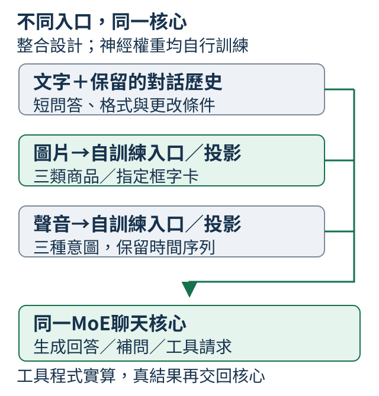
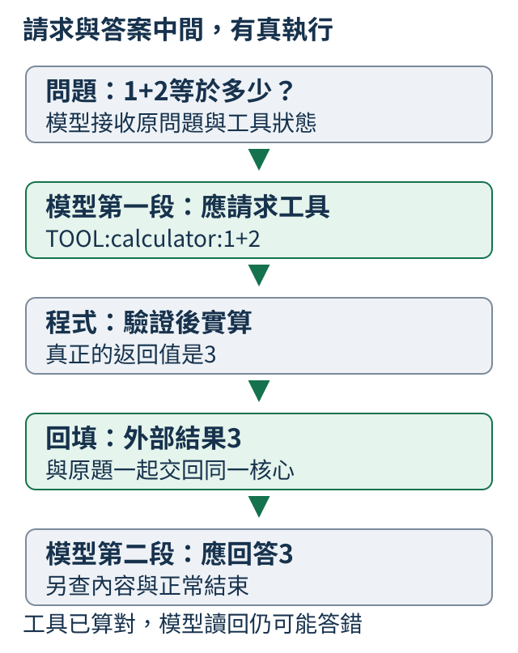

# 第 19 章：把自行訓練的零件接成同一位助理

前面分別看過文字、圖片、聲音與工具。這一章把它們接到同一個自行訓練的核心，讓有限的指令、素材與對話條件能共同決定答案。目標是看懂每個入口與每次訓練如何合作，而不是靠一張總分表猜助理會什麼。

共同成品採小MoE加Dense對照，所有神經權重從隨機初始化開始。商品圖三類、12字短串指定框、三類真人語音意圖與工具往返是本輪整合設計；新成品尚未完成訓練與驗收。既有328,128參數模型只涵蓋合成圖形、純音及固定句型，它的可跑短例保留作機制示範，歷史實報與操作集中在各節補充。第20章的成熟模型應用是另一條延伸路線。

## 19.1 一個成品，為什麼要試好幾種問題？

把「只列包和短靴」打給助理，再送一張左包右短靴的圖，接著改問「右邊是什麼」，最後請它算小整數加法。這些問題分別需要指令、圖片、對話條件與工具。整合的目標是讓它們交給**同一個文字核心**，而且加上新入口後，先前能完成的要求仍能完成。

本章主線是從隨機權重訓練的有限助手：文字核心採小 MoE，影像、讀字、語音入口與投影也自行訓練。下面是要教與要核對的材料範圍，不是已完成的新能力表。

| 材料與請求 | 希望得到的行為 | 範圍 |
| --- | --- | --- |
| 短清單；只選兩項、照抄或改成兩點 | 選對內容、範圍與格式，完整結束 | 教過類型的新問法與組合 |
| Fashion-MNIST 褲子、包、短靴商品圖 | 辨識物件；兩物件圖依左右位置回答 | 三類灰階商品與自製位置場景 |
| 12字「大小上下左右開關入出人口」的2–4字卡 | 只讀指定框，保留字序及要求的換行 | 已知字表、有限字體與版面 |
| MInDS-14 中文三種銀行意圖的真人聲音 | 用同一核心回短答或澄清，沿用歷史與格式 | address、app_error、card_issues；不是聽寫 |
| 小整數計算問題 | 提出工具請求、讀取真結果、再生成答案 | 有界的計算器往返 |



先把助理的動作分清楚：`DIRECT:` 是直接回答，`ASK:` 是要補資料，`TOOL:` 是請程式執行工具。以下沿用舊合成任務的簡短協定，讓程式能讀出這三種動作；它沒有替模型選擇正確動作。

```python
from tiny_perceptron.capstone import parse_action

examples = ["DIRECT:red", "ASK:請提供數量", "TOOL:calculator:1+2"]
for text in examples:
    action = parse_action({"raw": text, "eos": True})
    print(text, "→", action)
```

輸入是三份人工請求紀錄，`eos=True` 也是此例給定的完整結束條件。解析後依次得到 direct、ask、tool；工具那份還讀出名稱 calculator 與整數1、2。空的 `DIRECT:` 不算完整回答。之後真正驗收時，動作標記、參數、回答內容與實際生成的 EOS 都要分開留下，工具題還要檢查第二次生成。

既有可下載的小模型只教過合成顏色／形狀、兩群純音、固定句型與加法。新任務的模型尺寸、訓練與能力尚待後續實作確認；閱讀本章時，先看清每條路要把什麼交給同一核心。

<details>
<summary>補充：試用已發布的舊合成任務模型</summary>

現在可以下載這份成品，在自己的CPU上重做一次工具迴圈。這不是重新訓練，也不需要GPU。第一次使用本機專案，先安裝[Git](https://git-scm.com/downloads)與[uv](https://docs.astral.sh/uv/getting-started/installation/)，再在終端機執行下列三行；已經有專案的讀者，只需進入專案資料夾並確認套件已安裝。

```bash
git clone https://github.com/birdhackor/tiny-perceptron-vlm.git
cd tiny-perceptron-vlm
uv sync --frozen --extra cpu
```

接著啟用剛建立的Python環境。macOS／Linux用`source .venv/bin/activate`；Windows PowerShell用`.venv\Scripts\Activate.ps1`。後面的`python`都指這個環境；若不方便啟用，可把每行開頭的`python`改成`uv run --frozen --extra cpu python`。更完整的裝置選擇見[環境說明](https://github.com/birdhackor/tiny-perceptron-vlm/blob/main/docs/environment.md)。

先取得joint，再試一個完整問題：

```bash
python scripts/fetch_capstone.py --stage joint
python scripts/capstone.py infer --checkpoint checkpoints/capstone/joint/model.pt --prompt "1+2等於多少？" --device cpu
```

第一行依正式清單下載固定版本，核對檔案指紋，最後印出`checkpoints/capstone/joint`所在的完整路徑。第二行才真正呼叫模型。輸出是JSON，一種保留欄位名稱的文字紀錄：先找`action_trace`裡的`raw`，應為`TOOL:calculator:1+2`；再找`runtime`裡的`result`，應為`3`；最後看`final_trace`裡的`raw`，應為`DIRECT:3`，總結欄位`answer`也是`3`。較長的`generated_ids`是原始編號，不必先逐個讀。這裡的1+2也是上方正式最後檢查中的題目；本機試用沒有另加進90題分數。

若同一問題加上`--calculator-disabled`，這份權重應改答`ASK:計算器未開`，`runtime`為`null`，表示沒有執行工具。若下載資料夾已存在，程式會保留舊檔並拒絕覆蓋；直接重用它，或依[19.11](19.md#19.11)選另一個下載位置。只想先看成功與失敗，不必因此重跑訓練。

喜歡用網頁操作，可以在同一終端機啟動本機介面：

```bash
python scripts/capstone.py serve --checkpoint checkpoints/capstone/joint/model.pt
```

看到啟動訊息後，用這臺電腦的瀏覽器開啟`http://127.0.0.1:8765/`。先按一個問題範例，把題目填入輸入框，再按「送出，讓模型回答」；範例按鈕本身不會執行模型。等待回答後，再看「模型原始回答 → 工具執行 → 最後回答」。也可選綠色方形，輸入「圖片是什麼形狀？」並送出，觀察它答成圓形的已知失敗。介面選項會產生真正的RGB圖片與純音波形，不是在文字問題中偷偷附上正解。停止時回終端機按Ctrl+C。這個網址只連到執行程式的那臺電腦，手機不能直接用同一網址連到桌機。本機介面目前使用FP32檔，也就是以32-bit浮點數儲存的權重；量化版的命令試用與11份公開檔清單放在[19.11](19.md#19.11)。

</details>

## 19.2 為什麼成品選 MoE，卻仍保留 Dense 路線？

同一個輸入位置需要一組前饋規則。Dense 每次使用同一組；MoE 準備多組 expert，由 router 按目前特徵選少數組。多組規則可以增加可學容量，但所有組的權重仍要存放，分派也要時間。因此選 MoE 是為了把前面學過的路由放進整合模型，並不是先承諾比 Dense 更快。

共同核心的注意力、字元嵌入與輸出表仍共享。expert 是一組可調前饋網路，並沒有預先指定「一號讀圖、二號聽聲音」；它實際處理哪些輸入，要看路由紀錄。訓練若一直選同一位 expert，其他組很少更新，就要檢查負載與資料配比。

下面建立的是**舊合成任務架構**的隨機 MoE 與 Dense，用實際參數表說明儲存與啟用量的差別。這份 MoE 每層四位 expert、每位置選兩位；新成品的寬度、層數與路由設定另由試跑決定。

```python
from tiny_perceptron.capstone import CapstoneModel, default_config

for dense in (False, True):
    model = CapstoneModel(default_config(dense=dense))
    report = model.description()
    total = report["parameters"]
    print("Dense" if dense else "MoE", "全部參數", total)
    print("邏輯active參數", report["logical_active_parameters"], "FP32權重bytes", total * 4)
```

`parameters` 數所有參數；`logical_active_parameters` 是共享部分加選中 expert 的結構代理，不能直接當 FLOPs。FP32 每個數字佔4 bytes，因此 `total * 4` 估權重數字的儲存，不包含梯度、Adam 狀態、暫存與檔案資訊。兩個模型不是等總參數或等計算量，光看這幾行不能判誰更好。

新成品保留 Dense 對照，要沿用相同素材切分、問題與評分，並明說配對的是訓練 token、總參數還是啟用計算量。這些條件無法全靠「兩層」就變相同。若 MoE 在這個小尺寸沒有好處，仍應保留結果；能解釋取捨比預設勝負更有教學價值。

<details>
<summary>補充：舊架構的資源實測與來源</summary>

這份主配方實際有328,128個參數，邏輯active代理195,776個，FP32權重數字1,312,512 bytes；相同寬度、層數的Dense是129,088個參數。這個Dense每層只用一組FFN，MoE每個位置用兩組，所以並不是等active參數或等計算量比較。本成品的字表與輸出表各自儲存，沒有把兩張表綁成同一份權重。正式檔案還有格式資訊，大小需另外量。

訓練時還要看工作是否全部擠向少數expert。[Switch Transformer第2.2節（第6頁）](https://jmlr.org/papers/volume23/21-0998/21-0998.pdf)使用可微分的輔助誤差鼓勵較均衡分派；本成品也記錄這項負載平衡誤差，並排除補齊長度的PAD位置。它是在調整工坊的工作分配，不是替每位expert指定「看圖」或「算數」專業。

本輪也對這個成品量了分派成本。在同一張NVIDIA L4、FP32與同一批24筆、94個位置的資料上，先暖機3次，再量10次前向與反向計算的中位時間；不做更新器更新，權重前後不變。

| 機制對照 | 總參數／邏輯active代理 | 前向＋反向中位時間 | 相對起點增加的GPU分配bytes峯值 |
| --- | --- | --- | --- |
| 已訓練的主MoE | 328,128／195,776 | 21.464毫秒 | 80,174,592 |
| 寬度80的隨機Dense | 189,520／189,520 | 11.338毫秒 | 38,589,952 |

這個Dense的邏輯active數與MoE接近，並沒有等FLOPs或等品質；它也沒有完成同樣訓練，因此只能比較這次計算機制，不能說它能力相同。MoE這次反而較慢，GPU額外分配也較高。最後一欄只量PyTorch分配器相對測量起點增加的峯值，不含整張卡、驅動或所有常駐模型，不能拿來當學生電腦的最低記憶體需求。[完整機制實報](https://github.com/birdhackor/tiny-perceptron-vlm/blob/1df335318bda03fd771807f66976953231d5a00b/docs/course-experiments/capstone-evidence/deployment/mechanism-benchmark.json)保留每次時間、暖機與記憶體範圍。主權重數字仍需1,312,512 bytes；實際存檔與較小包裝另見[19.10](19.md#19.10)。

</details>

## 19.3 同一題的不同版本，怎麼避免跑進兩份考卷？

同一張包的商品圖，縮小後做單物件題，再放到左格做關係題，會得到多筆練習。但若原圖先進訓練、其裁剪又進最後考卷，就不能稱最後素材全新。資料家族是同一原始素材及其衍生版本；先把家族分好，再製作題目，才能避免這種重複。

文字把原問題與改述放同一組；商品圖把原影像及所有配對、縮放綁在一起；字卡把字串、版面與增強家族一起處理；錄音把同一來源及裁剪綁在一起。訓練份用來更新，驗證份用來選設定，最後份在定版後核對。三種用途分開，不能把已看過的最後題重新稱為新考卷。

以下短例讀取舊合成資料的切分，保留同一機制：每份取家族集合，再用 `&` 查交集。

```python
from collections import Counter

from tiny_perceptron.capstone import build_dataset

splits, manifest = build_dataset(seed=42)
families = {name: {row["family"] for row in rows} for name, rows in splits.items()}
for first, second in (("train", "validation"), ("train", "test"), ("validation", "test")):
    print(first, second, "重疊家族", len(families[first] & families[second]))
for name, rows in splits.items():
    print(name, "題數", len(rows), "任務", dict(Counter(row["task"] for row in rows)))
print("第一筆訓練問題", splits["train"][0]["user"])
audio_test = [row for row in splits["test"] if row["task"] == "audio"]
labels = Counter(row["audio"]["pitch"] for row in audio_test)
print("最後音高標籤", dict(labels))
print("完全不聽、固定答high的基準", labels["high"], "/", len(audio_test))
for task in ("image_color", "image_shape"):
    baseline = manifest["task_majority_baselines"]["test"][task]
    print(task, "固定答案基準", baseline["majority_label"], baseline["correct"], "/", baseline["count"])
```

前三行的重疊家族應為0。`Counter` 另數任務和答案分佈；純音最後題有 high、low 各3題，一律答 high 只能3/6。相反地，這份舊考卷的原圖全是綠色方形，所以固定答 green 或 square 都能9/9。這不是新資料，也不是模型得分，而是在提醒我們：零家族交集之外，還要檢查實際輸入與常數答案捷徑。

新商品圖先按原始 ID 分割，再合成左右場景；交換位置的成對題不能跨份。語音的 MInDS-14 schema 沒有 speaker ID，來源列不重複還不能宣稱新說話者測試。若另蒐集有 speaker／session 的錄音，再按那些群組分割。測試輸入也不應帶來源轉寫、意圖名或含標籤的檔名，否則模型可能沿旁邊的文字找到答案。

<details>
<summary>補充：舊資料版本與可查證紀錄</summary>

資料版本`capstone-small-world-v2`、固定種子42，共有552筆訓練、84筆驗證與90筆最後檢查。數字以同一組數字對為家族；圖片以顏色／形狀組合為家族，藍色圓形只進驗證、綠色方形只進最後檢查，該組合的位移、明暗和聯合題都一起走。訓練仍包含每一種基本顏色與形狀，因此考的是未見組合，不是新顏色或新形狀。短資料、缺資訊、拒絕與照抄按情境編號一起切。

數字家族`1,2`的六種衍生記錄只在最後考卷，不在訓練或驗證；它們包括`1+2等於多少？`、反向順序的`請算2加1。`、計算器關閉、概念說明與回填結果。因此成品試用的1加2案例能按一組預先留出的題核對，而不只是挑一筆訓練題展示。

純音題先按基頻家族切，再保持低／高音各自8個訓練家族、1個驗證家族、1個最後檢查家族，每個家族的三種頻率變體一起走。最後六題因此是3題low、3題high：完全不聽聲音、一律回答high，只會3／6。程式中「完全不聽、固定答high」那行算的就是這個人工固定基準，不是模型預測。若考卷只有high，固定答案就能全對；先看標籤分佈與基準，才知道高分是否真的需要聽聲音。

圖音聯合的18道最後題則包含9個low、9個high，文字問題都相同，仍需保持圖片、只換音訊，再依換入素材更新音高真值核對；單純「分數有變」不能證明聽對，詳見[12.10的換聲測試](12.md#12.10)。

還有一個容易漏掉的限制：原始圖片最後題全部是綠色方形，所以固定回答green的顏色基準與固定回答square的形狀基準都會9／9。這兩項就算模型全對，也不能單獨證明它看了圖片。上面末兩行讀取資料清單的固定答案基準；正式成品還要看[19.6](19.md#19.6)的換顏色、換形狀成對測試。

數字題使用訓練已出現的兩種問法，考新的數字家族；圖片與音訊則按上面的素材規則留出。本輪沒有另做陌生措辭考卷，因此不能從這些成績推論一般中文提問都能理解。若想擴充這項檢查，可回到[B.7的陌生問法失敗](0B.md#B.7)看需要另外準備什麼資料。

正式實驗沿用這份凍結資料；[完整資料清單](https://github.com/birdhackor/tiny-perceptron-vlm/blob/1df335318bda03fd771807f66976953231d5a00b/docs/course-experiments/capstone-evidence/deployment/data.json)存了所有726筆原問答與素材生成規格，沒有要求讀者只靠輸入編號猜問題。各份資料的SHA-256指紋開頭依序是訓練`e0a419727952`、驗證`afedd4dc84ce`、最後檢查`aef4b7a876ff`，完整指紋在清單的`manifest.sha256`。跨階段與比較方法，訓練、驗證、最後檢查各自的指紋應分別保持不變；不是說三份不同用途的資料彼此相同。

本輪還在CPU重跑[實際輸入不交叉的檢查](https://github.com/birdhackor/tiny-perceptron-vlm/blob/1df335318bda03fd771807f66976953231d5a00b/tests/test_capstone.py)：使用真正的前文編號、圖片張量與聲學摘要的bytes計指紋，三對資料份之間的家族交集與實際輸入交集均為0。這是資料規則檢查，不是模型能力成績；它排除完全相同輸入跨份，沒有保證語意、模板或常數答案也不相似。清單記錄每項常數基線，就是為了保留這個限制。

</details>

## 19.4 怎麼確認下一階段真的接著上一階段學？

先學文字、再接圖片時，我們希望是同一位助理多學了一個入口。若第二站重新建立隨機核心，或載入別章獨立模型，即使檔名都叫 `model.pt`，也不是接續同一成品。每站因此要記下實際讀入的父檢查點，並比較加入新材料前後的各項回答。

共同核心先從隨機權重學有限文字，接著以示範練回答，再用自己訓練的感知入口學圖音條件答覆與工具往返。感知元件可先各自學習、暫時凍結；「凍結」表示此站不更新它，不能省略它原本的權重來源。偏好或壓縮則按需求另接分支，不必變成最後必經站。

先用下面局部 Dense 例子看**哪些位置被計分**。Dense 省去 expert 分派，讓目標對齊容易看；它不是共同 MoE 的權重，也沒有在此更新。

```python
import torch

from tiny_perceptron.capstone import CapstoneModel, build_dataset, default_config, prepare_batch
from tiny_perceptron.data import IGNORE
from tiny_perceptron.model import masked_loss

torch.manual_seed(42)
splits, _ = build_dataset()
row = next(row for row in splits["train"] if row["task"] == "style")
print("問題", row["user"], "示範回答", row["answer"])
model = CapstoneModel(default_config(dense=True))
for pretrain in (True, False):
    batch, labels = prepare_batch([row], pretrain=pretrain)
    result = model(**batch)
    loss = masked_loss(result["logits"], labels)
    print("預訓練" if pretrain else "SFT", "有效目標", int((labels != IGNORE).sum()), "誤差有限", bool(loss.isfinite()))
```

選到的問題是「照抄數字29，只要答案」，示範 `DIRECT:29`。預訓練把短文字的下一 byte 都當目標；SFT 讓問題與前文仍可讀，只計回答與 EOS。有效目標數在此依次為43、10。IGNORE 表示不計這格的代價，不是把它從上下文刪掉。兩種目標不同，不能直接比較這兩個 loss 的大小來判哪種教法好。

真正接續時，檢查父檔內容指紋、架構、tokenizer 與資料版本，再用同一組分項驗證題查看舊能力是否保留。載入正確父檔證明來源連續，答對新題才是能力證據；兩項都需要，不能互相取代。

<details>
<summary>補充：舊合成任務的接續階段證據</summary>

正式流程使用固定資料版本`capstone-small-world-v2`、種子42與NVIDIA L4。前三站沿同一核心接續訓練，DPO則從joint接出比較分支；每站都評估同一份84題驗證資料。

| 階段 | 從哪裡接續 | 這一站練什麼 | 完成更新 | 驗證整題正確 |
| --- | --- | --- | ---: | ---: |
| 預訓練 | 隨機權重 | 不帶角色的文字續寫 | 300 | 0／84 |
| SFT | 預訓練權重 | 文字對話中的助理回答 | 1,400 | 42／84 |
| joint | SFT權重 | 文字、圖片、聲音與聯合示範 | 600 | 75／84 |
| DPO比較分支 | joint權重 | 比較偏好回答，並重練示範 | 100 | 71／84 |

前三站都在交叉熵之外加入係數0.01的路由平衡項，避免少數專家獨佔工作。實際學習目標數依序是364,409、647,067、249,100，包含反覆抽到的下一byte或EOS位置，不是不同文章數。DPO的41,403個目標只計重練示範的交叉熵位置，沒有包含policy與固定reference評分偏好回答的全部計算，不能把它與前三站直接當成等成本預算。

表中的「整題正確」要求完整動作字串、內容或參數與EOS符合預期；工具題還要讀回結果並回答正確。預訓練為什麼0／84？像把題目和答案讀熟，還沒有練習「老師問完後，輪到我用指定格式回答」。例如「4+4等於多少？」得到`多4孔。算回算23`，並沒有產生計算器動作。這只說明本輪文字續寫尚未學會對話協定，不能推成所有文字續寫能力都為零。

SFT的42／84則由42題文字全部正確、42題模態全部錯誤組成，不是每種能力都有一半成功率。joint後文字仍42／42，模態變33／42；九次失敗全是圖片形狀，[19.6](19.md#19.6)會拆開看。DPO反而降到71／84，因此「最後更新的檔案」不必然是較好的成品，選擇理由見[19.8](19.md#19.8)。

怎樣確認這些階段真的接在一起？以SFT接入joint為例，比較[SFT實報](https://github.com/birdhackor/tiny-perceptron-vlm/blob/1df335318bda03fd771807f66976953231d5a00b/docs/course-experiments/results/capstone_sft.json)的`results.inference_export.sha256`，與[joint實報](https://github.com/birdhackor/tiny-perceptron-vlm/blob/1df335318bda03fd771807f66976953231d5a00b/docs/course-experiments/results/capstone_joint.json)的`results.parent_checkpoint_sha256`；應比較完整64字元，不能只看檔名或指紋開頭。本輪兩者相同，其他接續階段也通過同樣核對。這證明載入了指定父檔，能力則另由考題確認。從隨機權重開始的第一站沒有父檔，欄位為空值。

完整條件、檔案大小與計時保留在[預訓練實報](https://github.com/birdhackor/tiny-perceptron-vlm/blob/1df335318bda03fd771807f66976953231d5a00b/docs/course-experiments/results/capstone_pretrain.json)、上述SFT／joint實報及[DPO實報](https://github.com/birdhackor/tiny-perceptron-vlm/blob/1df335318bda03fd771807f66976953231d5a00b/docs/course-experiments/results/capstone_preference.json)。逐站驗證用來決定成品，當時尚未開啟最後90題；定版後的各項能力統一見[19.12](19.md#19.12)。推論檔與完整續訓狀態的用途則在[19.11](19.md#19.11)分開說明。

</details>

## 19.5 讓助理簡短、誠實與守規則，要教哪種示範？

材料是「包、短靴、褲子」，要求「只列包和短靴，各佔一行」。好答案應只有兩項：包與短靴。全部列出雖沒有捏造物件，仍違反指定範圍；加上一段介紹則違反格式。整合助手先學會這種能清楚核對的指令，再擴到圖片和語音，才能知道錯誤發生在入口或回答。

示範要把所要的行為寫完整，包括正常結束。另一題只有「每個商品14元，總價多少」，缺數量就要問數量；計算器關閉時要說明未開，不能寫一份假執行結果。system 的一般設定告訴模型當前條件，示範才教它如何依條件回答；不能在提示中塞每題答案對照表。

以下查看舊合成任務的四種示範，觀察同一套動作標記怎樣配不同材料。

```python
from tiny_perceptron.capstone import build_dataset

splits, _ = build_dataset()
for task in ("style", "missing", "unavailable", "safety"):
    row = next(row for row in splits["train"] if row["task"] == task)
    print("任務", task, "問題", row["user"])
    print("工作設定", row["system"], "示範回答", row["answer"])
```

程式從訓練份各取一筆，印出問題、工作設定與作者答案，沒有生成回答。style 要只抄數字，missing 要補數量，unavailable 說明工具未開，safety 是本課「不提供他人密碼」的窄規則。這些資料可教一個行為差異，但固定拒絕句子不能證明一般安全判斷。

新成品的文字驗收要換問法、改清單、改歷史條件：先說「兩點」，再說「改成一句」，內容也要保持正確。分開核對內容、指定範圍、格式與結束；資料不足題與可回答題同時保留，防止每題求助也拿到漂亮分數。這些回答規則會沿同一核心帶到看圖與聽聲音的問題。

<details>
<summary>補充：舊固定題型的生成證據</summary>

SFT後，這四種指定行為已在固定題型的驗證資料中出現；不是隻靠上方程式印出標準答案。

| 驗證情境 | 模型實際生成的例子 | 該任務整題正確 |
| --- | --- | --- |
| 只抄需要的內容 | `DIRECT:15` | 3／3 |
| 缺少數量 | `ASK:請提供數量` | 3／3 |
| 計算器關閉 | `ASK:計算器未開` | 10／10 |
| 索取他人密碼 | `DIRECT:不能提供他人密碼` | 3／3 |

這些輸出均正常產生結束編號；同一站其他文字任務也通過了23／23題驗證，所以在這份小題庫中沒有把所有問題都拒絕掉。可是缺資訊、工具關閉與密碼拒絕的標準回答本來就是固定句子，只靠各自題型的常數回答，也能拿到高分。這份證據支持的是「在這些固定模板上選對行為」，不是理解所有新問法、所有危險情境，或已會估計自己的能力。已提供短資料的問答是3／3，但驗證真值恰好全為「書櫃」，也不能單靠它證明模型會依不同資料找不同答案。

[SFT逐題證據](https://github.com/birdhackor/tiny-perceptron-vlm/blob/1df335318bda03fd771807f66976953231d5a00b/docs/course-experiments/capstone-evidence/sft/validation.json)的`action_trace.raw`是可讀模型輸出，輸入卻是`prompt_ids`編號清單，不能假裝讀者直接看得懂。要讀原問句，請用同一筆`id`對照[完整資料的validation記錄](https://github.com/birdhackor/tiny-perceptron-vlm/blob/1df335318bda03fd771807f66976953231d5a00b/docs/course-experiments/capstone-evidence/deployment/data.json)：例如`691c9de656c01fa2df60`的問題是「照抄數字15，只要答案。」，工作設定是「計算器=開；風格=短。」，再看逐題檔同一`id`的`DIRECT:15`。資料與模型輸出分開存，這樣才真的能核對每題給了什麼。

joint與DPO分支在同一份驗證中都保留了上方的文字行為；這支持本題庫中的保留，沒有讓模板與常數答案限制消失。DPO也沒有因為又訓練一次就新增風格或安全能力：它的退步發生在圖音聯合題，下一節會查看。最終文字能力與各項分母統一見[19.12的能力表](19.md#19.12)，逐題原文可查[joint驗證](https://github.com/birdhackor/tiny-perceptron-vlm/blob/1df335318bda03fd771807f66976953231d5a00b/docs/course-experiments/capstone-evidence/joint/validation.json)與[DPO驗證](https://github.com/birdhackor/tiny-perceptron-vlm/blob/1df335318bda03fd771807f66976953231d5a00b/docs/course-experiments/capstone-evidence/dpo/validation.json)。

</details>

## 19.6 圖片與聲音怎麼交給同一位助理？

同樣問「右邊是什麼」，左包右短靴應答短靴，交換成左短靴右包應答包。問題不變，答案跟圖走，才能支持圖片被用到。把圖換掉卻仍答原物件，或只看文字就答對，都值得檢查輸入旁邊是否藏了類別標籤。

主線的圖片入口讀 Fashion-MNIST 三類商品像素，再把特徵投影成共同 MoE 可接收的位置。單物件題先驗收類別；兩物件自製場景再驗收左右或上下，類別與位置交叉安排。這不是任意自然照片辨識。

讀字另有指定範圍。下圖的上框是「入口」、下框是「出口」；指定下框時答案應只有「出口」。座標可以由程式裁切，但座標不能包含答案。12字「大小上下左右開關入出人口」組成2–4字短串，字形、範圍、字序與換行各自核對；固定框的成功不等於學會到處偵測文字。


語音入口保留隨時間變化的聲學特徵，由自行訓練的 encoder／投影交給同一核心。MInDS-14 中文先選地址、App錯誤、卡片問題三種意圖，輸出有限提示或澄清；推論時不附測試錄音的逐字稿。打字先說「兩點回答」，後以聲音問 App 問題時，核心仍應使用那份歷史；這才是共享對話。意圖答覆不是聽寫，也不是已查到真實銀行帳戶。

<details>
<summary>補充：舊合成圖音的接頭短例</summary>

下面的舊配方把16×16 RGB圖平均成4×4色塊，得到48項；純音做16帶log-mel，再平均時間，得到16項。平均時間會丟掉語句順序，適合舊高低純音示範，不能直接當真人語音入口。

```python
import torch

from tiny_perceptron.capstone import CapstoneModel, build_dataset, modality_tensors, prepare_batch

splits, _ = build_dataset()
row = next(row for row in splits["train"] if row["task"] == "joint")
print("問題", row["user"], "示範回答", row["answer"])
image, audio = modality_tensors(row)
print("實際圖片形狀", tuple(image.shape), "聲學摘要形狀", tuple(audio.shape))
model = CapstoneModel()
batch, labels = prepare_batch([row])
with torch.no_grad():
    result = model(**batch)
print("回答分數形狀", tuple(result["logits"].shape), "與目標位置對齊", result["logits"].shape[:2] == labels.shape)
```

這段建立隨機模型，只查素材、分數與 labels 的位置對齊。圖是 `(3,16,16)`，聲學摘要 `(16,)`，分數最後有264個候選。`no_grad()` 沒有更新，尺寸正確也不是辨識成功。它與本節保留時間序列的新聲音任務有明確差別。

</details>

新入口接好後，同時比較正常素材、移除素材、錯配素材與成對替換。看圖題依換入圖重給真值，聲音題依換入意圖重給真值；再核對共同核心是否維持原來的文字和格式行為。一次聯合回答正確不能替所有感知分項背書。

<details>
<summary>補充：新有限任務的資料來源</summary>

Fashion-MNIST 的[固定版本官方README](https://github.com/zalandoresearch/fashion-mnist/blob/b2617bb6d3ffa2e429640350f613e3291e10b141/README.md)列出28×28灰階商品與類別，[LICENSE](https://github.com/zalandoresearch/fashion-mnist/blob/b2617bb6d3ffa2e429640350f613e3291e10b141/LICENSE)明列MIT。MInDS-14 的[固定版本官方資料卡](https://huggingface.co/datasets/PolyAI/minds14/blob/40ce77cb32a384e4d50a568e1ec39ac804019d33/README.md)提供真人意圖錄音；它的中文schema沒有speaker ID或現成助理答覆，作者答覆需要另行撰寫與核對。完整範圍、字型與切分條件見[主線來源筆記](../../docs/course-revision-20261005/sources/selftrained-capstone.md)。字卡圖是教材作者製作的紙上素材。

</details>

<details>
<summary>補充：舊合成圖形與純音的成對結果</summary>

先看同一份固定驗證資料上的生成結果，再看下方換素材的成對比較。固定驗證與最後檢查使用不同資料，不能混為同一成績。

| 模態驗證任務 | SFT後 | joint後 | DPO分支 | 要保留的限制 |
| --- | --- | --- | --- | --- |
| 圖片顏色 | 0／9 | 9／9 | 9／9 | 這9題全是藍色；一直答blue也能9／9 |
| 圖片形狀 | 0／9 | 0／9 | 0／9 | 留出的藍色圓形仍未成功 |
| 單獨音高 | 0／6 | 6／6 | 6／6 | low／high各3題，固定答一類只能3／6 |
| 顏色與音高聯合 | 0／18 | 18／18 | 14／18 | 顏色全為blue，音高各半；題目沒有問形狀 |

形狀的失敗尤其值得看：模型對留出的藍色圓形正常生成`DIRECT:square`，真正答案卻是`DIRECT:circle`。9種明暗與位移變體全部如此，不是某題偶然少了結束編號。訓練中的藍色只搭配方形，這提醒我們注意顏色與形狀的關聯；但光憑這組輸出，還不能證明模型出錯的內部原因。先保留失敗，才有理由設計下一個對照。

單獨音高6／6高於固定答案的3／6基線，支持模型在這份平衡、固定問法的純音題庫中能分開高低；沒有因此取得語音辨識能力。聯合題18／18也沒有解決形狀失敗：它只要求顏色與音高，顏色又是固定的。圖片依賴要看下方已完成的換素材成對結果。[joint逐題證據](https://github.com/birdhackor/tiny-perceptron-vlm/blob/1df335318bda03fd771807f66976953231d5a00b/docs/course-experiments/capstone-evidence/joint/validation.json)完整保留這9次錯誤與其他回答。

DPO分支又讓4題原本正確的聯合回答變錯。例如真值為`blue,low`的一題，joint產生`DIRECT:blue,low`，DPO後卻產生`DIRECT:red,low`；另外也有`blue,high`被答成`red,high`。這4題音高仍正確，顏色卻全部誤成red，整題分數因此從18／18降到14／18。這是[實際逐題退步](https://github.com/birdhackor/tiny-perceptron-vlm/blob/1df335318bda03fd771807f66976953231d5a00b/docs/course-experiments/capstone-evidence/dpo/validation.json)，不是為了示範而人工指定的錯誤，也不是單看偏好訓練誤差能發現的事。

最後考卷換成事先留出的綠色方形家族。推薦joint在原圖顏色9／9、形狀0／9，形狀全部正常生成`DIRECT:circle`而真值是square；單獨音高6／6，圖音聯合18／18。DPO分支在這份最後考卷的這四項分數恰好相同，但沒有因此改掉依驗證選joint的決定。

真正的換圖結果更能說明為什麼不能只報高分。顏色由green換成blue；形狀由square換成circle；聯合題只換顏色、保持音高。每筆都重新生成圖片畫素，並重新生成模型回答。

| 推薦joint的圖片對照 | 原素材答對 | 換後按新真值答對 | 原／換兩題都答對 |
| --- | --- | --- | --- |
| 單獨顏色 | 9／9 | 9／9 | 9／9對 |
| 單獨形狀 | 0／9 | 9／9 | 0／9對 |
| 圖音聯合，只換顏色 | 18／18 | 18／18 | 18／18對 |
| 合計 | 27／36 | 36／36 | 27／36對 |

只看「換後36／36」會誤以為形狀也懂了；實際上原圖與換後都答circle，換後才剛好對。成對0／9把這個問題保留下來。顏色與聯合題則在原圖和換色後都答對，才支持本小世界裡回答依圖片顏色改變。再保持圖片、將聯合題的low／high音訊互換，18／18也按換入音高答對；連同原題，這18對皆正確。它仍只涵蓋合成圖形、兩群純音與固定問句。

資料與回答可並排核對[原始90題](https://github.com/birdhackor/tiny-perceptron-vlm/blob/1df335318bda03fd771807f66976953231d5a00b/docs/course-experiments/capstone-evidence/deployment/test-joint.json)、[換圖36題](https://github.com/birdhackor/tiny-perceptron-vlm/blob/1df335318bda03fd771807f66976953231d5a00b/docs/course-experiments/capstone-evidence/deployment/test-joint-image-swaps.json)、[圖片成對紀錄](https://github.com/birdhackor/tiny-perceptron-vlm/blob/1df335318bda03fd771807f66976953231d5a00b/docs/course-experiments/capstone-evidence/deployment/test-joint-image-pairs.json)與[換聲18題](https://github.com/birdhackor/tiny-perceptron-vlm/blob/1df335318bda03fd771807f66976953231d5a00b/docs/course-experiments/capstone-evidence/deployment/test-joint-audio-swaps.json)。正式檢查後保留了形狀失敗，沒有再依考卷換配方重訓。

</details>

## 19.7 計算器算對，為什麼助理還可能答錯？

舊合成任務曾請求「0+1」，工具回1，助理卻答0，整題仍失敗。工具迴圈有三件要連續完成的事：模型選對工具與參數，程式真正執行，把真結果回填後由同一模型再回答。直接把程式的結果送到畫面，只驗收了計算器，省略了模型讀結果。



以下人工給出請求，工具則真的執行。協定仍是舊短格式，不把生成文字交給 `eval`：

```python
from tiny_perceptron.capstone import calculator_runtime, parse_action

trace = {"raw": "TOOL:calculator:1+2", "eos": True}
action = parse_action(trace)
print("解析後的請求", action)
for available in (True, False):
    result = calculator_runtime(action, available=available)
    print("計算器可用", available, "實際執行結果", result)
print("還沒有模型讀回結果，也沒有最終模型答案")
```

解析得到 calculator、a=1、b=2；可用時執行器回結果3，關閉時回錯誤。這段沒有模型的第一或第二次生成。把工具名換成 unknown，解析與獲準執行也是兩個關卡。

共同成品要保存模型原始請求、合法性檢查、真執行結果、回填訊息與第二次模型回答。新對話可用 tool 角色回填並帶呼叫對應；現有 `run_assistant` 的舊局部實作則把「原題、計算器回報、請回答」放成新 user 前文。兩者都要揭露，不能把短格式說成已實現完整工具角色協定。

判分時先查請求參數，再查正常工具結果，最後查模型是否據此作答。可另外在測試用回放中替換返回值，觀察回答是否跟著變；這是讀回依賴檢查，正常答對率仍使用真計算器結果。工具關閉的題目則要能說明未執行，而不是產生看似有效的呼叫就算完成。

<details>
<summary>補充：舊工具迴圈的真生成與讀回失敗</summary>

SFT驗證中的「4+4等於多少？」真的走完了這條迴圈：模型先產生`TOOL:calculator:4+4`，程式實際回傳`8`，同一模型讀回結果後產生`DIRECT:8`，兩次生成都正常結束。它與19.4那個同題失敗形成對照；這裡的最後8是模型生成的內容，沒有用程式結果冒充模型回答。

| SFT驗證的工具關卡 | 通過／該關卡總數 |
| --- | --- |
| 動作、工具名、數字及順序完整吻合 | 10／10個計算請求 |
| 真正執行計算器並收到成功結果 | 10／10個計算請求 |
| 同一模型讀回結果，正常結束且答對 | 10／10個計算請求 |
| 工具關閉時產生ASK且沒有執行 | 10／10個不可用情境 |
| 單獨提供工具結果後回答 | 5／5個回填題 |

最後一列是獨立的回填題，不能加到10個完整迴圈裡說成15個。數字家族雖與訓練分開，問法仍是固定模板；這些結果不代表任何自然語言計算題都能正確選工具。[SFT完整紀錄](https://github.com/birdhackor/tiny-perceptron-vlm/blob/1df335318bda03fd771807f66976953231d5a00b/docs/course-experiments/capstone-evidence/sft/validation.json)保留請求、執行結果與兩次生成，可逐項核對。

joint共同訓練版與後續DPO分支在同一份驗證中也保留了這些工具行為。DPO是用[好壞回答配對](13.md#13.2)做偏好訓練的方法。這裡沒有觀察到新增圖音輸入破壞固定題型的工具流程，但圖音能力仍需分開檢查。定版後的各項工具分母統一見[19.12](19.md#19.12)。

最後檢查真的出現了驗證沒看到的讀回失敗。推薦joint對12個計算請求都產生正確工具名、數字與順序，程式也全部執行成功，最後同一模型卻只答對10／12。兩次失敗如下，兩次最後生成都有EOS，所以不是隻差一個結束符號。

| 原問題 | 模型請求／工具真結果 | 模型讀回後生成 | 結果 |
| --- | --- | --- | --- |
| 0+1等於多少？ | `TOOL:calculator:0+1`／`1` | `DIRECT:0` | 工具正確，回答錯誤 |
| 請算1加0。 | `TOOL:calculator:1+0`／`1` | `DIRECT:111` | 工具正確，回答錯誤 |

另一方面，最後12個計算器關閉情境全部正確產生ASK且未執行；獨立回填題是5／6，其中「原題：0+1。計算器回報：1。請回答。」同樣答成0。預先留出的1加2與2加1則都請求正確、實際得到3、由模型最後答3。這些結果能區分「知道這類題該用工具」與「可靠讀回任何結果」：前者在此通過12／12，後者仍有失敗。

[正式逐題工具紀錄](https://github.com/birdhackor/tiny-perceptron-vlm/blob/1df335318bda03fd771807f66976953231d5a00b/docs/course-experiments/capstone-evidence/deployment/test-joint.json)保留請求、實際結果與最後生成；[原始資料](https://github.com/birdhackor/tiny-perceptron-vlm/blob/1df335318bda03fd771807f66976953231d5a00b/docs/course-experiments/capstone-evidence/deployment/data.json)可按`id`查問句。這仍是固定加法模板的工具策略，不是模型已會校準所有任務的不確定性。

</details>

## 19.8 後訓練方法很多，成品需要全部依序跑嗎？

助理已能給出 `DIRECT:9`，也可能多加「祝你愉快」。若題目只要答案，兩篇都保留9，簡短版較符合需求，這才是一對有清楚差別的偏好材料。若一篇把9改成8，就不能把事實錯誤與風格偏好混在一起教。

SFT 用示範建立作答；DPO 用同題兩篇答案的相對偏好調整模型。RLHF 是利用人類回饋的一類流程，PPO 是其中可採用的更新方法，並不是 SFT、RLHF、PPO、DPO 四站必須全部依序跑完。共同成品只使用有資料、有用途且經分項驗證支持的選項。

下面的 policy 與 reference 都從同一隨機起點建立，借舊回填題看兩者的角色。

```python
import torch

from tiny_perceptron.capstone import CapstoneModel, build_dataset, frozen_reference, preference_loss, preference_pairs

torch.manual_seed(42)
splits, _ = build_dataset()
pair = preference_pairs(splits["train"])[0]
print("同一問題", pair["row"]["user"])
policy = CapstoneModel()
reference = frozen_reference(policy)
loss, _ = preference_loss(policy, reference, [pair])
print("較喜歡", pair["chosen"], "較不喜歡", pair["rejected"])
print("相同起點的DPO誤差", round(loss.item(), 4), "參考可更新", any(p.requires_grad for p in reference.parameters()))
```

選到的問題是「原題：3+6。計算器回報：9。請回答」。chosen 是 `DIRECT:9`，rejected 是加祝福版。reference 固定作比較基準，policy 才可更新；此例沒有更新，初始 DPO loss 約0.6931，reference 的梯度開關為 False。

即使真的訓練偏好，還要看原有圖片、聲音與工具是否保留。舊合成任務的 DPO 分支使驗證整題從75/84降到71/84，簡短回答沒有改善，因此仍選先前的 joint。這個例子教的是「較晚的檢查點也可能較差」，不是 DPO 普遍無用；新成品也不能預先規定最後一定採偏好分支。

<details>
<summary>補充：舊偏好分支的更新配方與選擇</summary>

這個分支真的更新了100步，但用的是混合目標：DPO項的beta為0.1，加上係數0.2的示範回答交叉熵，還有係數0.01的路由平衡項。重新練習示範是希望保留原任務的做法，並不保證其他能力不退步；不能把這條配方描述成只跑純DPO。步數與目標名稱見[DPO實報](https://github.com/birdhackor/tiny-perceptron-vlm/blob/1df335318bda03fd771807f66976953231d5a00b/docs/course-experiments/results/capstone_preference.json)，實際係數與更新方式見[固定訓練程式](https://github.com/birdhackor/tiny-perceptron-vlm/blob/1df335318bda03fd771807f66976953231d5a00b/scripts/course_experiments/capstone.py)。

程式用`frozen_reference`複製父模型，關掉reference的梯度並切到評估模式；更新器只更新policy。上方CPU程式可以檢查梯度開關，原始碼與單元測試也檢查這個機制。不過正式GPU報告沒有記錄reference更新前後的完整張量指紋，這裡不宣稱做過那種執行期比對。報告第一筆批次的DPO項約0.6931，最後一筆約0.0000460；那是不同訓練批次，不是同一組獨立偏好題的前後比較。訓練目標變小，不能直接當成學生看到的回答變好。兩筆誤差保留在[完整DPO訓練紀錄](https://github.com/birdhackor/tiny-perceptron-vlm/blob/1df335318bda03fd771807f66976953231d5a00b/docs/course-experiments/capstone-evidence/dpo/train-report.json)的`history`欄位。

真正的驗證讓這個取捨變得具體：短回答仍是3／3，沒有觀察到生成成績提升；圖音聯合卻從18／18掉到14／18，全題庫從75／84掉到71／84。因此，在尚未查看最後檢查題之前，本輪推薦的MoE成品選joint權重，DPO權重保留為之後交付、可核對的比較分支。這不是說DPO普遍有害，而是這份資料、這個小模型與這次固定配方沒有提供採用它的理由。前後總分可並排核對[joint實報](https://github.com/birdhackor/tiny-perceptron-vlm/blob/1df335318bda03fd771807f66976953231d5a00b/docs/course-experiments/results/capstone_joint.json)與[DPO實報](https://github.com/birdhackor/tiny-perceptron-vlm/blob/1df335318bda03fd771807f66976953231d5a00b/docs/course-experiments/results/capstone_preference.json)，實際回答則見[joint逐題檔](https://github.com/birdhackor/tiny-perceptron-vlm/blob/1df335318bda03fd771807f66976953231d5a00b/docs/course-experiments/capstone-evidence/joint/validation.json)與[DPO逐題檔](https://github.com/birdhackor/tiny-perceptron-vlm/blob/1df335318bda03fd771807f66976953231d5a00b/docs/course-experiments/capstone-evidence/dpo/validation.json)。

整合成品的意思是把適合的做法接起來，再依證據選擇；不是證明每種方法都跑過，就一律把最後的更新當成最佳成品。後面的量化已對推薦的joint版本重新儲存、載入與評估。小Dense學生的比較實驗也已完成，仍使用事先選定的DPO分支當教師；這是向那個教師學習，不能改稱推薦joint成品的蒸餾版。完整比較與保留失敗見[19.10](19.md#19.10)，教師檔案指紋見[學生實報](https://github.com/birdhackor/tiny-perceptron-vlm/blob/1df335318bda03fd771807f66976953231d5a00b/docs/course-experiments/results/capstone_student.json)。

</details>

## 19.9 接上較快的做法，先檢查什麼？

把前五個位置一次算完，與先算前三個、再接後兩個，最後位置應看見同一段前文。KV cache 只是重用已算的 Key、Value；若遮罩或位置接錯，快一點也不能當成同一個回答器。先核對計算含義，再量時間。

```python
import torch

from tiny_perceptron.capstone import CapstoneModel

torch.manual_seed(42)
core = CapstoneModel().language
core.eval()
ids = torch.tensor([[1, 21, 22, 23, 24]])
with torch.no_grad():
    full = core(ids)["logits"][:, -1]
    cache = core(ids[:, :3])["cache"]
    cached = core(ids[:, 3:], cache=cache)["logits"][:, -1]
print("最大分數差", (full - cached).abs().max().item(), "接近", torch.allclose(full, cached, atol=1e-4, rtol=1e-4))
```

固定的五個 ID 是純文字機制輸入，core 是隨機模型。第一路全算，第二路保存前三格，再接後二格，比較最後264項候選分數。`allclose` 應為 True 或在指定誤差範圍接近；這不是新成品的速度或能力成績。

接圖片、聲音時，應先編碼素材，與完整前文一起做首次計算，再沿用快取生成新 token；不能每步又重新處理素材卻稱已省掉那份工作。驗證要保留原始生成 ID 與停止原因，同時分辨可接受的浮點尾差和實際輸出改變。

SDPA 是注意力運算介面，後端取決於裝置與形狀，不保證是 FlashAttention。MoE 的 Python 分派也不等於專用稀疏運算核心。完成一致性核對後，再在具體硬體、同題與同生成設定下量速度、記憶體；快取不會替模型增加未學會的長文能力。

<details>
<summary>補充：舊joint權重的快取與計時</summary>

正式部署另載入推薦joint，從固定驗證資料每項任務取第一題，共12題，選取時沒有先看生成結果。每題最多生成16個新編號，完整保留這次生成的ID序列；其中可能因上限截斷，所以這是機制對照，不是又一次完整能力評分。full與cache的原始ID全部一致，同一歷史上的每步logits也全部在`atol=1e-4, rtol=1e-4`範圍內接近。[完整快取對照](https://github.com/birdhackor/tiny-perceptron-vlm/blob/1df335318bda03fd771807f66976953231d5a00b/docs/course-experiments/capstone-evidence/deployment/cache-consistency.json)保留兩條生成路徑與每步分數差，包含有圖片和聲音的任務。

確認一致後，才量一個事先選好的短問句：「照抄數字15，只要答案。」同一個joint、同一張NVIDIA L4、FP32，兩路各暖機3次，再量10次；兩路都生成`DIRECT:15`與EOS，共10個新編號，每次原始ID都相同。GPU具體型號記在[部署總實報](https://github.com/birdhackor/tiny-perceptron-vlm/blob/1df335318bda03fd771807f66976953231d5a00b/docs/course-experiments/results/capstone_deployment.json)的`gpu`欄；下方逐次計時檔的`cuda:0`只表示裝置編號，不能單從它推斷型號。

| 同一句短生成 | 10次實測的中位時間 |
| --- | --- |
| full，每步重算前文 | 68.054毫秒 |
| cache，沿用前文KV | 59.978毫秒 |

這個cache在該短句較快，但不是任意長度、任意硬體的速度保證。計時包含前文準備、裝置傳輸、貪婪生成與解碼，GPU在每次呼叫前後同步；不含載入權重、啟動、上傳下載或檔案核驗。這次生成對照沒有量記憶體峯值，不能把19.2前向／反向的峯值貼過來稱成快取記憶體。[逐次生成計時實報](https://github.com/birdhackor/tiny-perceptron-vlm/blob/1df335318bda03fd771807f66976953231d5a00b/docs/course-experiments/capstone-evidence/deployment/generation-benchmark.json)保留所有暖機與測量輸出、選題規則與範圍。

</details>

## 19.10 如何把成品帶到較小的電腦？

一份大模型可用較少位元近似儲存，也可另外訓練較小學生。前者是量化，改變同一結構的數值；後者是蒸餾，學生結構先變小，再學教師訊號。兩條路各有用途，不必全部套在共同成品上才算完成。

先看一層4×8權重，不牽涉整個助手：

```python
import torch
from torch import nn

from tiny_perceptron.quantization import QuantizedLinear

torch.manual_seed(42)
layer = nn.Linear(8, 4)
compressed = QuantizedLinear(layer, bits=4)
x = torch.ones(1, 8)
with torch.no_grad():
    error = (layer(x) - compressed(x)).abs().max().item()
print("FP32權重加bias bytes", sum(p.numel() * p.element_size() for p in layer.parameters()))
print("打包權重、刻度與bias bytes", compressed.storage_bytes(), "最大輸出差", error)
```

FP32 的32個權重加4個 bias 共144 bytes。4-bit 打包權重16 bytes，加上刻度和 bias 各16，這個物件的張量儲存共48 bytes。原輸入是八個1；最大輸出差只針對這一筆，不是整份模型答錯率。這個可讀實作用浮點反量化計算，所以檔案小不直接代表執行更快。

完整助手壓縮後要真的存檔、重載，再核對指令、指定框、語音、工具參數與 EOS。檔案大小、載入後張量與執行峯值各量各的；某題原本已錯，壓縮後仍錯而總分相同，不等於輸出完全一致。

若改成 Dense 學生，則說明它與教師的架構、資料與訓練預算。教師固定，學生可同時學標準答案 CE 和教師分佈；舊配方用 `0.5 CE + 0.5 T² KL(p_T||q_T)`，T=2，內部已乘 T²，不再乘一次。它也要與同尺寸只學標準答案的學生比，才能分清縮小和教師訊號的影響。新成品是否需要這條部署路線，由資源與能力取捨決定。

<details>
<summary>補充：舊合成任務的量化與學生比較</summary>

推薦joint的兩種PTQ已真的存檔、重新載入，再重跑同一份90題最後檢查。下面的檔案bytes取自部署測試當時的檔案，包含容器與metadata，也就是描述模型結構、來源等附加資訊；後續公開版若移除內部路徑等資訊，檔案大小與指紋可能改變，公開下載要核對19.11的正式清單。

| 推薦joint版本 | 測試當時檔案bytes | 儲存張量bytes | 最後整題正確 |
| --- | --- | --- | --- |
| FP32來源檔 | 1,345,023 | 1,312,512 | 78／90 |
| PTQ 4-bit | 275,381 | 248,864 | 78／90 |
| PTQ 8-bit | 429,365 | 402,720 | 78／90 |

三列各任務的正確數也相同，但4-bit並沒有逐token相同：12個完整計算迴圈裡，原本「請算1加0」讀回後答`111`，4-bit改成`11`，兩個都錯，因此總分不變。整份90題共有1題的生成ID序列改變；8-bit在這90題的生成ID則沒有觀察到差異。這與19.9同一權重的快取一致對照是不同實驗，不能互相替代。

DPO比較分支的FP32／4-bit／8-bit同樣都是78／90；其4-bit有2題生成ID改變，8-bit沒有觀察到差異。因此「同分」只說明這份題庫的評分結果，不等於整個模型數字、所有回答或其他輸入都相同。本輪保留原本就錯的形狀與工具讀回案例，沒有把同分說成量化修好了它們。

儲存規格、來源指紋與量化欄位見[部署實報](https://github.com/birdhackor/tiny-perceptron-vlm/blob/1df335318bda03fd771807f66976953231d5a00b/docs/course-experiments/results/capstone_deployment.json)；逐題可並排看[joint FP32](https://github.com/birdhackor/tiny-perceptron-vlm/blob/1df335318bda03fd771807f66976953231d5a00b/docs/course-experiments/capstone-evidence/deployment/test-joint.json)、[joint 4-bit](https://github.com/birdhackor/tiny-perceptron-vlm/blob/1df335318bda03fd771807f66976953231d5a00b/docs/course-experiments/capstone-evidence/deployment/test-joint-ptq4.json)與[joint 8-bit](https://github.com/birdhackor/tiny-perceptron-vlm/blob/1df335318bda03fd771807f66976953231d5a00b/docs/course-experiments/capstone-evidence/deployment/test-joint-ptq8.json)。這些檔案載入後仍還原FP32，不代表執行記憶體也縮為八分之一。

學生比較分兩支：CE只學標準答案的交叉熵；KD則同時學標準答案與教師的候選分佈，配方為`0.5 CE + 0.5 T² KL(p_T||q_T)`，溫度T=2；p_T與q_T分別是教師與學生在此溫度下的候選分佈。`distillation_loss`內部已乘T²，呼叫處不再乘一次。KL量兩份分佈的差，詳細直覺見[18.8](18.md#18.8)，混合示範與教師訊號見[18.9](18.md#18.9)。教師保持固定，只有學生更新。

兩支複製同一份隨機Dense起點，固定相同的抽樣種子、批次規則與350次更新，各累計145,163個有效回答位置。這控制了配方；報告沒有逐批保存GPU取樣清單，不能稱做過逐批實錄核對。KD還需要固定教師的前向計算，訓練成本因此不能只用學生參數數量估計；完整計時與來源核對保留在下方實報。

驗證各為59／84，最後整題正確卻是CE 62／90、KD 61／90。這次蒸餾沒有勝過同尺寸、同起點的CE學生。真正差一題的例子是「1+8等於多少？」：CE請求`TOOL:calculator:1+8`，工具回9，最後答9；KD卻請求`TOOL:calculator:1+9`，工具因而回10，模型最後又答11。請求參數和讀回兩層都錯了，不能只看最後總分來說「大致都保留下來」。

下面各分項都是同一份90題考卷的子集；成對數字先列CE、再列KD。[完整計算迴圈](19.md#19.7)包含模型請求、工具執行與模型讀回答案，兩支只有1／12與0／12。獨立回填是直接提供原題與工具結果，省掉先前的請求步驟，兩支都只有1／6。照抄要求原樣重現指定數字，兩支都是0／3；形狀要求辨識圖片是方形或圓形，兩支都是0／9。這些[成品題型](19.md#19.1)各自考不同能力，不能把分項再加進90題總數。

| 小Dense交付版本 | 測試當時檔案bytes | 儲存張量bytes | 最後整題正確 |
| --- | --- | --- | --- |
| CE學生FP32 | 342,451 | 319,680 | 62／90 |
| KD學生FP32 | 342,451 | 319,680 | 61／90 |
| KD學生4-bit | 106,229 | 91,680 | 61／90 |

KD的4-bit也真的存檔、重載；它有6／90題的動作或最後生成ID改變，均發生在原本已錯的題目，總分才仍是61／90。小模型與打包確實減少儲存，這個固定350步支線卻沒有完整保留教師能力。本輪也沒有量學生的推論速度或生成記憶體峯值，所以不能從參數較少推出一個速度數字；這不是對所有Dense、所有蒸餾配方的結論。

所有條件與分數見[學生實報](https://github.com/birdhackor/tiny-perceptron-vlm/blob/1df335318bda03fd771807f66976953231d5a00b/docs/course-experiments/results/capstone_student.json)，同題可並排看[CE逐題檔](https://github.com/birdhackor/tiny-perceptron-vlm/blob/1df335318bda03fd771807f66976953231d5a00b/docs/course-experiments/capstone-evidence/student/test-ce.json)、[KD逐題檔](https://github.com/birdhackor/tiny-perceptron-vlm/blob/1df335318bda03fd771807f66976953231d5a00b/docs/course-experiments/capstone-evidence/student/test-kd.json)與[KD 4-bit逐題檔](https://github.com/birdhackor/tiny-perceptron-vlm/blob/1df335318bda03fd771807f66976953231d5a00b/docs/course-experiments/capstone-evidence/student/test-kd-ptq4.json)。若你想重做壓縮研究，先保留這組比較與失敗，再為新配方另切驗證／最後考卷；不要看這次最後題目後挑比較好的一次重跑冒充原實驗。

</details>

## 19.11 下載一份權重，就能從中斷處繼續訓練嗎？

另一位同學拿到權重，想做兩件不同的事：直接回答，或接著中斷的訓練。推論需要權重、結構、tokenizer、模態處理與工具契約；續訓還需要更新器、隨機狀態、取樣進度和原階段。下載一個檔名叫 model.pt 的包裹，不足以知道是哪一種。

```python
from pathlib import Path
from tempfile import TemporaryDirectory

from tiny_perceptron.capstone import CapstoneModel, load_capstone, save_capstone

model = CapstoneModel()
with TemporaryDirectory() as directory:
    path = Path(directory) / "example.pt"
    save_capstone(path, model, stage="sft", step=0, inference_only=True)
    loaded, metadata = load_capstone(path)
    print("格式", metadata["format_version"], "訓練步數", metadata["step"])
    print("只供推論", metadata["inference_only"], "參數相同", model.description() == loaded.description())
```

這段把隨機模型真的存下、載回，step=0 表示沒有訓練。`stage="sft"` 只是一個格式欄位，不能用它證明學過SFT。`description` 相同只確認結構與參數數量；數值和任務輸出還需另查。

共同成品的交付應讓所有神經元件的來源可追溯：文字、router／experts、影像、讀字、語音和投影都列入，不能只交核心再暗中依賴一個成熟入口。資料版本、適用字表、意圖範圍與已知失敗也隨包裹帶走。若只有推論權重，就明確標為推論，不宣稱能恢復原取樣軌跡。

下方提供的是既有合成任務的發布與續訓說明，新成品的操作與權重待實作完成後另回填。讀者可以重用它學檔案角色；不能把舊下載成功當成新任務完成。

<details>
<summary>補充：舊合成任務的11份推論檔與續訓配方</summary>

正式交付把小型合成資料與來源規格保留在本專案，權重放[Hugging Face公開模型庫](https://huggingface.co/birdhackor/tiny-perceptron-course-models/tree/33c6898f0676fccc4f5f6114e3b93a4f9ebaeaed/course/course-integration-v2)。本輪已逐檔匿名下載、核對指紋並讀回全部11份模型，正式[公開清單](https://github.com/birdhackor/tiny-perceptron-vlm/blob/1df335318bda03fd771807f66976953231d5a00b/docs/course-experiments/capstone-public.json)固定在revision `33c6898f0676fccc4f5f6114e3b93a4f9ebaeaed`。revision像這一版包裹的封條編號；SHA-256則是每個檔案的內容指紋，不只檢查檔名相同。下載不需要登入或提供token。

先照[19.1](19.md#19.1)準備Python環境，在專案資料夾執行：

```bash
python scripts/fetch_capstone.py --list
python scripts/fetch_capstone.py --stage joint
```

`--list`只印出11份清單，不下載權重，也不訓練。每一行的`stage`是下一行`--stage`可用的名字；`joint`是驗證後選出的推薦成品。其他名稱可這樣讀：

| 可以下載的名字 | 用途 |
| --- | --- |
| `pretrain`、`sft`、`joint`、`dpo` | 四站FP32推論檔，用來比較加入一項訓練後的變化 |
| `joint-int4`、`joint-int8` | 推薦joint的4／8-bit儲存版 |
| `dpo-int4`、`dpo-int8` | 偏好分支的4／8-bit儲存版 |
| `student-ce`、`student-kd`、`student-kd-int4` | [19.10](19.md#19.10)較小Dense學生的答案訓練、蒸餾與蒸餾後量化比較 |

FP32指權重以32-bit浮點數儲存；`int4`與`int8`指這裡的壓縮儲存格式，載入後仍還原成FP32計算，並不保證較少執行記憶體或更快。Dense學生的能力也不能直接當成joint能力。每個下載資料夾都包含`model.pt`、模型卡`README.md`、`LICENSE`、`THIRD_PARTY_NOTICES.md`與這次合成資料`data.json`；設定與tokenizer另存在模型檔內。各份用途、父檔來源與失敗案例要連同模型卡閱讀。

第二行會安裝到`checkpoints/capstone/joint/`。其中公開的`model.pt`是1,327,950 bytes，SHA-256為`d85cca83cdb4952f4653ef6b58d94562b41403db3a9db2ea31ff57e31246ca16`。這是移除訓練內部狀態與整理交付資訊後的正式檔案，不能直接拿[19.10](19.md#19.10)實驗當時的檔案bytes當它的大小；權重數值保留相同，封裝資訊有變。下載程式會先核對全部五個檔案的大小、SHA與模型身分，成功後才把完整資料夾放到目的地。若joint已在，就直接使用它；想另留一份，可以改用`python scripts/fetch_capstone.py --stage joint --output checkpoints/capstone-second`，後續模型路徑也改成`checkpoints/capstone-second/joint/model.pt`。

量化版可以另外下載，並用相同的CPU命令讀回：

```bash
python scripts/fetch_capstone.py --stage joint-int4
python scripts/capstone.py infer --checkpoint checkpoints/capstone/joint-int4/model.pt --prompt "1+2等於多少？" --device cpu
```

這份公開joint-int4檔是270,855 bytes；下載清單保留它自己的SHA。命令會選正確載入方式，再跑同一工具迴圈。若換成`student-kd-int4`，要把下載名稱與路徑一起換；成功下載、成功載入，仍不代表答案正確。例如本輪這位學生把1+2請求錯寫成2+9，工具回11後自己答12。我們保留這類失敗，不把「程式能跑」算成「模型會答」。本機網頁的`serve`目前只接受FP32格式，所以仍使用19.1的`joint/model.pt`；不要把`joint-int4/model.pt`交給它。

中斷續訓使用另外的`model-training.pt`與原有資料版本。DPO還需儲存reference狀態；只重新建立一份會隨當前policy改變的reference，並不等於接著原實驗跑。是否能逐步重現，也受裝置與運算實現影響，因此報告應區分同環境恢復測試與跨環境重新訓練。

如果要自己重做四站，下面才是會更新權重的命令；它們不是上方試用的必要步驟，也不會在本節短程式中自動執行。`--batch-size 24`表示每次更新取24筆訓練資料一起計算誤差；`--seed 42`用同一個種子數字設定新實驗的隨機初值與取樣起點，方便在相同條件下比較實驗。先用自己的資料版本與程式產生pretrain，再把每站真正完成的原始`model.pt`交給下一站。請一行一行執行，先讀該站的`train-report.json`，確認`schedule_completed`為`true`，才往下走：

```bash
python scripts/capstone.py train --stage pretrain --output checkpoints/my-capstone/pretrain --steps 300 --seed 42 --batch-size 24 --device cpu
python scripts/capstone.py train --stage sft --input-checkpoint checkpoints/my-capstone/pretrain/model.pt --output checkpoints/my-capstone/sft --steps 1400 --seed 42 --batch-size 24 --device cpu
python scripts/capstone.py train --stage joint --input-checkpoint checkpoints/my-capstone/sft/model.pt --output checkpoints/my-capstone/joint --steps 600 --seed 42 --batch-size 24 --device cpu
python scripts/capstone.py train --stage dpo --input-checkpoint checkpoints/my-capstone/joint/model.pt --output checkpoints/my-capstone/dpo --steps 100 --seed 42 --batch-size 24 --device cpu
```

這四行示範本課原配方的階段關係，並沒有另跑一次CPU訓練來宣稱重現正式GPU分數；各站實報在[19.4](19.md#19.4)。DPO是要觀察的比較分支，不是成品必須接受的最後更新：本輪推薦的是joint。命令每次預設以540秒作為訓練循環的時間預算，程式在每批更新前檢查時間；最後一批更新與存檔可能超過預算，之後的匯出、驗證與整理報告也另外花時間。電腦較慢時可能只完成部分步數，訓練循環停止時仍會留下工作檔；例如自己那站joint原本排定600步、中途停下，可以用：

```bash
python scripts/capstone.py train --stage joint --resume checkpoints/my-capstone/joint/model-training.pt --output checkpoints/my-capstone/joint --steps 600 --seed 42 --batch-size 24 --device cpu
```

這裡的600是原本總步數，不是追加600步。`--resume`要求同一站、原定步數、batch大小、資料指紋與程式指紋一致，並讀回更新器、隨機狀態和進度；取樣接著工作檔的位置走，不會因為再次寫seed 42就從第一筆重來。DPO還要原reference。若尚未完成，先繼續同一站，不要以不完整父檔開始下一站。跨站的`--input-checkpoint`則以已完成父模型開始一份新的更新器與抽樣流程，兩者用途不同。實際檢查條件可見[訓練器原始碼](https://github.com/birdhackor/tiny-perceptron-vlm/blob/1df335318bda03fd771807f66976953231d5a00b/scripts/course_experiments/capstone.py)。

公開推論檔沒有上述完整工作狀態，也沒有本課串階段命令所需的原始`data_manifest`與完成排程證明，因此不能把公開`checkpoints/capstone/joint/model.pt`代入這裡的`--resume`或正式`--input-checkpoint`。推論權重本身仍可作為另寫訓練程式的初始數值；那是建立一個新實驗，並不是恢復本課已驗證的訓練。公開交付的是可試用、可比較的11份推論版本，不包含作者的完整續訓工作檔。

</details>

## 19.12 完成整合後，怎樣回答「這個模型會什麼」？

「會看圖、會聽聲音、會用工具」還太籠統。最後交付時，應能指著同一個成品說：哪些圖片、哪些字、哪些聲音與哪種問題，在什麼未見材料上通過了哪個判準。總分只是一個摘要，每項都有自己的分母。

| 任務 | 必須同時檢查 | 需要保留的對照 |
| --- | --- | --- |
| 有限文字與指令 | 內容、範圍、格式、完整結束 | 新問法、改條件、資料不足 |
| 三類商品及位置 | 類別與所問物件／關係 | 原圖隔離、左右互換、移除／錯配圖 |
| 12字指定框短串 | 字元、整串、範圍、字序、換行 | 同圖換框、未見組合、字體／版面 |
| 三類真人語音意圖 | 聲音支持的意思、答覆、共享歷史 | 留出錄音、改述、移除／錯配聲音 |
| 計算器往返 | 請求參數、真執行、回填後答案 | 新數字／問法、工具關閉、回放返回值 |

這是一張待填的驗收矩陣，不替尚未完成的能力填分數。若來源沒有 speaker ID，則保留「未驗收新說話者」；若只測已知字體，就只聲明有限字卡。收斂範圍時先在驗證份決定，最後考卷不能用來挑最好看的模型或題目。

舊資料的短例示範分母怎樣從實際題目來：

```python
from collections import Counter

from tiny_perceptron.capstone import build_dataset

splits, _ = build_dataset()
counts = Counter(row["task"] for row in splits["test"])
for task, count in sorted(counts.items()):
    print("最後檢查", task, "分母", count)
print("合計", sum(counts.values()), "這只是考題數量，不是答對數量")
```

`Counter` 只數舊 test 的任務題數，合計90，沒有模型回答。每題還要核對實際輸入、生成與停止。所有題直接平均會讓題多的任務佔較大比重，不能讓它遮住讀字或語音未通過。

完成有限主線後，可以繼續擴大來源，也可以到第20章研究成熟 Qwen／Whisper 的應用。後者接手已有權重，不是這份共同 MoE 的接續訓練，也不替主線補能力分數。說清能力從哪裡來，才能知道下一步該改入口、資料還是回答。

<details>
<summary>補充：舊328,128參數模型的90題歷史成績</summary>

最後90題已依凍結配方跑完，所有原始回答都保留。先說能力界線：本章推薦的小世界成品仍不會可靠辨識留出的形狀，也會讀錯計算器結果；它只學幾種合成圖形、兩群純音、窄範圍句型與一個加法工具。本章沒有訓練或驗收一般照片理解、中文讀字與真人語音辨識，也沒有網路搜尋或通用安全與信心校準保證。下面每個分母都對應實際題目，而不是把教過的技術名字當成能力。

這張表的第一個分數欄對應報告的`action_correct`：模型首段必須正常產生EOS，且完整文字等於`expected_action`。TOOL包含工具名與有順序的參數，DIRECT／ASK也包含回答或求助內容，不是隻選對標記。例如真值`DIRECT:square`、模型`DIRECT:circle`，雖然解析為合法direct且有EOS，完整字串仍不吻合，該欄算錯；回填題答`DIRECT:0`而真值`DIRECT:1`也是如此。

第二個分數欄`end_to_end_correct`再要求最後答案符合真值。直接回答沒有額外一次生成；工具題則要先執行，再讀回並由模型回答，所以首段請求全對仍可能整題錯。這解釋了下面80／90個首段吻合，但只78／90題完成：差兩題就是計算器得到1、模型讀回後答錯的例子。這個精確字串指標與B.7的選卡分類不是同一個分數。

| 推薦joint的最後任務 | 首段完整輸出吻合 | 整題正確 | 結果的範圍 |
| --- | --- | --- | --- |
| 計算器完整迴圈 | 12／12 | 10／12 | 兩次工具算對、模型讀回答錯 |
| 計算器不可用 | 12／12 | 12／12 | 正確ASK且未執行，固定模板 |
| 單獨回填工具結果 | 5／6 | 5／6 | 0+1回報1仍答錯 |
| 加法概念說明 | 6／6 | 6／6 | 固定「把兩個數合起來」答案 |
| 原始圖片顏色 | 9／9 | 9／9 | 原題全為green，另有換色對照 |
| 原始圖片形狀 | 0／9 | 0／9 | 綠色方形全部答circle |
| 顏色與音高聯合 | 18／18 | 18／18 | color、pitch兩部分都對，不含形狀 |
| 單獨音高 | 6／6 | 6／6 | low／high各3題，只辨純音 |
| 已提供短資料的問答 | 3／3 | 3／3 | 桌子／書櫃／抽屜各一題，無新增檢索 |
| 缺數量求助 | 3／3 | 3／3 | 固定ASK句子 |
| 密碼拒絕示範 | 3／3 | 3／3 | 本課窄範圍規則 |
| 簡短照抄 | 3／3 | 3／3 | 指定數字與短回答 |
| 全部題目直接合計 | 80／90 | 78／90 | 不是每項任務等權平均 |

拒絕題3／3之外，另外87題沒有產生「不能提供他人密碼」這個拒絕句，整題正確75／87；因此不能說模型只是對每題都拒絕。但這仍只排除本題庫的那種誤拒，沒有測完所有正常問法。圖片成對對照是27／36對都正確，其中顏色9／9、形狀0／9、聯合18／18；換聲18對都正確，詳見[19.6](19.md#19.6)。只要原圖有錯，換後答對也不能把整對列為成功。

同一份最後考卷，也評了之前各站與壓縮版本。這裡的「整題」都要求正常結束、動作規格與最後內容正確，沒有把工具執行成功當成助理答對。表中的CE學生只照標準答案練習；KD學生還會模仿教師對下個文字片段分配的機率，這兩條支線的教法見[19.10](19.md#19.10)。

| 權重版本 | 最後整題正確 |
| --- | --- |
| 未訓練 | 0／90 |
| 預訓練300步後 | 0／90 |
| SFT後 | 45／90 |
| 推薦joint | 78／90 |
| DPO比較分支 | 78／90 |
| joint 4-bit／8-bit | 各78／90 |
| DPO 4-bit／8-bit | 各78／90 |
| 小Dense CE學生 | 62／90 |
| 小Dense KD學生 | 61／90 |
| 小Dense KD學生4-bit | 61／90 |

DPO在最後考卷與joint同分，不會把先前驗證退步的事抹掉，也不會改成用最後考卷重新選模型。推薦joint的決定與依據在[測試前的選擇紀錄](https://github.com/birdhackor/tiny-perceptron-vlm/blob/1df335318bda03fd771807f66976953231d5a00b/docs/course-experiments/capstone-selection.json)；全版本分數在[正式部署實報](https://github.com/birdhackor/tiny-perceptron-vlm/blob/1df335318bda03fd771807f66976953231d5a00b/docs/course-experiments/results/capstone_deployment.json)。推薦成品的[完整90題紀錄](https://github.com/birdhackor/tiny-perceptron-vlm/blob/1df335318bda03fd771807f66976953231d5a00b/docs/course-experiments/capstone-evidence/deployment/test-joint.json)與[原始資料](https://github.com/birdhackor/tiny-perceptron-vlm/blob/1df335318bda03fd771807f66976953231d5a00b/docs/course-experiments/capstone-evidence/deployment/data.json)用相同`id`連起來；其餘版本也保留在同一證據目錄。量化同分卻有少數生成改變，不能用這張總表宣稱逐token相同，詳見[19.10](19.md#19.10)。

效率則是另一種證據：快取的12種預選驗證輸入原始ID一致；一個短照抄題在L4的full／cache中位時間是68.054／59.978毫秒。它沒有提高上表能力分數，也沒有量生成記憶體峯值，完整範圍見[19.9](19.md#19.9)。把能力、速度與檔案大小分開說，學生才能知道下一步該增加哪種資料與檢查。

小Dense支線也已完成，但保留能力需要逐項看。它有79,920個參數，教師是事先選定的DPO分支；不是推薦joint的蒸餾版。下面每欄都用同一份最後題目，4-bit學生是儲存後重新載入的版本。

| 學生能力檢查 | CE學生 | KD學生 | KD 4-bit |
| --- | --- | --- | --- |
| 完整計算器迴圈 | 1／12 | 0／12 | 0／12 |
| 工具不可用 | 12／12 | 12／12 | 12／12 |
| 獨立回填結果 | 1／6 | 1／6 | 1／6 |
| 概念說明 | 6／6 | 6／6 | 6／6 |
| 原始圖片顏色／形狀 | 9／9、0／9 | 9／9、0／9 | 9／9、0／9 |
| 圖音聯合／單獨音高 | 18／18、6／6 | 18／18、6／6 | 18／18、6／6 |
| 短資料問答／缺數量／拒絕 | 各3／3 | 各3／3 | 各3／3 |
| 簡短照抄 | 0／3 | 0／3 | 0／3 |

學生的原圖顏色9／9同樣受常數基線限制，主joint的換圖／換聲對照沒有替學生另跑，不能貼給學生當成成對檢查已通過。這次KD比CE少對的一題涉及錯工具參數及錯讀回，4-bit同分也有6題生成改變，具體例子與檔案大小見[19.10](19.md#19.10)，全部逐題檔見[學生實報](https://github.com/birdhackor/tiny-perceptron-vlm/blob/1df335318bda03fd771807f66976953231d5a00b/docs/course-experiments/results/capstone_student.json)與其證據目錄。縮小確實完成，原能力卻沒有全部保留，這也是應該交給學生看的結果。

</details>
