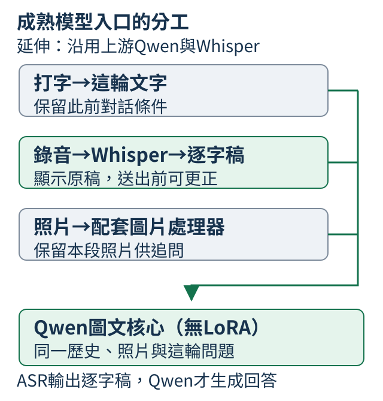
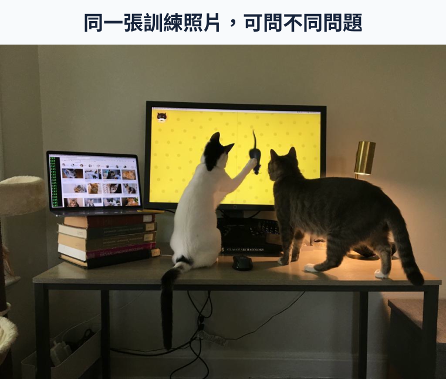
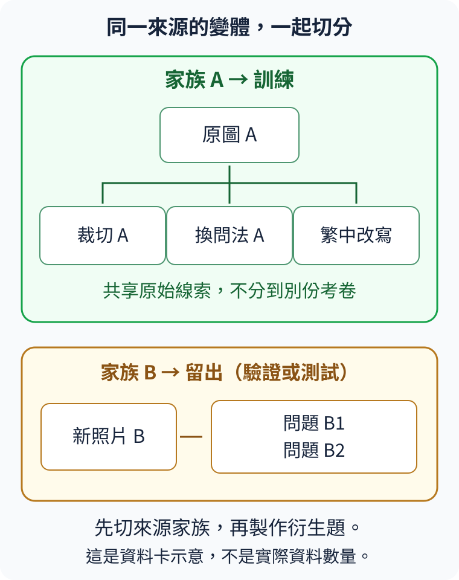
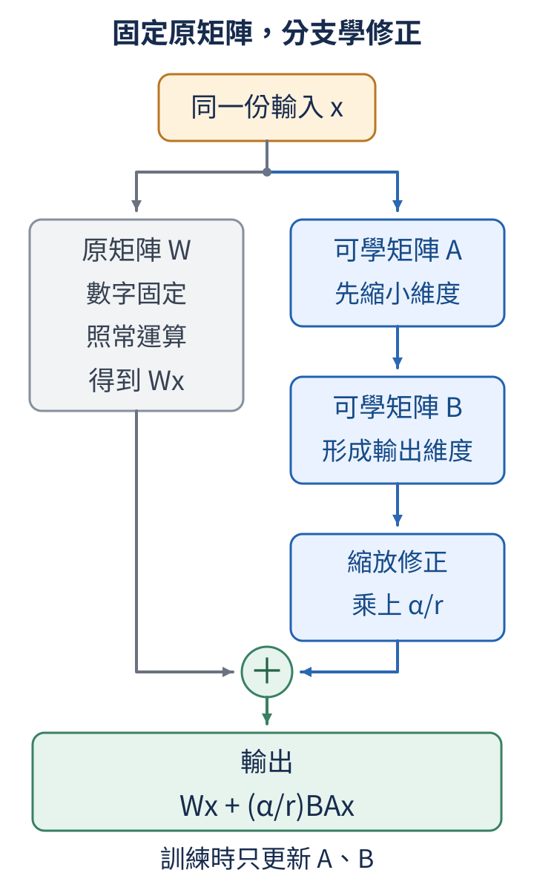
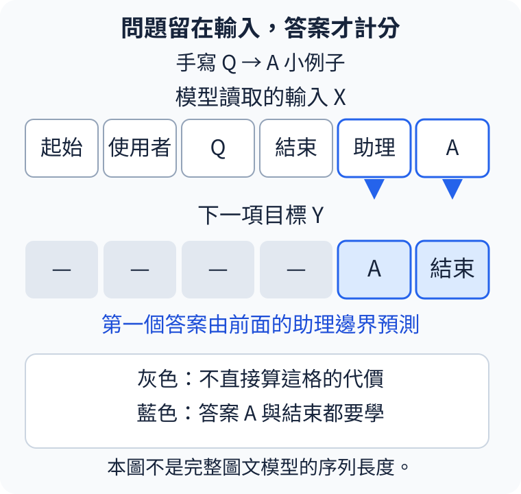
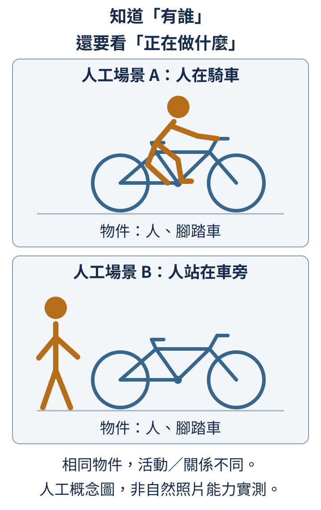
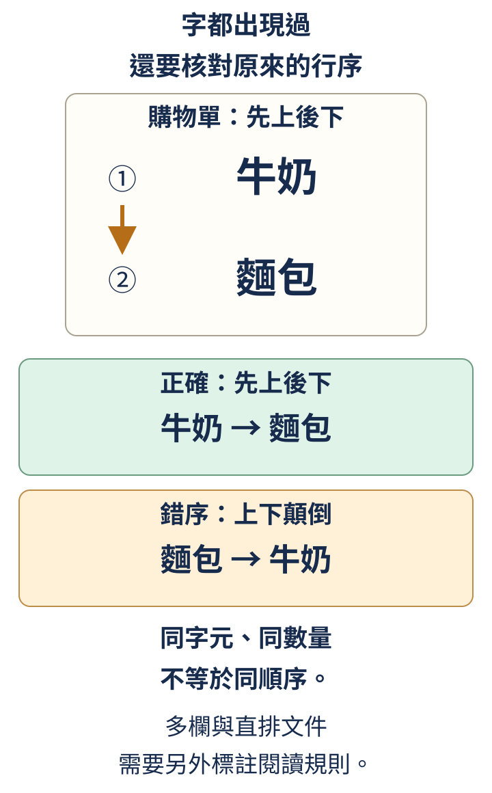
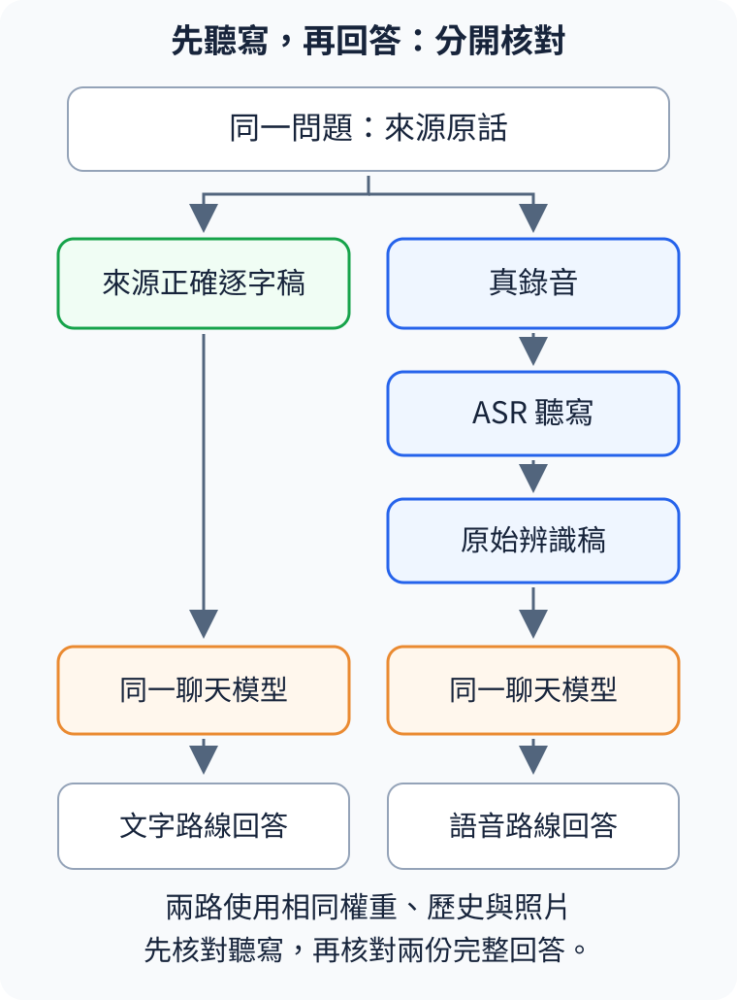

# 第 20 章：延伸——沿用成熟模型處理照片、讀字與語音提問

這條路線接手Qwen圖文權重，聲音先由Whisper轉寫，再交給同一聊天核心。它讓我們研究已具備能力的模型如何應用、微調與驗收，與第19章所有神經元件從隨機權重訓練的主線有不同起點。

本課曾訓練LoRA候選，驗證沒有支持採用，因此目前保留原底座。各節短Python隔離一個機制；成熟模型下載、推論與候選重訓另有操作入口，不能把CPU手算當成完整模型能力證據。

## 20.1 照片、打字與說話，怎麼交給同一位助理？

先打字說「接下來請用繁體中文回答」，附圖問招牌，下一輪改用聲音追問。我們希望照片與語言要求仍保留，換的是這輪問題的入口。成熟模型延伸採同一份聊天歷史：打字直接加入；錄音先由 Whisper 聽寫，再把逐字稿加入同一位置。

ASR 是語音辨識，輸出「聽到哪些字」，不是問題的答案。圖文核心 Qwen 讀照片、歷史與這輪文字，才生成回答。可選 LoRA 是核心旁的小修正，並不是另一位聊天模型；目前交付配置沒有開啟它。



```python
history = [{"role": "user", "content": "接下來請用繁體中文回答。"}]
typed_question = "請讀出照片裡的招牌。"
recognized_question = "請讀出照片裡的招牌。"
typed_chat = history + [{"role": "user", "content": typed_question}]
spoken_chat = history + [{"role": "user", "content": recognized_question}]
print("聊天模型收到相同對話", typed_chat == spoken_chat)
print("這輪問題", spoken_chat[-1]["content"])
```

這兩份問題由人手寫成相同，所以對話比較為 True。這段只示範會合點，未辨識錄音或讀圖。真正兩路比較還要固定照片、歷史與生成設定，查看ASR是否把條件改掉。

介面先顯示辨識原稿，使用者可以更正後再送出。評測原始語音路線時保留更正前的逐字稿；更正後成功是人工操作結果，不能偷偷算成辨識器原本就聽對。這套配置以文字回答，沒有因此具備語音朗讀。

## 20.2 不重新訓練，怎麼先開啟成品？

先打字問候，再附圖提問，最後加入一段錄音，能把三條通路逐一打開。這次使用 Qwen3-VL-2B-Instruct 與 Whisper-large-v3-turbo，保留原圖文底座，沒有加本課 LoRA。試用已有配置不需要重新訓練，但仍需要下載並載入兩份成熟權重。

在本機介面按以下順序操作，每一步等結果出現再繼續：

1. 在「要送出的文字」寫「你好，請用一句話回答」，按「送出問題」。
2. 加入照片，問畫面有哪些東西；追問同圖的位置時保留照片與歷史。
3. 選中文錄音、按「辨識語音」，查看「辨識原稿」；此時只有逐字稿。
4. 確認或更正「要送出的文字」，再送出，核對回答所依據的是最後送出的問題。

「開始新對話」清除本段歷史與上傳素材。終端機保持執行才能回應；`127.0.0.1:8766` 是這臺電腦的服務位址，不是教材網站在代算。停止時在終端機按 Ctrl+C，已下載權重仍可重用。

下方是已核對的 Linux CPU 安裝路線。先讀清下載哪些內容：公開清單下載配置及來源記錄，完整圖文權重在啟動時取得，語音權重等第一次辨識才載入。操作接通和回答可靠是兩種檢查，品質仍依本章最後的能力卡。

<details>
<summary>補充：固定版本、Linux CPU環境與啟動命令</summary>

本版使用Qwen3-VL-2B-Instruct圖文底座與Whisper-large-v3-turbo，沒有啟用本課的微調修正。下面走已實際核對的Linux CPU路線：Bash終端機、Git、Python 3.12，以及可建立`venv`的Python。先在終端機執行`git --version`；若找不到命令，依[Git官方安裝指引](https://git-scm.com/downloads)安裝後再繼續。完整模型與配套需要數GB磁碟，運算另外需要記憶體；實測範圍見[學生操作指引](../../docs/natural-assistant/v4/STUDENT.md)第2節。[20.3](20.md#20.3)會再說明權重大小與記憶體需求的差別。

先把本版程式放在新的`tiny-perceptron-natural`資料夾，保留原有專案與練習：

```bash
GIT_LFS_SKIP_SMUDGE=1 git clone --no-checkout https://github.com/birdhackor/tiny-perceptron-vlm.git tiny-perceptron-natural
cd tiny-perceptron-natural
GIT_LFS_SKIP_SMUDGE=1 git checkout --detach 59a1eda4ed7b6e8609892ec2b9013c821ac93e69
python3.12 --version
```

`GIT_LFS_SKIP_SMUDGE=1`讓Git先取得教材與程式，跳過大型訓練資料。第三行固定這次操作核對使用的程式與公開清單；現在只使用成品，還不需要下載全部練習題。最後應顯示`Python 3.12.x`。以下指令都在這個新專案的根目錄執行。

建立獨立環境，保留前面小實驗使用的`.venv`：

```bash
python3.12 -m venv .venv-natural
.venv-natural/bin/python -m pip install --upgrade pip
.venv-natural/bin/python -m pip install torch==2.8.0 torchvision==0.23.0 --index-url https://download.pytorch.org/whl/cpu
.venv-natural/bin/python -m pip install -r requirements-natural.txt
```

每個指令都寫出`.venv-natural/bin/python`，讓你不用猜正在使用哪一套Python。第三行安裝配對的CPU版PyTorch與torchvision，第四行補齊其餘固定套件。Notebook裡的這些Bash區塊是操作說明，不會自動執行下載。

接著讀取本章公開清單，再取得選定配置需要的配套：

```bash
.venv-natural/bin/python scripts/fetch_natural_release.py --manifest docs/natural-assistant/v4/public-release.json --list
.venv-natural/bin/python scripts/fetch_natural_release.py --manifest docs/natural-assistant/v4/public-release.json --output checkpoints/natural-assistant/release-v4
```

這份[公開清單](../../docs/natural-assistant/v4/public-release.json)固定兩個官方模型的版本。本版下載步驟先取得配置說明與來源記錄，不包含另加的修正權重，也不包含完整模型權重；權重會在啟動及第一次語音辨識時另從指定官方版本取得。配置文件逐檔核對大小與內容指紋，不需要Hugging Face登入。成功後先重新核對，再啟動：

```bash
.venv-natural/bin/python scripts/fetch_natural_release.py --manifest docs/natural-assistant/v4/public-release.json --output checkpoints/natural-assistant/release-v4 --verify
.venv-natural/bin/python scripts/fetch_natural_release.py --manifest docs/natural-assistant/v4/public-release.json --output checkpoints/natural-assistant/release-v4 --serve --device cpu --dtype float32
```

第一次啟動會下載並載入固定圖文底座；語音模型等第一次按「辨識語音」才下載並載入。已有相同快取時可重用。等終端機顯示助理已啟動，再用同一臺電腦的瀏覽器開啟`http://127.0.0.1:8766/`。這個網址使用你的電腦運算；GitHub Pages提供的是教材。終端機須保持開啟，網頁才能繼續取得回答。

</details>

更完整的裝置、容量與離線說明見[學生操作指引](../../docs/natural-assistant/v4/STUDENT.md)。


## 20.3 只調整一小份權重，為什麼還要載入大模型？

LoRA修正包像幾張便條，使用時原書仍需在桌上。可更新的數字少，不等於整套權重少。本章 Qwen3-VL-2B-Instruct 圖文底座實際有2,127,532,032個參數；它是上游已訓練的另一份 Dense 模型，並未接續第19章的隨機MoE。

先用乘法估這份底座的數值儲存：

```python
parameters = 2_127_532_032
for label, bytes_per_number in [("32-bit", 4), ("16-bit", 2)]:
    weight_bytes = parameters * bytes_per_number
    print(label, "權重數字bytes", weight_bytes, "約GiB", round(weight_bytes / 1024**3, 2))
```

32-bit 每個數字4 bytes，共8,510,128,128 bytes，約7.93 GiB；16-bit每個2 bytes，約3.96 GiB。GiB以1024³ bytes計。這段沒有載入模型，也不包含圖片特徵、對話快取、工作空間和語音模型。

訓練另有梯度、更新器與中間結果，不能看見4 GiB權重就推論4 GiB顯示卡能訓練。圖片細節與長歷史也增加計算。裝置實測範圍見[訓練指引](../../docs/natural-assistant/v4/TRAINING.md)，乘法估算只回答數字要佔多少位元組。

Dense 在此沒有 expert 路由；選它是接手成熟圖文能力的具體配置，不是 Dense 普遍優於 MoE。Whisper則另負責轉寫。後面比較LoRA時，底座與語音入口各自固定，才能把變化歸到實際改過的地方。

## 20.4 怎樣的練習，才能教到我們想要的能力？

這張照片有兩隻貓在書桌上看螢幕。若請求「桌上有幾隻貓」，示範應直接回答兩隻；若請求一至兩句描述，就要把物件與可見姿勢連起來。相同圖片能教不同要求，關鍵在問題和答案是否配對，而不是資料夾的名字。



照片由Jason Baldridge and family創作，DOCCI透過Google LLC以[CC BY 4.0](https://creativecommons.org/licenses/by/4.0/)提供；[固定版本原圖](https://storage.googleapis.com/docci/thumbnails/train_01827.jpg?generation=1713028329088595)未裁切或改動。它可以提供兩種互補練習：

| 練習請求 | 示範回答 | 這題教什麼 |
| --- | --- | --- |
| 請用一至兩句繁體中文描述主要內容。 | 兩隻貓在書桌上看著黃色的電腦螢幕；左邊的貓抬起一隻前腳。 | 把物件與可見姿勢連成短描述。 |
| 桌上有幾隻貓？ | 兩隻貓。 | 直接回答畫面中的數量。 |

這兩份回答是本課AI助理實際看圖、讀原始人工英文描述後寫的繁中標註，並非DOCCI官方人工中文答案。原圖、原始描述與修改來源一起保存。照片是訓練示範，用它解釋題型，不能把它另報成未見過照片的能力。

本章按用途挑資料：

| 來源 | 使用方式 | 授權與標註要點 |
| --- | --- | --- |
| DOCCI自然照片 | 短場景描述與可見事實問答。 | 圖片與原描述採CC BY 4.0；繁中題目與回答是本課改寫。 |
| NVIDIA合成OCR（圖片文字辨識）文件 | 從文件取文字區域，配對原轉寫。 | 資料集採CC BY 4.0；它是合成文件，不稱真人街拍。 |
| Wikimedia Commons文字照片 | 補充真實招牌與背景中的文字。 | 逐張核對作者與授權；裁切仍保留原圖來源。 |
| OpenAssistant中文對話 | 練直接回應與保留對話條件。 | 資料集採Apache-2.0；從同一段開場對話延伸的不同回覆分支，合稱一棵對話樹，視為同一家族。 |
| FLEURS真人朗讀句子 | 只檢查語音辨識轉寫。 | 語料採CC BY 4.0；沒有來源助手答案，不拿它計聊天成功率。 |
| AISHELL真人朗讀問句 | 檢查轉寫，以及同問句的文字／語音兩路回應。 | 語料採Apache-2.0；助手回應判準由本課另訂。 |

照片、合成文字文件和真實招牌提供不同難點，要分清來源與標註。錄音搭配逐字稿只提供聽寫參考；若要檢查助理答覆，還得另訂回答判準。DOCCI 繁中問答由本課AI助理看圖與原始英文描述後改寫，不能改稱官方人工中文答案。這批改寫題目用於本章的成熟模型延伸，不列入第19章規劃的、從隨機權重訓練共同 MoE 的有限主線資料；兩條路線的來源與標註應分開記錄（見[19.6](19.md#19.6)）。

把同一句重複多次只增加練習比重，不增加新情境。要教保留條件，就展示不同歷史下的回答；要教只讀指定區域，就展示同圖換框。完整來源、授權與修改保留於[資料說明](../../docs/natural-assistant/v4/DATA.md)，挑題時先看這道示範實際教哪件事。

## 20.5 換個問法，為什麼仍可能是同一道舊題？

同一張貓照片，換成問數量或問姿勢，仍共享一份畫面。若其中一題用來訓練，另一題當陌生照片測試，模型可能已記熟背景。原圖、裁切與問法應先歸成一個來源家族，再一起分配用途。



下面用四筆人工記錄，檢查已分到 train／test 的題目是否讓同一家族跨份；程式不會自動重新切分資料。

```python
records = [
    {"family": "貓照片A", "split": "train", "question": "有幾隻貓？"},
    {"family": "貓照片A", "split": "train", "question": "哪隻貓抬起前腳？"},
    {"family": "招牌照片B", "split": "test", "question": "招牌寫什麼？"},
    {"family": "招牌照片B", "split": "test", "question": "有沒有中文字？"},
]
families = {name: {row["family"] for row in records if row["split"] == name} for name in ["train", "test"]}
print("訓練家族", sorted(families["train"]))
print("測試家族", sorted(families["test"]))
print("跨份重疊", sorted(families["train"] & families["test"]))
```

兩份集合分別含貓照片A與招牌照片B，所以交集為空。把第二筆的 split 改成 test，貓照片A就跨份了，雖然文字不同。修正是讓家族一起走，不能只替它改一個名字。

正式資料還要核對來源ID與實際檔案，避免相同像素換檔名。DOCCI 的公開相似群組表示畫面相近，不等於已確認同一拍攝session；OpenAssistant的共享前文分支則屬同一對話樹。資料有哪種群組，能力聲明就到哪裡。

驗證用來選本課微調版本，最後份定版後才檢查。已公開舊題用來檢查改動後是否仍能完成原先的工作，這叫回歸檢查；它不再算新盲測。本課家族隔離也不能排除上游預訓練曾見過這些公開素材。

## 20.6 保留底座，怎麼只學一小份修正？

輸入四項特徵，要輸出三項分數。原矩陣 W 可保持固定，再加一條 A→B 的小修正：A把四項縮成r項，B把r項轉回三項，最後與原輸出相加。r叫rank，此例的修正尺度是 alpha/r；固定底座仍參與計算。



```python
import torch
from torch import nn
from tiny_perceptron.alignment import LoRALinear

torch.manual_seed(42)
layer = LoRALinear(nn.Linear(4, 3), rank=2, alpha=2)
base_before = layer.base.weight.detach().clone()
branch_before = layer.b.detach().clone()
optimizer = torch.optim.SGD([p for p in layer.parameters() if p.requires_grad], lr=0.1)
loss = layer(torch.ones(1, 4)).square().mean()
loss.backward()
optimizer.step()
print("可更新數字", sum(p.numel() for p in layer.parameters() if p.requires_grad))
print("原矩陣完全未變", torch.equal(base_before, layer.base.weight))
print("修正B真的改變", not torch.equal(branch_before, layer.b))
```

這個局部例子以輸出平方平均為代價，讓輸出接近0，不是讀照片。`backward()`算梯度，`step()`才真的更新。A有2×4個數，B有3×2個數，共14個可更新數字；原W不變，B改變。這個小例只示範更新機制：14反而比原W的3×4=12多，不能用它示範省參數。分支要更少，須讓 `r×(輸入數+輸出數)` 小於原W的 `輸入數×輸出數`。獨立保存舊值後再比，才能知道哪條路收到更新。

練習把 rank 改成1，先算A的1×4與B的3×1，共7個可更新數字，才比原W的12少；固定底座仍需載入（見[20.3](20.md#20.3)）。

完整候選在語言注意力的q、v投影加rank8、alpha16的LoRA，共1,605,632個可更新數字。視覺底座與Whisper不因這一步重訓。小例學習率0.1用來看一次更新，完整配方為0.00003，不能把兩個目標混成同一次實驗。

修正檔約6.44MB，不含底座或完整續訓狀態。[訓練核對](../../docs/natural-assistant/evidence/v4-runtime/train-37217452291/training-audit-summary.json)記錄112個修正張量的前後指紋改變，底座只有若干位置抽查，沒有逐位比較全部二十億數值。更新發生與用途改善，仍要另分兩種證據。

## 20.7 題目和答案都在輸入裡，模型究竟練哪一段？

訓練紙寫「桌上有幾隻貓？」和「兩隻」。題目提供線索，回答才是要練的輸出。對話SFT因此讓問題、圖片及歷史仍可讀，只把指定助理答案與結束位置計入代價；不是把題目從視野遮掉。



圖中在「助理」這格預測 A 時，只能讀到這格為止的前文，右邊的 A 尚不可讀；到了 A 這格，才以它作前文來預測結束。這是[7.4](07.md#7.4)的下一位置對齊，避免把待猜答案提前交給預測位置。

```python
from tiny_perceptron.data import render_chat

x, y = render_chat(
    [
        {"role": "user", "content": "Q"},
        {"role": "assistant", "content": "A"},
    ]
)
active = y != -100
first = active.nonzero()[0].item()
print("輸入位置數", len(x))
print("計分目標數", active.sum().item())
print("第一個計分目標的位置", first)
print("計分目標ID", y[active].tolist())
```

局部byte範例把Q、A各編成一格，共六格輸入。有效目標是A與結束，共兩格，第一格在0起算的位置4。`-100`是忽略計分的目標標記，不是輸入字表編號。它讓我們看下一位置對齊，沒有假定完整Qwen圖片輸入也只有六格。

真正資料用底座處理器轉圖片，並用配套模板整理角色。完成編碼後才計長度；截掉答案尾端或結束，會改變原示範要教的工作。逐筆核對有效目標與保留範圍，比單純問「句子夠不夠短」準確。

練習把小例A改成AB，預測有效目標由2增至3，問題仍在前文，再核對計分位置。

## 20.8 訓練跑完後，怎麼決定可以交付哪個版本？

照片描述比較好，聊天卻退步，要不要採用修正？這要由事先約定的用途與門檻決定，不能只挑有進步的一欄。此處用相同底座、處理與生成設定比較原版和LoRA，Whisper版本與實際逐字稿也固定。

接受修正的條件有三項：回答按規則完整結束、各用途達到保留門檻、約定綜合分數嚴格高於原底座。本次要求全部132份驗證回答以EOS結束，而且正確逐字稿與真正ASR這兩條語音聊天路線，各自都不能比底座少答對。綜合分數與其餘用途的完整門檻見[訓練指引第6節](../../docs/natural-assistant/v4/TRAINING.md#6-先驗證用途再選定自己的版本)；下面四列用來看清聊天退步，並非全部選版得分。1,039步候選提供具體對照：

| 同一份驗證題的用途 | 原底座 | 1,039步修正 |
| --- | ---: | ---: |
| 照片短描述 | 16／28 | 23／28 |
| 照片可見事實問答 | 31／56 | 53／56 |
| 真人問句：直接給正確逐字稿後聊天 | 4／4 | 2／4 |
| 同組問句：用真正ASR逐字稿後聊天 | 3／4 | 2／4 |

照片兩項改善，正確逐字稿直接聊天卻從4/4降到2/4。這列省掉ASR，已足以說明退步不全來自聽錯；真ASR路線也下降。這些分母小、部分同圖多問，只支持本組比較。

2,077步候選同樣未通過語音聊天保留門檻。兩個候選各有三份回答用滿384個新token仍未正常結束，綜合分數亦沒有勝過底座。因此本版[選定原底座](../../docs/natural-assistant/v4/selection.json)，使用相同Whisper-turbo，不開LoRA；較晚的權重沒有自動取得交付資格。

訓練代價下降說明示範預測改變，完整回答仍可能重複或多添細節。先在驗證份決定配置，再凍結權重與生成設定，最後考卷用來描述它的能力，不再拿來挑模型。原底座也有錯誤，保留它只說明候選沒有提供足夠採用理由。


<details>
<summary>補充：候選訓練、判準與原始驗證</summary>

候選從固定底座更新LoRA，於1,039及2,077步保存。實際命令與更新條件見[訓練指引](../../docs/natural-assistant/v4/TRAINING.md)，各分項與完整生成見[驗證得分](../../docs/natural-assistant/evidence/v4-runtime/validation-37219466611/blind-review/scored/scores.json)。本節沒有重新訓練或重新選版。

</details>


## 20.9 回答出現正確名詞，就算看懂照片了嗎？

圖裡有人和腳踏車，卻可能在騎車，也可能站在車旁。兩個正確名詞還不能回答「人在做什麼」。照片問答要依請求核對物件、動作或關係，再查回答多出的細節是否有畫面支持。



```python
truth = {"objects": {"人", "腳踏車"}, "activity": "騎車"}
cards = [
    {"objects": {"人", "腳踏車"}, "activity": "騎車"},
    {"objects": {"人", "腳踏車"}, "activity": "站在車旁"},
]
for index, card in enumerate(cards):
    print("卡", index, "物件吻合", card["objects"] == truth["objects"])
    print("活動符合本題", card["activity"] == truth["activity"])
```

兩張人工回答卡的物件集合都吻合，只有第一張的活動符合「騎車」。程式沒有讀圖，只隔離評分差別。真正描述允許同義措辭，但不能把站在車旁當騎車。

[20.4的兩隻貓訓練照片](20.md#20.4)若問數量，答「兩隻」就完成；問左貓姿勢，則核對抬前腳。再補「牠等主人回家」是可見內容以外的推測，長一些不代表更完整。保持問題、歷史與設定，換實際圖片，答案也應依新畫面重核；少量換圖只支持該組對照；還要用未參與本課訓練與選版的照片，分別檢查描述、可見事實問答等用途。照片家族怎樣一起留出，見[20.5](20.md#20.5)。

## 20.10 讀懂意思，和逐字抄寫，是同一項能力嗎？

告示是「今天去臺北」，回答「今天去台北」可能保留意思，卻沒有逐字抄對。OCR從圖片辨識文字；用它做原樣轉寫時，字形差異就是需要檢查的內容。

```python
from tiny_perceptron.natural_concepts import text_error_report

report = text_error_report("今天去臺北", "今天去台北")
print("完整相同", report["exact"])
print("最少編輯次數", report["edits"])
print("參考字數", report["reference_characters"])
print("CER", report["cer"])
```

完整相同是False，最少一次替換，參考5字，所以CER=1/5=0.2。CER即最少插入、刪除、替換次數除以參考字元數；漏掉北，分母仍是原來5字。這裡按Unicode字元，不按UTF-8 bytes。

核對前先約定哪些整理允許。NFKC可把全形Ａ換成A，並不把臺改成台。是否忽略空白、標點或接受繁簡必須先訂，原樣結果也保留。要求繁中解釋，不代表能自行把圖片上的簡體轉寫改成繁體。

沒有字的圖要另測：補上一句熟悉文字也是錯誤；參考空串沒有字數可除，不能直接報普通CER。模糊到讀不清則屬於有字但缺可讀內容。合成文件、真實招牌、短行與整頁各有不同難點，得分應跟實際材料範圍一起說。

## 20.11 字都認對，為什麼整頁仍可能讀錯？

購物單上行牛奶、下行麵包。答「麵包／牛奶」保留了所有字，卻交換兩行。讀整頁需要把所選文字按指定版面次序連起來。



```python
from collections import Counter

reference = "牛奶\n麵包"
predicted = "麵包\n牛奶"
print("字元種類與數量相同", Counter(reference) == Counter(predicted))
print("完整字串相同", reference == predicted)
print("參考行序", reference.splitlines())
print("預測行序", predicted.splitlines())
```

`Counter`把字元與換行都放進字袋，種類和數量相同，所以True；完整字串不同，所以False。`splitlines()`則顯示兩種行序。若去掉所有空白再比較，會把換行要求一起丟掉。

這個橫排例子約定上到下、每行左到右。直排、多欄或不同招牌區域要另訂讀序，不能看到答案後才選一種方便得分的規則。裁切可以放大字形，但必須保留原位置，否則看清一行也不知道它原在頁首還是頁尾。

完整版面驗收應留下文字區域、內容與順序。單區OCR或整理後字串相同不替多欄讀序背書；能力卡把這些用途分開，才能知道下一張考卷缺哪種材料。

## 20.12 助理答錯時，怎麼分清聽錯與回錯？

原話「請推薦不辣的晚餐」，聽寫漏掉不，就變成相反條件。助理依收到的字推薦辣菜，可能正確使用了錯誤中間輸入。診斷時先查聽寫，再查回答，不把兩站混成一個錯誤。



```python
from tiny_perceptron.natural_concepts import text_error_report

reference = "請推薦不辣的晚餐。"
recognized = "請推薦辣的晚餐。"
report = text_error_report(reference, recognized)
print("最少編輯次數", report["edits"])
print("參考字數", report["reference_characters"])
print("CER百分比", round(report["cer"] * 100, 1))
print("兩份問題相同", reference == recognized)
```

人工漏字例需要補一次，原話含句號共9字，CER約11.1%，兩份問題不相同。一個否定詞就能反轉要求，所以平均字元差距不能代替條件是否保留。程式沒有播放錄音或生成回答。

真評測讓同一問句走兩路：一條把來源正確文字交給聊天，另一條把實際Whisper結果交給相同聊天。照片、歷史與要求固定。正確文字也答錯，就繼續查聊天；正確文字能答、錄音路線不能，則先查ASR的關鍵字。

AISHELL來源提供朗讀錄音與逐字稿，助理答覆判準由本課另訂。這不是即興長聊天，也沒有驗收所有噪聲、口音或多人重疊。介面人工更正可以幫助使用，卻要把更正前結果保留作原路線評測。

## 20.13 交給別人使用時，要一起帶走哪些東西？

交付助理時，要讓下一位學生拿到同一份底座、處理器、語音入口與生成設定。若用了LoRA才附修正；本版沒有開啟它。只拿到一份檔案卻不知搭哪個底座，無法知道重現的是哪位助理。

```python
from hashlib import sha256

expected = b"base A, adapter B"
received = b"base A, adapter C"
print("期待內容指紋", sha256(expected).hexdigest()[:12])
print("收到內容指紋", sha256(received).hexdigest()[:12])
print("內容符合清單", sha256(expected).digest() == sha256(received).digest())
```

兩串人工bytes只有adapter名稱不同，完整指紋比較就False。畫面截短12字元只是方便讀；正式下載比較完整SHA-256與檔案大小。指紋確認內容配對，不保證回答正確。

選定配置是Qwen3-VL-2B-Instruct＋Whisper-large-v3-turbo，無LoRA。底座有2,127,532,032參數，ASR另有808,878,080，權重來源與工作各自列明。[執行核對](../../docs/natural-assistant/evidence/v4-runtime/evaluate-37221188153/selected-final-test-audit-summary.json)和[ASR選版](../../docs/natural-assistant/v4/asr-selection.json)保留固定配置。

能力卡每題同時核對內容、請求與正常結束。最後共178份回答，171份正常結束，7份在文字聊天組用滿384個新token而截斷；這7份仍留在13題分母裡。

| 用途 | 最後考卷結果 | 考了什麼，結果支持到哪裡 |
| --- | --- | --- |
| 自然照片的主要場景描述 | 25/42題通過 | 42張照片，各要求一至兩句繁中描述主要內容；不是把所有細節逐一列完。 |
| 自然照片的可見事實問答 | 58/84題通過 | 同42張照片各問兩題，包含物件、屬性、數量、動作與關係。當中動作題3/11、關係題21/29，已包含在84題裡。 |
| 有沒有清楚可見的中文字 | 18/18題通過 | 18張真實照片，10張有、8張沒有；只判有無，不代表讀出文字。 |
| 真實照片裡指定區域的逐字抄寫 | 8/10題通過 | 10張照片，先做NFKC字元形式正規化並移除全部空白，保留繁簡差異及正規化後的標點；不是整張照片所有文字的轉寫。 |
| 真實文字的指定讀序與分行 | 1/3題通過 | 三張照片，依問題選定文字、排列順序並保留要求的換行；文字與順序一起正確才算通過。 |
| 中文文字請求與聊天 | 2/13題通過 | 13題裡只有1題必須依前文作答，該題未通過；其中7題截斷。沒有驗收長多輪聊天。 |
| 真人語音轉寫 | 原樣CER 112/674＝16.62%；規約CER 96/661＝14.52% | 22段普通話真人朗讀：18段FLEURS句子、4段AISHELL問句；這是聽寫字元誤差率，不是聊天成功率。 |
| 同一語音問句，先給正確文字再回答 | 2/4題通過 | 把四段AISHELL問句的來源逐字稿送進聊天核心，檢查它收到正確請求時的回答。 |
| 同一語音問句，先辨識錄音再回答 | 2/4題通過 | 使用同四段錄音的實際ASR逐字稿，接進相同聊天核心，檢查整條語音問答路線。 |

42個描述與84個問答共用42張圖；字題也共用部分照片，兩條語音問答共用四個問題。因此178份回答不是178個獨立情境，不合成一個「什麼都會」的總分。結果和題型子集見[逐題得分](../../docs/natural-assistant/evidence/v4-runtime/evaluate-37221188153/blind-review/scored/scores.json)與[子集](../../docs/natural-assistant/evidence/v4-runtime/evaluate-37221188153/blind-review/descriptive-subsets.json)。

ASR原樣CER保留空白與標點；規約先做NFKC再去空白，仍留標點、大小寫和繁簡差異。四段AISHELL兩種CER皆0/42，兩路聊天仍各2/4，說明聽對之後仍要答對。動作3/11、讀序1/3與聊天2/13也應留在能力說明，不因某些讀字成功而蓋掉。

本版支持部分照片和中文文字任務，尚不足以當可靠通用助手。未測任意整頁、多欄、即興語音長對話，保持未驗收。已有官方權重與本課LoRA候選的作用都說清楚，才不會把沿用底座的能力記成從隨機權重學得。

下載配置與操作見[公開清單](../../docs/natural-assistant/v4/public-release.json)、[20.2](20.md#20.2)與[學生指引](../../docs/natural-assistant/v4/STUDENT.md)。需要新候選時使用[資料說明](../../docs/natural-assistant/v4/DATA.md)和[訓練指引](../../docs/natural-assistant/v4/TRAINING.md)，另留驗證和最後題。推論配套與精確續訓狀態仍是不同包裹。
