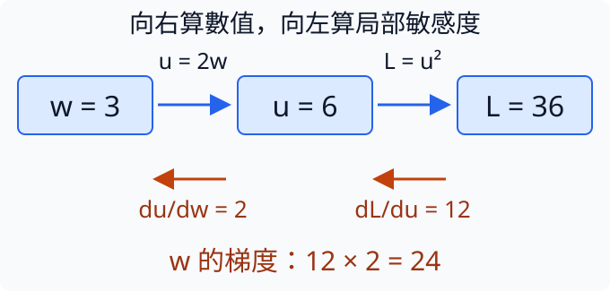

## 1.10 影響怎麼穿過多個運算？

[1.9](#1.9) 用一個旋鈕直接算代價。真實模型卻會先查表、再混合數字、最後才得到代價；參數的影響怎樣穿過中間步驟？想像水龍頭旋鈕增加一格，流量增加兩單位，而每增加一單位流量，裝滿水桶的成本又增加十二單位。旋鈕的一格影響最後成本就是 `2×12=24`，不是把兩段影響相加。

我們用兩段運算精確追蹤這件事：先令 `u=2*w`，再令 `loss=u²`。目前 w=3，u=6，代價為 36。第一段對 w 的敏感度是 2，第二段在 u=6 附近對 u 的敏感度是 `2*u=12`。若 w 微增 0.001，u 微增 0.002；代價約增加 `12×0.002=0.024`。所以相對於 w，總代價的敏感度是 `0.024/0.001≈24`。

把相連步驟的區域性敏感度相乘，叫鏈式法則（chain rule）。用符號寫就是 `dL/dw = (dL/du) × (du/dw)`：L 是最後的 loss，`dL/du` 問 u 微動會讓 L 改多少，`du/dw` 問 w 微動讓 u 改多少。不是另一種神秘公式，只是把「每單位」從 u 換回 w。這裡用平方代價方便手算，並非所有模型代價都是平方。

```python
import torch

w = torch.tensor(3.0, requires_grad=True)
u = 2 * w
loss = u.square()
loss.backward()
print("中間值", u.item(), "代價", loss.item())
print("兩段敏感度", 2 * u.detach().item(), 2)
print("合成梯度", w.grad.item())
assert w.grad.item() == 24
```

`import torch` 載入 PyTorch 這個數值計算工具庫，後面的 `torch.` 便是在使用它提供的工具。`torch.tensor(3.0, ...)` 建立一個數值容器，叫 tensor（張量）；本例只在裡面放一個數字 3。用這個容器，PyTorch 才能替接下來的計算保存求導關係，普通的 Python 數字本身沒有這份記錄。`requires_grad=True` 要求記錄和 w 有關的運算。`u = 2 * w` 和 `loss = u.square()` 依序產生 u=6、loss=36，這一方向叫前向計算（forward）。

`backward()` 再沿運算關係反方向求導，最後把 24 放在 `w.grad`。`.item()` 從只有一個數字的 tensor 中取出那個普通數字，供 `print` 顯示，所以第一次列印看到中間值 6 與代價 36。第二次列印手算兩段敏感度 12 與 2，第三次列印自動算出的梯度 24，可以親眼核對乘積是否相同。最後的 `assert` 是檢查：`==` 比較兩邊是否相等，和用來設定變數的單一 `=` 不同。相等時它不印任何東西；不相等時會報 `AssertionError` 並停止程式。因此正常執行只有三次列印的輸出。

`.detach()` 表示拿出一份不再追蹤求導關係的數值，用來顯示手算結果，沒有改變 w 或 u。PyTorch 的自動求導系統叫 autograd；它在前向時記住哪些運算連在一起，這份關係叫計算圖（computational graph）。`backward` 使用各工具已知道的區域性求導規則沿圖傳回，並不是從程式文字猜公式。若一個參數走兩條路影響同個代價，兩條路算出的影響還要相加，因為兩路同時受到那個參數的改變。

這個例子中梯度為正，只說明當前附近增加 w 會增加代價。程式沒有更新參數，跟 [1.9](#1.9) 一樣仍在測敏感度。後面真正的模型雖有更多步驟，也遵守相同的追蹤方式。

下圖上方藍箭頭跟著程式前向走：w=3乘2得到u=6，再平方得到L=36。下方橘箭頭反方向讀，先從L回到u得到敏感度12，再從u回到w乘敏感度2；底部24才是對w的總梯度。箭頭方向區分算數值和算影響，沒有把數值36當成梯度。



練習把 `u = 2 * w` 改成 `u = 3 * w`，把列印「兩段敏感度」那行最後的常數 `2` 改成 `3`，並把最後檢查中的 `24` 改成你算出的梯度。列印行是在顯示手算結果，不會自動讀取前面的倍率，所以也要一起修改。先算 w=3 時 u=9、兩段敏感度為 18 和 3，合成應為 54，代價為 81，所以檢查應改成 `assert w.grad.item() == 54`。執行核對這些數；若只把舊梯度 24 乘 1.5 會得到 36，那是忘記第二段也因 u 的位置改變了。

