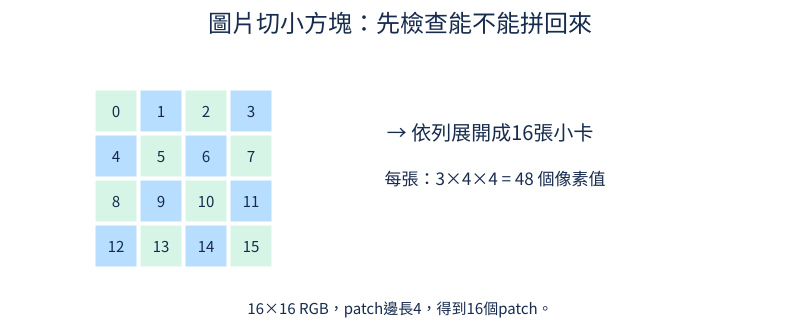

## 10.2 圖片怎麼切成序列？

文字可以依讀取順序排成一串，但圖片有上下左右兩個方向。把整張圖攤平會使序列很長，因此先切成小方塊，再讓每個小方塊成為一個位置。小方塊英文叫patch。本節先說清楚採用的切法與順序，再檢查切塊與拼回兩個工具是否能一致往返。

前置是[10.1的批次與RGB軸](10.md#10.1)。16×16的圖，用邊長4的patch切割，每列有16/4=4塊，共4×4=16塊。每塊包含3個通道、4列、4行，即3×4×4=48個數字。文字模型把文字切成輸入單位，稱為token，例如一個字或一小段文字；這裡一個序列位置則是一整塊圖片。48是這塊內的像素數值數量，不是48個文字token。

圖中0到15標示patch的讀取順序：第一列從左到右為0、1、2、3，下一列從4開始。箭頭「依列展開」表示把16塊排成一串，右邊的48說明每塊仍保存其全部RGB像素。這樣順序與空間位置才有可核對的對應。



```python
import torch
from tiny_perceptron.multimodal import scene, patchify, unpatchify

image = scene()[None]
patches = patchify(image, 4)
restored = unpatchify(patches, 3, 16, 16, 4)
print("小塊序列", tuple(patches.shape))
print("拼回相同", torch.equal(image, restored))
```

輸入`scene()`預設紅方塊，`[None]`與上一節的`unsqueeze(0)`一樣增加一張圖的批次軸。`patchify`按上述順序切塊並攤平每塊，輸出`(1,16,48)`：1張圖、16個位置、每位置48數字。`unpatchify`是反向工具，需要告知通道3、高寬16、邊長4，才能把一串位置放回正確格子。

`torch.equal`逐一比較原圖與重建圖，輸出`True`。它比只看形狀多確認了一件事：這次往返後沒有像素值遺失或改變。但它不能單獨證明中間序列遵守圖示的排序。例如切塊時把RGB倒過來，拼回時又倒回去，仍能得到`True`；兩個工具互相配合，卻用了另一種通道約定。要驗證特定順序，還需要直接核對已知位置和通道在序列中的內容。

可以用一個更小的紙上例子記住順序：2×2張卡片，左上寫a、右上b、左下c、右下d，依列展開就是[a,b,c,d]，不是[a,c,b,d]。直接看第二個位置是不是右上的b，就能核對這個排列約定；若切時依欄讀、拼時也依欄放，[a,c,b,d]仍能拼回原圖，往返成功不會揭露兩者的差別。真圖片每張卡內還有48個像素值，同樣要保持通道與格子順序。若只隨意攤平，雖然數字總數仍768，也可能把「整張圖的紅通道」當成第一張小卡內容，形狀數值看起來合理但不再描述相同區域。切塊工具封裝這種排列約定；圖與卡片例子說明它，重建檢查則核對兩個工具是否相容。

練習只把patch邊長改8，兩處工具參數都要改。先算每列2塊，共4塊；每塊3×8×8=192個數字，再跑核對形狀`(1,4,192)`與相同`True`。小塊變大後位置變少，但沒有憑空丟像素；之後把每塊壓成短特徵時，才涉及學習如何保留有用資訊。

