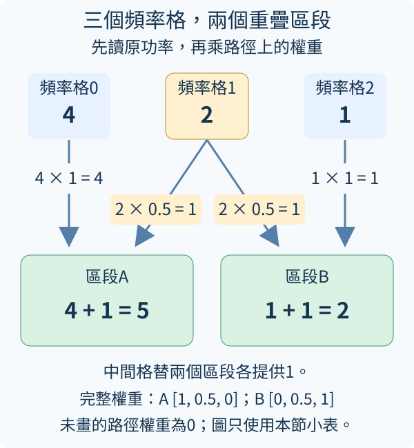

## 12.6 怎麼組合頻率區段？

每框有201個頻率格，後續文字模型接收的是每框一排數字特徵，不一定需要逐格保留這201項；這裡稱兩者銜接處為語言接口。我們可以用幾組重疊權重，把附近頻率加權合成16個區段。區段不像簡單每十格一組：低頻分得較細、高頻分得較粗，這種尺度叫mel。它反映一種聽覺頻率刻度選擇，但仍是固定前處理，不是已經訓練好的語音理解。

前置是[12.5頻率格與功率](12.md#12.5)和[W.5加權矩陣](../first-steps.md#W.5)。濾波器組filter bank是一張權重表，每一橫排負責一個頻率區段，每一欄對應一個原始頻率格。本項目採用三角權重：接近區段中心權重較大，向兩側降到0，相鄰區段可以同時收到同一頻率的貢獻。

```python
import torch
from tiny_perceptron.multimodal import mel_filter_bank

bank = mel_filter_bank(bands=16)
power = torch.ones(201, 3)
mel_power = bank @ power
print("權重表", tuple(bank.shape))
print("合成後", tuple(mel_power.shape))
print("權重非負", bool((bank >= 0).all()))
```

輸入bank使用預設16kHz、n_fft400，因此原頻率格201；power造三框全1功率，便於只觀察維度變換。`bank @ power`用(16,201)乘(201,3)，輸出(16,3)。第一行權重表(16,201)，第二行16區段、3時間框，最後True。區段數改變的是頻率軸，不會讓時間框數加倍。

mel刻度常寫為mel(f)=2595×log10(1+f/700)，f是Hz。log10是以10為底的對數，回答「10的幾次方會得到這個數」；例如log10(1)=0、log10(10)=1、log10(100)=2。f=700時，括號裡是2，log10(2)約0.30103，再乘2595得到約781.17mel。

可以把0、700、2100Hz代入同一公式：括號裡依序是1、2、4，log10(4)約0.60206，得到約0、781.17、1562.34mel。三個mel點的間距相同，對應的Hz間距卻是700、1400，讓你看見高頻的Hz間距較大。這三點只是示意；正式16區段的中心由工具按範圍安排。公式的意義是決定區段中心如何排布，不是給每個格一個模型預測標籤。這裡權重也不是每行必然加總1，不能預設輸出是簡單平均能量。

合並之後會失去一部分細頻率差異，例如落在同一區段的兩個很接近單音可能更難分。是否足夠，要看任務；區分高低音或識別語音需要的細節不同。設置應記錄bands、取樣率與n_fft，和訓練資料保持一致。

三角加權可以用三格頻率、兩組區段的小表想像：第一組權重[1,0.5,0]，第二組[0,0.5,1]，原功率[4,2,1]。第一輸出4+1=5，第二輸出1+1=2；中間格2同時給兩組各貢獻1。這是重疊區段，不是必須互斥的分類。真實bank有16橫排、201欄，矩陣乘法一次完成相同的逐格乘加。功率表有三欄時間框時，同一張權重表各用一次，故輸出仍三框；若把表轉錯軸，結果會不匹配，而不是聲音變得更長。

下圖只畫這張三格小表。箭頭標的是「原功率乘這條路徑的權重」：中間格2沿兩條0.5路徑，給A與B各1；左格4只給A，右格1只給B，最後得到5與2。權重為0的路徑沒有畫出。這個示意不表示真實濾波器組的全部區段一定保持功率總和；還要按實際權重計算。



練習只把bands改32，先預測權重表(32,201)、輸出(32,3)，時間框仍3，再執行核對。區段變多不等於原始錄音多了資訊，只是用更細的表示保留原本頻譜的部分差異。

