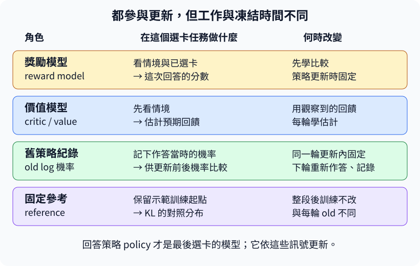

## 13.14 誰在估計這題平常能拿多少分？

[13.11](#13.11)先人工填了一個0.4基準。但題目難度不同，不能永遠靠我們猜同一個數。可以另教一個模型：看到這道題的情境，先估計目前策略作答後大概能拿多少分。它叫**value model，價值模型**，也常叫critic。這位估計員與[13.10](#13.10)的獎勵評分員，工作不同；更新前後的機率比較則先讀[13.12](#13.12)。

獎勵模型看到情境和已選回答，評這次回答；價值模型在這個小任務只看情境，估計尚未選卡前的平均結果。價值模型預測0.4，這次實際拿1分，就用兩者差距教它更新；平方誤差`(預測−目標)²`會讓估計向觀察到的分數靠近。它需要多次、不同卡的樣本，才可能估計好平均，不是看一個1就認定以後都拿1。

```python
import torch
from tiny_perceptron.posttraining import exact_kl

value = torch.tensor([0.4], requires_grad=True)
target = torch.tensor([1.0])
value_loss = (value - target).square().mean()
value_loss.backward()
print("估計員代價與梯度", round(value_loss.item(), 4), round(value.grad.item(), 4))

policy_logits = torch.tensor([[0.8, 0.2]]).log()
reference_logits = torch.tensor([[0.5, 0.5]]).log()
print("相對固定參考的KL", round(exact_kl(policy_logits, reference_logits).item(), 4))
```

前半輸入預測0.4與目標1，輸出代價0.36、梯度−1.2。梯度下降會增加value，朝這次目標靠近。後半則是另一種檢查：目前選擇分布為0.8、0.2，固定參考為0.5、0.5。`exact_kl`接收兩套候選分數，再用softmax轉成機率；它不是直接接收機率。程式先對指定機率取`.log()`，因為softmax作用在這些log機率上，會還原原來的分布。

**KL**是衡量兩個分布偏離的量。令`p`是目前策略、`q`是固定參考，這裡算的方向是`KL(p||q)`：每張卡算`p_i × log(p_i/q_i)`，再把所有卡的結果加起來，`i`表示卡的編號。這次就是`0.8 × log(0.8/0.5) + 0.2 × log(0.2/0.5)`，約0.1927；兩者相同時每項的log比值都是0，KL也為0。這裡只有兩張卡，可以把全部選項加完，沒有用一張抽樣回答假裝算到完整KL。

參考約束通常把這個偏離量乘上一個係數，作為額外代價：很高的獎勵值得不值得付出很大的偏移，需要一起考慮。[DPO論文第3節公式3](https://arxiv.org/pdf/2305.18290v3)呈現了「偏好獎勵−相對參考的KL代價」這個目標。本章PPO小實驗的KL另外加入策略代價，價值模型仍估計獎勵模型分數；這是明確的有限選項配方，不等同所有LLM都採同一種逐token回饋。

下面的圖把四種角色放在不同時間線：評分員先學比較，之後固定；critic每輪學估計；old記這輪收集時的機率，下一輪換新的；reference保留後訓練起點，整段不動。策略模型才是最後拿來選回答的模型。評分員與critic即使能從相同底座開始，也不因為同樣叫「模型」就可以交換职責。



本章小實驗為四個小網路，不是同時载入四個大型LLM。真正多步任務的critic可以估計後續回饋，PPO原論文[第5節與演算法1](https://arxiv.org/pdf/1707.06347)另外處理那種情況。這裡一次選卡就結束，不需要把尚未教過的多步公式全部塞進來。

練習將value改成1.4，先預測平方代價0.16、梯度+0.8，下降更新會降低估計，再執行核對。接著把policy分布也改成0.5、0.5，KL應成0；這兩個改動各自檢查估計員與參考約束，並沒有真的更新回答策略。

