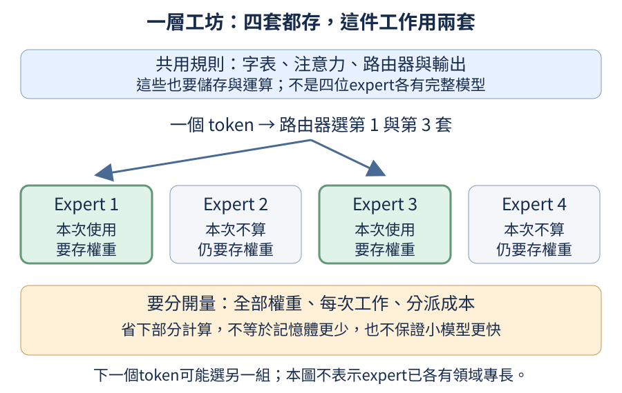

## 19.2 為什麼成品選 MoE，卻仍保留 Dense 路線？

如果學生的電腦比較弱，多放幾位expert、每次只叫少數人工作，是否一定比一個Dense模型好跑？可以把它想成一間有四套工作臺的工坊：一件工作只用其中兩套，確實沒有用完四套；但四套設備仍要有地方存放，分派工作也需要時間。MoE讓儲存容量與每個token使用的規則不再綁在一起，並沒有自動免除儲存成本。

前置是[expert如何獨立儲存](15.md#15.2)、[total與active的差別](15.md#15.10)與[小矩陣的分派成本](15.md#15.11)。Dense在這裡指每個位置使用同一組完整前饋網路；MoE則準備多組前饋網路，每個位置選兩組。位置處理的單位叫token，本成品沿用byte tokenizer，中文的一個字往往佔好幾個byte位置，不要把192個位置讀成192個中文字。

本成品採兩層、每位置64項特徵、每層四位expert且選兩位；另外共用字表、注意力與輸出規則。選它是為了讓你把已學過的MoE放進一個可操作成品，也延續我們想觀察多套規則如何共同學習的方向。實際是否比Dense更好、更快，需要另量。本課先前在L4上的單種子短訓，top-2 MoE更新中位27.24毫秒，近似每token啟用參數量的Dense為11.96毫秒；這個可讀Python分派實作當次反而慢約2.28倍，詳見[15.13](15.md#15.13)。



```python
from tiny_perceptron.capstone import CapstoneModel, default_config

for dense in (False, True):
    model = CapstoneModel(default_config(dense=dense))
    report = model.description()
    total = report["parameters"]
    print("Dense" if dense else "MoE", "全部參數", total)
    print("邏輯active參數", report["logical_active_parameters"], "FP32權重bytes", total * 4)
```

程式建立兩個尚未訓練的模型，`description`實際數每張參數表的元素。邏輯active數是「共享部分加被選expert」的結構代理，不是精確浮點運算次數，也不是只需存那些數字。FP32是每個浮點數佔4 bytes的格式，所以最後一欄乘4；它尚未包括更新器狀態、梯度、中間特徵、檔案容器與框架本身。

[Mixtral原論文第3節的成本討論](https://arxiv.org/pdf/2401.04088)明說服務記憶體隨總參數增加，路由與單裝置多expert也會增加成本。大型系統可以分散儲存並使用專門運算核心，本章的單機小模型沒有重現那些系統。數出不同參數量的兩個模型，只是在建立取捨基準，沒有控制成等FLOPs比較；FLOPs指實際浮點運算次數。

這份主配方實際有328,128個參數，邏輯active代理195,776個，FP32權重數字1,312,512 bytes；相同寬度、層數的Dense是129,088個參數。這個Dense每層只用一組FFN，MoE每個位置用兩組，所以並不是等active參數或等計算量比較。本成品的字表與輸出表各自儲存，沒有把兩張表綁成同一份權重。正式檔案還有格式資訊，大小需另外量。

訓練時還要看工作是否全部擠向少數expert。[Switch Transformer第2.2節（第6頁）](https://jmlr.org/papers/volume23/21-0998/21-0998.pdf)使用可微分的輔助誤差鼓勵較均衡分派；本成品也記錄這項負載平衡誤差，並排除補齊長度的PAD位置。它是在調整工坊的工作分配，不是替每位expert指定「看圖」或「算數」專業。

本輪也對這個成品量了分派成本。在同一張NVIDIA L4、FP32與同一批24筆、94個位置的資料上，先暖機3次，再量10次前向與反向計算的中位時間；不做更新器更新，權重前後不變。

| 機制對照 | 總參數／邏輯active代理 | 前向＋反向中位時間 | 相對起點增加的GPU分配bytes峰值 |
| --- | --- | --- | --- |
| 已訓練的主MoE | 328,128／195,776 | 21.464毫秒 | 80,174,592 |
| 寬度80的隨機Dense | 189,520／189,520 | 11.338毫秒 | 38,589,952 |

這個Dense的邏輯active數與MoE接近，並沒有等FLOPs或等品質；它也沒有完成同樣訓練，因此只能比較這次計算機制，不能說它能力相同。MoE這次反而較慢，GPU額外分配也較高。最後一欄只量PyTorch分配器相對測量起點增加的峰值，不含整張卡、驅動或所有常駐模型，不能拿來當學生電腦的最低記憶體需求。[完整機制實報](https://github.com/birdhackor/tiny-perceptron-vlm/blob/1df335318bda03fd771807f66976953231d5a00b/docs/course-experiments/capstone-evidence/deployment/mechanism-benchmark.json)保留每次時間、暖機與記憶體範圍。主權重數字仍需1,312,512 bytes；實際存檔與較小包裝另見[19.10](19.md#19.10)。

練習把最後一欄改成`total * 16`，先想它增加了哪三份FP32數字：一份梯度、兩份Adam更新器狀態。這仍只是常見全量訓練的數值儲存粗估，不是執行中整個程序的記憶體實測。若你的限制是記憶體，較小Dense或[19.10](19.md#19.10)的學生部署選項可能比增添experts更直接。

