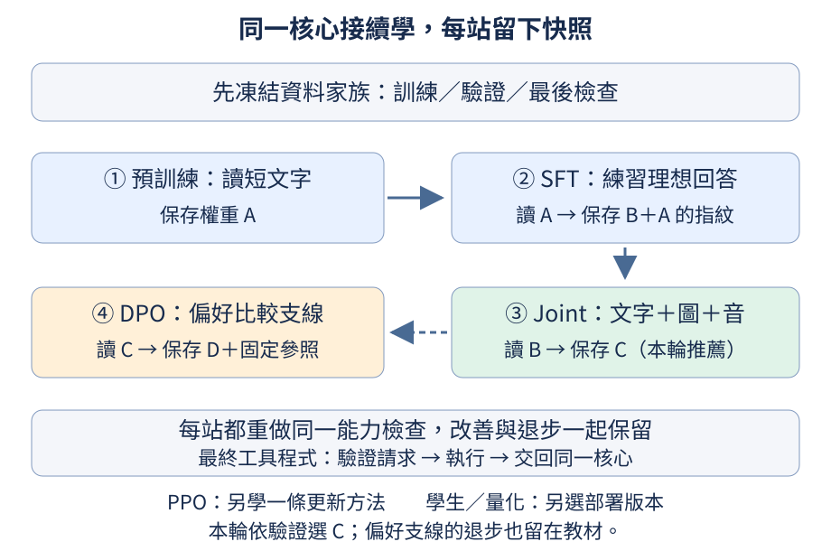

## 19.4 怎麼確認下一階段真的接著上一階段學？

一位學生讀完課文再練習回答，和另一位學生直接練習回答，都可能得到好看的結果。但若我們想研究「讀書後再練習」這條路，就必須確認練習的人確實是剛讀完的那位。整合模型也是如此：各章獨立實驗的權重不能因為檔名都叫`model.pt`，就被當成同一個成品接續長大。

前置是[為何分預訓練與後訓練](07.md#7.17)、[只學回答位置](07.md#7.3)、[儲存訓練狀態](05.md#5.7)與[本成品的Dense／MoE選擇](19.md#19.2)；偏好分支的兩份模型角色另見[後訓練角色地圖](13.md#13.17)。checkpoint是某一時刻的權重及相關狀態快照。本成品固定架構與tokenizer，先pretrain，再載入那份權重做SFT；後面的模態與偏好階段，也儲存自己讀進來的父檔案指紋。指紋是從檔案bytes算出的摘要，用來辨認實際讀的是哪一份檔案，不是替模型加能力。



先從一筆資料看兩種教法的差別。下面只建立隨機Dense模型並各計一次誤差，不執行完整成品訓練。Dense示範每層只有一組前饋規則；正式成品則用MoE的多組expert與路由。短程式省去分派，是為了只看「哪些位置要學」，不能把它的模型誤當正式MoE權重。

`build_dataset()`依固定規則產生資料，回傳`splits`與資料清單manifest；`splits["train"]`是訓練記錄串列，`_`表示此處暫不使用第二個回傳值。每筆記錄用`task`標任務、`user`放問題、`answer`放示範回答。`next(...)`取第一筆`style`記錄，下面也印出那筆問答，讓你能知道誤差在量什麼。

```python
import torch

from tiny_perceptron.capstone import CapstoneModel, build_dataset, default_config, prepare_batch
from tiny_perceptron.data import IGNORE
from tiny_perceptron.model import masked_loss

torch.manual_seed(42)
splits, _ = build_dataset()
row = next(row for row in splits["train"] if row["task"] == "style")
print("問題", row["user"], "示範回答", row["answer"])
model = CapstoneModel(default_config(dense=True))
for pretrain in (True, False):
    batch, labels = prepare_batch([row], pretrain=pretrain)
    result = model(**batch)
    loss = masked_loss(result["logits"], labels)
    print("預訓練" if pretrain else "SFT", "有效目標", int((labels != IGNORE).sum()), "誤差有限", bool(loss.isfinite()))
```

本例問題是「照抄數字29，只要答案。」，示範是`DIRECT:29`。`prepare_batch`把它轉成模型輸入字典`batch`與下一位置的目標編號`labels`；`**batch`將字典各欄展開成模型的具名參數，例如輸入編號`ids`。`result["logits"]`是每個位置對候選編號的分數，`masked_loss`只計沒有被忽略的位置。

預訓練版本把短文字裡每個下一byte都當目標；SFT版本提供對話前文，只把回答及結束編號當目標，因此本例的有效目標數分別是43與10。IGNORE是「這個位置不計回答誤差」的標記，不是從模型視野刪掉前文。兩行應印出有限誤差，這只證明資料與計分接得上，不表示預訓練更有效，也不比較兩種不同目標的loss高低。

本小世界的預訓練材料把訓練家族的題目與標準回答接成短文字，不放對話角色，逐個下一byte學習。它沒有讀完大型網路語料，也不是用兩套全然不同內容來證明預訓練的好處；這輪主要演示同一個模型如何接續改變學習目標。正式流程每站會另測同一份能力矩陣，讓我們知道哪一站改善了哪項能力、又傷到哪項。

這條接續訓練的第一站已經跑完。使用資料版本`capstone-small-world-v2`、固定種子42與NVIDIA L4，預訓練完成全部300次更新，累計學了364,409個下一byte或結束編號目標。這個數字包含抽樣重複看到的位置，不是364,409篇不同文章。訓練目標除了文字的交叉熵誤差，也包含係數0.01的路由平衡項，避免少數專家獨占工作。下面的「首段完整吻合」要求完整動作字串、內容或參數與EOS都符合預期，不是只分對回答類型；使用工具的整題正確還需讀回後的回答正確。

| 第一站的紀錄 | 實測結果 | 該怎麼讀 |
| --- | --- | --- |
| 訓練更新 | 300／300次 | 預定步數全部完成 |
| 訓練迴圈時間 | 7.085秒 | GPU同步計時，包含每100步儲存本地快照 |
| 整個實驗時間 | 12.358秒 | 包含訓練、驗證與本地存檔；不含環境啟動、映像建置或Hugging Face上傳 |
| 驗證首段完整吻合／整題正確 | 0／84、0／84 | 這時還沒有學對話角色與助理作答協定 |

為什麼讀過文字卻一題也沒答對？像把題目和答案讀熟，還沒有練習「老師問完後，輪到我用指定格式回答」。驗證用的是成品的對話輸入與動作協定；這站學的卻是不帶角色的文字續寫。例如驗證題「4+4等於多少？」得到`多4孔。算回算23`，並沒有產生計算器動作。這是實際失敗，不能把0／84解讀成所有文字續寫能力都等於零；也不能因為訓練誤差降低，就說已經得到會對話的助理。這站沒有開啟最後90題檢查，後續才用它評估定版成品。

第一站從隨機權重開始，因此父檔案指紋是空值。它輸出的`model.pt`是1,344,959 bytes，SHA-256指紋以`2300e45f`開頭、以`49efae2f`結尾；完整指紋與條件記在[預訓練實報](https://github.com/birdhackor/tiny-perceptron-vlm/blob/1df335318bda03fd771807f66976953231d5a00b/docs/course-experiments/results/capstone_pretrain.json)，84題原始輸出保留在[逐題驗證檔](https://github.com/birdhackor/tiny-perceptron-vlm/blob/1df335318bda03fd771807f66976953231d5a00b/docs/course-experiments/capstone-evidence/pretrain/validation.json)。下一站應載入這份權重，再把它的完整指紋寫入父檔案欄位。若要恢復更新器等訓練狀態，另有`model-training.pt`；推論檔與完整續訓檔不是同一用途。

第二站SFT也已完成，而且父檔案指紋完整吻合上方的預訓練推論檔，不是另造一個隨機模型。同一資料版本、同一架構與種子42，在NVIDIA L4完成1,400／1,400次更新，累計647,067個回答位置的下一byte或結束編號目標。這站只練文字任務，誤差是回答位置的交叉熵，加上同樣係數0.01的路由平衡項。訓練迴圈為40.013秒，整個實驗為46.040秒；兩種計時的範圍與上表相同。

驗證首段完整吻合與整題正確都變成42／84。拆開才看得懂這個分數：42題文字任務全部正確；42題圖片、音訊與圖音聯合任務全部錯誤，因為還沒練這些素材。這不是「所有能力都有一半機率成功」，更不是通用能力分數。下一站要新增模態能力，也要檢查文字能力有沒有退步。

SFT輸出的推論檔是1,345,023 bytes，指紋以`c35427bc`開頭、以`3e2aaba7`結尾。[SFT實報](https://github.com/birdhackor/tiny-perceptron-vlm/blob/1df335318bda03fd771807f66976953231d5a00b/docs/course-experiments/results/capstone_sft.json)記錄完整父子指紋與計時，[逐題驗證檔](https://github.com/birdhackor/tiny-perceptron-vlm/blob/1df335318bda03fd771807f66976953231d5a00b/docs/course-experiments/capstone-evidence/sft/validation.json)保留成功與失敗原文。最後90題檢查仍未開啟；這裡報告的是逐站驗證，不是定版後的最後成績。

第三站joint把圖片、聲音與文字示範一起練，已完成600／600次更新，累計249,100個回答位置的下一byte或結束編號目標。它載入的父檔案指紋完整吻合SFT輸出；資料仍是`capstone-small-world-v2`，誤差仍是回答交叉熵加係數0.01的路由平衡項。NVIDIA L4上的訓練迴圈為25.750秒，整個實驗為31.878秒，計時範圍與前兩站相同。

這站驗證首段完整吻合與整題正確都是75／84：文字保留42／42，模態任務33／42。失敗的9題全部是圖片形狀，19.6會拆開看，不能把總分升高說成每項能力都已學會。推論檔是1,345,023 bytes，指紋以`8f7e8582`開頭、以`bd7c3b47`結尾；[joint實報](https://github.com/birdhackor/tiny-perceptron-vlm/blob/1df335318bda03fd771807f66976953231d5a00b/docs/course-experiments/results/capstone_joint.json)與[逐題驗證檔](https://github.com/birdhackor/tiny-perceptron-vlm/blob/1df335318bda03fd771807f66976953231d5a00b/docs/course-experiments/capstone-evidence/joint/validation.json)保留完整證據。最後90題檢查仍未開啟。

第四站是從joint接出的DPO比較分支，完成100／100次更新，父檔案指紋完整吻合joint輸出。這一站有正在更新的policy，以及從joint複製、保持固定的reference作為比較基準。它的訓練迴圈是11.894秒，整個實驗是17.736秒，計時範圍與前面相同。報告的41,403個有效目標只計重新練習示範回答的交叉熵位置，沒有把這兩份模型評分偏好回答的位置一起算進去，不能用它除時間來代表整個DPO的處理速度。

DPO分支驗證變成71／84，低於joint的75／84。推論檔仍是1,345,023 bytes，指紋以`b2428be8`開頭、以`26396b1f`結尾；[DPO實報](https://github.com/birdhackor/tiny-perceptron-vlm/blob/1df335318bda03fd771807f66976953231d5a00b/docs/course-experiments/results/capstone_preference.json)與[逐題驗證檔](https://github.com/birdhackor/tiny-perceptron-vlm/blob/1df335318bda03fd771807f66976953231d5a00b/docs/course-experiments/capstone-evidence/dpo/validation.json)保留這條真正跑過的分支。19.8會說明為什麼本輪推薦joint，而不是無條件採用最後更新過的檔案；選擇時仍未開啟最後90題檢查。

練習將選取`row`那行的`"style"`改成`"concept"`。固定資料下，問題會是「用3和6說明加法。」，示範是`DIRECT:把兩個數合起來`；先預測目標數會變長，再核對預訓練53個、SFT29個，誤差仍有限。較長回答增加有效目標，但合併批次仍應把有效位置的誤差相加，再除以有效位置總數，不能讓補齊的空格影響分母，詳見[5.2的長短答案算例](05.md#5.2)。

