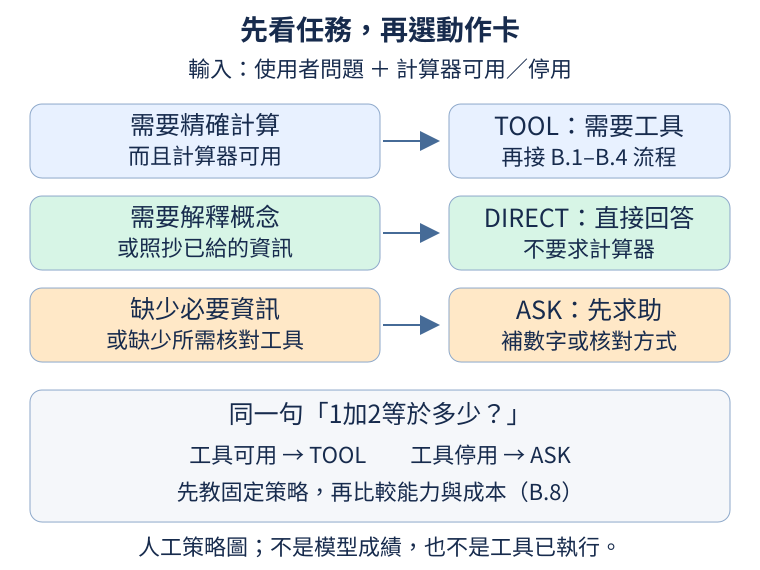

## B.5 同樣有數字，何時需要計算器？

學生知道1加2等於3，老師仍可能要求計算題用計算器，留下可核對的結果；但問「加法是什麼」，拿出計算器反而沒有解釋概念。同樣出現數字或「加」字，眼前要完成的工作卻不同。本節先訂一個明確的工作習慣：需要精確數值時使用可用的計算器，需要說明或照抄已給的資訊時直接回答，缺少必要資訊時先詢問。

前置是[B.3工具真的執行與回填](0B.md#B.3)和[B.4完成信號](0B.md#B.4)。直接回答也仍然是在產生文字；使用工具時，模型先產生的是請求文字。「預測下一個token」描述輸出的方式，token是[第6章的文字單位](06.md#6.1)，並不代表模型內部不能學到計算步驟。這裡改變的是下一段文字要做什麼，而不是替模型加上人類的自我意識。

先約定三張動作卡。DIRECT表示直接回答；TOOL表示接下來需要工具；ASK表示先向使用者求助。在資料不足時，求助是問缺少的數字；若任務要求可核對的精確計算，計算器卻停用，求助可以是請使用者啟用工具或提供其他核對方式。三個英文名稱只是程式方便辨認的固定標記，不是給使用者看的回答。

| 使用者問題 | 本例的條件 | 適合的動作 |
| --- | --- | --- |
| 1加2等於多少？ | 計算器可用，要求精確數值 | TOOL |
| 請解釋加法的意思。 | 問概念 | DIRECT |
| 請原樣回答數字3。 | 答案已經提供 | DIRECT |
| 請算總價。 | 尚缺單價與數量 | ASK |
| 1加2等於多少？ | 計算器停用，仍要求可核對計算 | ASK |

這是我們選定的教學策略，不是數學題永遠只能用工具的規定。對某個已可靠掌握的小任務，直接回答也可能更省時間；[B.8](0B.md#B.8)才會比較這個取捨。現在先用固定策略，避免同時要求初學者判斷能力、等待成本和資料是否齊全。

下圖的三條路都從同一份問題與工具狀態出發。綠色是直接回應，藍色是送往[B.1–B.4](0B.md#B.1)的工具流程，橘色是先補齊資訊或核對方式。箭頭表示可選的路，不代表目前已有一個模型能選對；接下來的程式也只是人工標註。



```python
examples = [
    {"question": "1加2等於多少？", "calculator": True, "action": "TOOL"},
    {"question": "請解釋加法的意思。", "calculator": True, "action": "DIRECT"},
    {"question": "請原樣回答數字3。", "calculator": True, "action": "DIRECT"},
    {"question": "請算總價。", "calculator": True, "action": "ASK"},
    {"question": "1加2等於多少？", "calculator": False, "action": "ASK"},
]
for row in examples:
    print(row["question"], "計算器可用", row["calculator"], "→", row["action"])
```

輸入是五筆由我們寫好的標註，沒有載入或更新模型。每筆字典的question保存問題，action是期望動作。calculator只有True或False兩種值：True表示計算器可用，False表示停用；這種只表示「是／否」的值叫布林值。字典、清單與迴圈可回看[W.2](../first-steps.md#W.2)。輸出依序為TOOL、DIRECT、DIRECT、ASK、ASK。第一筆與最後一筆問題相同，只換了工具狀態，合適動作便改變；第二筆有「加」字，仍不需要算兩個數字。因此不能只靠找到關鍵字就宣布完成任務判斷。

練習只把第一筆calculator改成False，先預測原本action=TOOL會違反這份策略，再執行觀察。程式仍會印TOOL，因為它只讀出我們填的標註，沒有自動重標。將action改成ASK後再核對，並用自己的話說明求助的原因：這次不是缺數字，而是缺少策略要求的核對方式。

