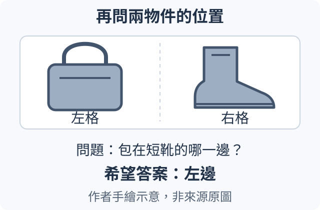

## 11.17 有限物件與短字詞，如何做成可學的看圖問答？

先看下圖的一個包，問題是「圖片裡是什麼？」我們希望答案只有「包」。如果材料再加上一隻短靴，問題改成「包在短靴的哪一邊？」，希望答案就變成「左邊」。物件名稱沒有變，但第二題還需要位置。設計小型看圖助手，先要說清楚這種材料、問題與答案的對應。

可以用 Fashion-MNIST 的褲子、包、短靴三類商品圖來設計這個有限任務。它們是小幅灰階影像，所以這一步先問類別，不問衣服顏色、材質或使用者穿起來是否合適。範圍小，才能讓「答對」有清楚的意思。

單物件題需要保留能分辨類別的輪廓與局部形狀。圖片入口把像素轉成一列數字特徵，接頭再把這些特徵接成文字核心可以使用的輸入位置；文字核心同時讀到問題，生成「包」。這些數字不是老師先寫好的物件名稱，而是由可調參數算出來的表示。主線中的圖片入口、接頭與文字核心都要自行訓練。

現在只增加一個變化：把包和短靴放在同一張關係圖，包在左，短靴在右。

可以把兩張來源商品圖放進固定格位，製成自己的關係場景。讀「包在短靴哪一邊」時，核心需要把物件特徵和所在格位一起使用。如果入口只留下「有包、有短靴」，交換左右之後仍得到相同摘要，就不夠回答這一題。這正接續前面整張圖的關係：留下哪些資訊，要由問題決定。

教這個任務時，可以提供圖片、問題及正確短答，讓模型把預測和答案比較，再更新參數。推論時則只提供圖片與問題。若程式把「包在左」直接附在問題後面，模型讀到的是答案線索，不能拿來說明它會看圖。

檢查時也要沿用同一個變化。先把兩個物件對調，原問題的希望答案應改成「右邊」；再保留原圖，改問「短靴在包的哪一邊？」，希望答案仍是「右邊」。前一題看是否使用位置，後一題看是否使用問題裡的物件次序。只會對所有圖回答「左邊」，即使碰巧答對第一圖，也沒有完成關係問答。

還要換成訓練時未使用的原始商品影像。同一個包的裁切、縮放或不同配對，都屬於同一素材家族，不能一部分放訓練、一部分放測試，然後宣稱能認出陌生商品。

中文字也可以採相同的安排：先限定字表、短詞與答案形式，再決定入口必須保留哪些筆畫。下一節用真正可見的「入口／出口」字卡，單獨處理「指定哪一區」與「讀出哪些字」，不把物件分類、關係判斷和讀字混成同一項成績。

材料來源與前文連結

Fashion-MNIST 的[官方 README](https://github.com/zalandoresearch/fashion-mnist/blob/b2617bb6d3ffa2e429640350f613e3291e10b141/README.md)說明 28×28 灰階商品圖及各類名稱，[LICENSE](https://github.com/zalandoresearch/fashion-mnist/blob/b2617bb6d3ffa2e429640350f613e3291e10b141/LICENSE)明列 MIT 授權。使用或散佈來源影像時需保留相應聲明。本節插圖由作者繪製，沒有取用該資料集的影像；希望答案為人工指定的設計例，不是模型執行結果。

前文的[11.14](../../../course/chapters/11.md#11.14)已說明平均摘要可能丟掉左右資訊；本節把它接到有限商品與關係問題。[主線來源筆記](../sources/selftrained-capstone.md)另記錄範圍與資料分組條件。

