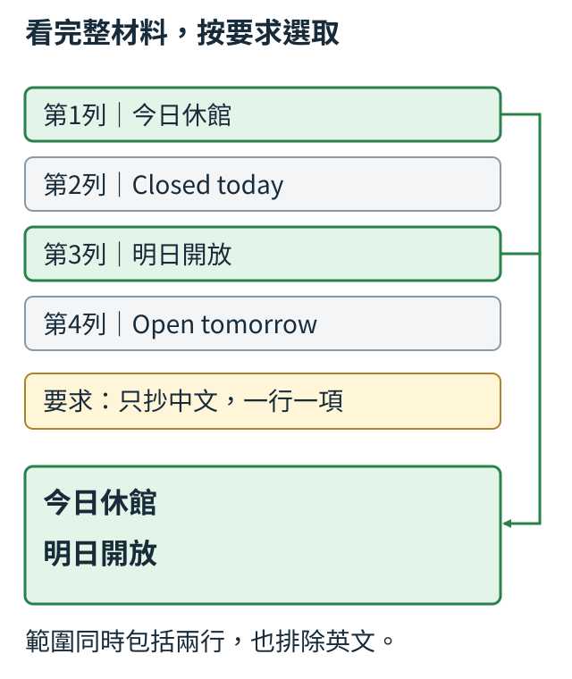

## 8.14 答案對了，為什麼仍沒完成要求？

書店交給你一份告示文字，請你替中文讀者抄一份簡短版本。材料已經打成文字，可以直接讀；我們先不處理拍照或認字。

| 列號 | 語言 | 告示文字 |
| --- | --- | --- |
| 1 | 中文 | 今日休館 |
| 2 | 英文 | Closed today |
| 3 | 中文 | 明日開放 |
| 4 | 英文 | Open tomorrow |

列號和語言標籤是整理材料時加的，實際要抄的是右欄文字。這次要求是：「只抄兩行中文，依告示順序，一行一項；不要加列號、英文或說明。」你應交出的內容因此是：

```text
今日休館
明日開放
```

如果助手把四行全部照抄，並沒有把休館寫成開館，兩句英文也確實來自材料；但它多交出了我們明說不要的內容。需要這份簡短版本的人仍要再刪英文。這讓我們看見「資料說了什麼」和「這次要回答其中哪一部分」是兩個需要分開檢查的問題。

圖中綠框圈出第1、3列，灰框保留仍可讀、這次卻不用抄的英文。箭頭把被指定的兩列連到回答，不表示要先把英文從輸入刪掉；助手可以看完整告示，再依請求選擇要交出的內容。



指定範圍不一定是「中文」。你也可以要求只抄第一行、只列明天的安排，或只回店名。每種要求都在完整材料裡圈定一部分；材料沒有改，合格回答卻會改。這裡的「圈定」只是幫我們理解任務，不代表模型裡已經找到一個獨立的選取模組。模型仍是在材料與要求共同形成的前文下，逐步生成回答。

要判斷它是否完成這次工作，不能只搜尋回答裡有沒有「今日休館」。四行全部照抄也包含這四個字，甚至加上「以下是中文版本」後仍然包含。搜尋只能確認某段文字出現，沒有確認其餘文字是否被允許。對這個有限抄寫任務，我們能直接把整份回答和兩行目標對照，連順序與多出的內容一起看。

再看另一種錯誤：助手只回「今日休館」，沒有多抄英文，卻漏了「明日開放」。不能因為它很簡短就判完成。合格範圍同時要包括該給的兩行，也排除不該給的英文和說明。「越短越服從」不是本節的規則；要求兩項，就應完整交出兩項。

這個例子還把格式固定為一行一項。若兩句原文都正確，也沒有加其他內容，卻把它們放在同一行，內容與範圍都已符合，交付方式仍需要另外核對。後面會把這些要求逐項列出，避免只說一個模糊的「答案不好」，卻不知道應該修哪件事。

練習保持告示不變，只把要求改成「只抄第一行文字，不加任何說明」。現在合格回答是「今日休館」，原本那份兩行中文反而多了一行。指出改變的是哪一句要求，以及哪個原先正確的輸出因此不再符合。能說清楚這個變化，才有辦法為下一節準備真的執行要求的示範。

<details>
<summary>補充：內容與遵循要求為何分項</summary>

[InstructGPT原論文](https://arxiv.org/pdf/2203.02155v1)的Table 3與Figure 4分別觀察是否執行正確任務、是否滿足明確約束與內容問題。[FLAN原論文](https://arxiv.org/pdf/2109.01652v5)§2.1、§2.3將指令與回答選項放在輸入設計中。它們支持在評估時分開檢查內容、任務與交付要求。

相關段落與適用界線見[指令遵循來源筆記](../sources/instruction-following.md)。

</details>
