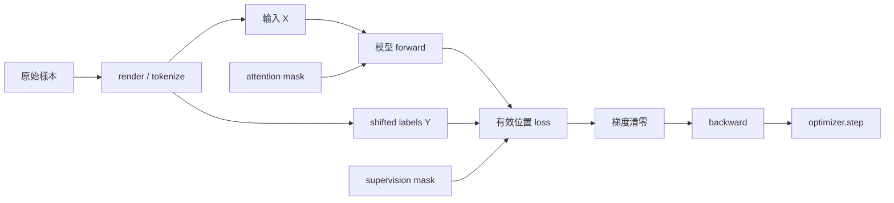

# 小小感知機：教學大綱 v0.8

這份 v0.8 保留教學設計與研究取捨。對應的正文、Notebook、圖解與基本操作入口已完成；加入B.5–B.8後，章節目錄共226節。從[教材入口](../course/README.md)開始閱讀。課程已另完成30組正式實驗及CUDA Flash補驗，逐組的配置、成績與限制保存在[實驗證據](course-experiments/README.md)，不能把規劃中的預期成果當成測得的能力。學生權重發布與本輪獨立審閱以[目前進度](course-experiments/progress.json)及[公開版本清單](course-experiments/public-models.json)為準；重跑方式見[訓練操作](../course/training.md)。

共同基礎：**猜下一個字 → 理解上下文 → Attention → 可訓練、可驗證的 Dense Transformer → 文字對話**。先用字元 tokenizer，BPE 可回讀；之後按問題進入行為、多模態、架構、效率與壓縮單元。

**容易理解是最高優先度。** 每個小節只處理一個主要概念，改動一小段程式，並留下一個能觀察或驗證的結果。先建立直覺和簡單基準，再因具體問題引入後續設計；歷史背景放在對應概念旁。可以回到小模型、切換 checkpoint 或使用獨立實驗；章節排序依概念依賴與理解難度安排。

排序原則：驗證從第一次訓練開始；SFT 後先用具體範例理解個性、遵循與安全；圖片和音訊接在已有的文字介面上；DPO 放到已理解理想回應與偏好資料之後；現代 Dense 與 MoE 放在相鄰的架構單元。量化與蒸餾各自建立小實驗，最後再做「蒸餾學生 → 量化學生」的組合比較。

參考近兩年公開課後，補入資料去重、評估有效性、微調遺忘、圖文對比學習與視覺 token 預算；另外提供上下文／RAG、工具使用、推理驗證三個跳讀單元。來源與查證限制見 [近期公開課對照](public-course-review-2025-2026.md)。

再依實際重現者的公開提問，補強資料／梯度流程、UTF-8、mask／shift、有效監督與截斷、LR 搜尋及合成 OCR。既有概念使用更細的 tensor 表、單步觀察與故障練習；來源見 [學習者回饋對照](learner-feedback-review.md)。

本輪四個角度的獨立審閱後，保留大章順序，改用小節級首次閱讀路線；先看到計數生成、單例 SFT 與模態任務成果，再按問題回讀比較和除錯。新增詞表輸出層與圖像／音訊共同使用的最小驗收，補齊跳讀資產的能力前置。取捨見 [大綱審閱與修訂理由](curriculum-review-v0.8.md)。

## 1. 參考專案與採用的教學策略

本稿直接檢閱以下版本的文件與原始碼，未執行它們的完整訓練：

- nanochat：`92d63d4e8bb4df75c3b71618f31ddde2378b2bcd`。
- MiniMind-V：`1862b633fc082a723e78dbead9777545f09d960c`。
- MiniMind：`f659b55761b754d306bd140573493a6543cafd7f`。
- Hugging Face Smol Course：`f445ae5d9dd83f355ce6a2b1c6c71b588c8e1541`。
- PKU Safe RLHF：`e8cca16665ef2340ac92c6514f05519310251581`。
- PyTorch TorchAO：`a701b6a6058720c21f95908b7ae4a24bf0cae1b6`。

規劃時另檢閱 Stanford CS336 2025／2026、MIT 6.S191 2025／2026、Harvard AC215 2025／2026 的官方公開課綱／教材，以及李宏毅 2025／2026 課程的筆記與作業副本。當時大學官網與 YouTube 的直連受代理限制，無頭瀏覽器實測亦未改善；台大資料列為鏡像證據，Harvard 2026 尚未授課的單元列為當時預定內容。未將影片入口視為已觀看或核實上傳日期；這段研究紀錄也不代表那些來源的現況已重新查證。

| 觀察 | 本教學的調整 |
| --- | --- |
| nanochat 將 tokenizer、pretraining、evaluation、SFT、inference 串成完整流程。 | 每階段都有可執行成果，新增獨立的文字 SFT 章，再進入多模態。 |
| nanochat 的評估同時包含生成樣本、BPB 與任務分數；tokenizer 另有壓縮率比較。 | 早期固定提示詞與測試資料；換 tokenizer 時加入 BPB，避免直接比較不同切詞下的平均 token loss。 |
| nanochat 提供 CPU 示範，並以 depth 作為主要規模旋鈕。 | 提供小型預設配置，列出參數量、資料量、步數與資源需求；讀者初期只改一個變數。 |
| nanochat 的成熟模型已整合多項架構與效能設計。 | 先完成可讀的初始 Transformer；第 14 章回到小模型比較單項架構選擇，第 16 章再由量測引出效能設計。 |
| MiniMind-V 從既有 LLM 延伸，新增視覺編碼器、投影層與圖片佔位符替換。 | 先完成文字模型，再逐步引入視覺特徵、projector 與 embedding 序列組合；顯示每一步的 tensor shape。 |
| MiniMind-V 的資料程式明確產生 assistant 區段的 labels，其餘位置忽略 loss。 | 先在文字 SFT 中教會 loss mask，再將相同原則沿用到圖片與音訊。 |
| 此版 MiniMind-V 可直接 SFT；projector 預對齊選配，SFT 預設解凍 projector 與 LLM 首末層。 | 先用小實驗分辨對齊與問答的目的，再比較兩階段、直接 SFT 與不同凍結策略。 |
| MiniMind-V 保留純文字資料以維持語言能力。 | 多模態訓練前後都跑固定文字測試，再引入文字／多模態資料混合。 |
| MiniMind 有身份／領域 LoRA 範例與手寫 DPO；Smol Course 將指令微調與偏好對齊分開教。 | 第一次文字 SFT 就建立行為基準；先用理想回應範例教風格、誠實與安全，再以獨立單元比較偏好訓練。 |
| PKU Safe RLHF 分開建模 helpfulness 的 reward 與 safety 的 cost。 | 行為評估分別報告有用性、指令遵循、誠實與安全，並檢查過度拒絕；reward model／PPO 留進階。 |
| nanochat 的 GPT 採 Dense FFN；MiniMind／MiniMind-V 可將同一位置的 FFN 換成 routed experts。 | 先完成 Dense 基準，再獨立教 MoE 的 router、top-k、負載平衡與成本比較，保持其他模組一致。 |
| MiniMind 分開介紹教師生成答案的黑盒蒸餾與 CE + KL 的白盒蒸餾，並提供手寫訓練入口。 | 先重用 SFT 模仿教師回答，再逐步引入 soft targets、temperature 與 KL；另外明確選擇較小的學生架構。 |
| TorchAO 分開處理量化數值、低位元儲存格式與執行 kernel，QAT 也有 prepare／convert 階段。 | 從手寫數值實驗到實際儲存，再量測相容後端；分開報告模擬誤差、檔案大小、執行記憶體與速度。 |

BKM 必須連同模型規模、資料、硬體與量測方式一起說明。nanochat 使用 ReLU² MLP 和未共享的輸入／輸出權重；MiniMind-V 的預設使用 SiLU gating 和共享權重。這些差異適合做有條件的比較。

MiniMind-V 使用已訓練的 MiniMind LLM 與凍結的 SigLIP2 視覺編碼器。我們的主線自行訓練小型文字與視覺模型，用可控制的玩具任務學習原理；預訓練編碼器可列為後續自然圖片延伸單元。

本稿區分三類目標：**模態對齊**讓視覺／音訊特徵能被文字模型使用；**行為對齊**調整風格、指令遵循、誠實與安全；**架構比較**研究 Dense／MoE 等計算方式。風格與遵循能力各自評估，預設可生動有想法，遇到明確格式或限制時仍可靠地完成要求。

縮小部署成本則分兩條路：**量化**以較低位元表示權重等數值，通常保留原本的參數數量；**蒸餾**由教師提供學習訊號，配合較小學生架構減少參數與計算。MoE 降低每 token 啟動計算，LoRA 減少微調參數，它們的資源效果各自量測。量化和蒸餾可組合，最後同時檢查品質、儲存與實際執行成本。

## 2. 教材呈現方式

**主教材採短 Jupyter Notebook；可在 JupyterLab 或 Colab 執行。完整模型、資料工具與長時間訓練放在 Python 模組和腳本。**

| 載體 | 用途 |
| --- | --- |
| 短 Notebook | 一小節一個主要問題；逐步看 tensor、曲線、attention 圖、圖片 patches 與聲音頻譜。 |
| Python 模組 | 維護完整模型與共用工具；各階段保留清楚可讀的實作版本。 |
| CLI 訓練／評估腳本 | 可重現的完整流程、checkpoint、長訓練及 CPU／GPU 配置。 |
| Markdown 與後續網頁閱讀版 | 課程索引、解說與預先產生的結果。 |
| 後段推論 demo | 上傳圖像／音訊或輸入文字，體驗已完成的模型。 |

Notebook 的教學核心程式會直接呈現。進入完整模型後，明確指出對應的 Python 檔案與本節改動；相同版本的共用模型維持單一來源。每份 Notebook 必須能從新 kernel 由上到下執行。需要權重時，明示使用讀者自行訓練或課程提供的哪一個 checkpoint。

Notebook 首跑指南涵蓋開啟介面、選對專案 kernel 與 restart-and-run-all。目前 `notebook` dependency group 已包含 ipykernel、matplotlib、JupyterLab 與 nbclient；安裝及啟動步驟見[W.1](../course/first-steps.md#W.1)。網站各節提供Colab入口；本地CPU kernel驗證與Colab雲端實機驗證分開記錄，不能互相代替。

每節開頭列出「只需閱讀的函式／小段程式、執行入口、指定資料／checkpoint、預期輸出」。教材版本與練習副本分開，提供易於 diff 的文字程式和改動導覽；採用同一套內容來源維持 Notebook 與模型程式一致。

每小節用連貫段落帶讀者看一個問題、追蹤一個具體例子，再讀程式與結果。可以先預測、手算或看圖，但依當節概念選擇合適的說明順序，不套固定六步或每節相同的小標題。練習明定改哪裡、先預測什麼及如何核對；實際編寫與逐節回查依[讀者審閱標準](editorial-guide.md)。

「只改一個變數」用來理解機制。研究方法品質時，另宣告匹配的是參數、有效訓練 tokens、估計計算量或實測時間；為匹配預算而調整寬度、步數或 learning rate，須一併列出。結構／梯度／數值觀察可完成概念驗收，品質比較允許無差異或退步。

難點的固定呈現方式：

| 難點 | 必須看得見的內容 |
| --- | --- |
| 公式接程式 | 先單例／單 head；列軸名稱、shape 與一個手算元素，使用非方陣暴露方向錯誤。 |
| 一筆資料到 loss | raw record → render → token IDs → X/Y → masks → batch → logits／loss；每節只展開當前一步。 |
| 一次更新 | 數值擾動／chain rule → autograd → 清零／累積 → step；列參數梯度及權重變化。 |
| 自己的資料與配方 | 展示少量原始、保留與淘汰例子及理由；記錄各來源的實際筆數和有效監督 tokens。 |
| 對齊／凍結階段 | 列已有能力、可訓練參數、optimizer 收錄、grad norm、權重變化及本階段任務。 |
| 失敗定位 | 給一個成功例、一個只破壞一項設定的例子；讀者先用觀察定位，再修正。 |

單筆資料與單步更新的觀察圖；每節只展開其中一步：

成功判準按實驗目的分別標示：程式可執行、資料／梯度有效、玩具 held-out 任務達標、較大自然語言任務品質。CPU smoke 可產生無意義文字；完整能力實驗另外明示資料與預算。

課程索引按下表區分「主題初讀」與「按需回讀」，完整訓練／硬體延伸另行標示。章節編號用於定位主題，首次閱讀按路線進行。初期保留直白預設值；理解單一問題後才加入配置、加速後端與硬體差異。每個主題選擇最容易看出效果的模型與資料。

### 各主題的首次閱讀次序

**先選主題，再讀它的初讀小節。** 行為、MoE、量化與蒸餾都有完整入口；它們各自需要的概念與成果仍保留，不是 VLM 的通用先修。以下涵蓋每章所有小節，未進入的主題不必先讀。

| 主題 | 初讀次序 | 按需回讀／比較 |
| --- | --- | --- |
| 1：猜下一字 | 1.1–1.5 → 1.14 的計數版體驗 → 1.6–1.9 → 1.11–1.15 | 1.10 手算 chain rule。 |
| 2：上下文 MLP | 2.1–2.5 | 固定一個短 context，之後再重跑不同長度。 |
| 3：Attention | 3.1–3.6 | 3.7 multi-head；首個模型可用單 head。 |
| 4：Dense Transformer | 4.1–4.7 | 4.8 增加深度。 |
| 5：可驗證的訓練 | 5.1–5.2 → 5.17 → 5.8–5.9 → 5.7 → 5.10–5.11 | 5.3–5.6 更新方法；5.12–5.16 去重／規模／LR／波動／配方。訓練不動或震盪時先讀 5.14。 |
| 6：Tokenizer | 6.1–6.2 → 6.7 → 6.3–6.6 | 6.8–6.9 window／讀檔邊界；字元路線可整章回讀。 |
| 7：文字 SFT | 7.1–7.5 → 7.9 → 7.11–7.13 | 7.6–7.8、7.10 在改用可變長 batch 時必讀；7.14–7.16 資料品質／遺忘。 |
| 8：個性與遵循 | 8.1–8.7 | 8.8 → 8.13 → 8.9 的 LoRA 支線；8.10–8.12 judge 校準。 |
| 9：誠實與安全 | 9.1–9.8 | 9.9–9.10 小分類器 calibration。 |
| 10：圖片入口 | 10.1–10.8 | 10.9–10.11 CLIP 對比學習。 |
| 11：圖文任務 | 11.1–11.4 → 11.8 → 11.11 → 11.7 | 11.5–11.6 凍結／階段比較；11.9–11.10 細節預算；11.12–11.13 OCR。 |
| 12：音訊與整合 | 原理路線 12.1–12.10 → 12.12；體驗路線 12.1 → 指定 log-mel 資產 → 12.8–12.10 → 12.12 | 體驗路線回讀 12.2–12.7；12.11 文字化對照。 |
| 13：偏好訓練 | 13.1–13.6 → 13.9 | 13.7–13.8 長度／附和對照。 |
| 14：現代 Dense | 各自從第 4 章基準進入 14.1–14.6，無須連讀 | 每項品質／成本比較按問題選做。 |
| 15：Dense／MoE | 15.1–15.11 → 15.13 | 15.12 expert capacity。 |
| 16：效率 | 16.1–16.3 建立瓶頸與 cache 直覺 | 16.4–16.11 按瓶頸與硬體選讀。 |
| 17：量化 | 17.1–17.9 → 17.15 的已具備測試 | 17.10 後端；17.11–17.14 activation／QAT。 |
| 18：蒸餾 | 18.1–18.11 | 18.12–18.14 MoE／多模態／量化組合。 |

先跑通的單例 SFT 使用 batch=1、無 padding、不會截斷的短對話；有效 assistant targets 的檢查從一開始就內建。回讀 padding／截斷時才擴到兩筆長短不同的資料。第 5 章先用明示的簡單 optimizer 預設值，更新方法比較不阻擋首次成果。

### 路線與前置知識

以下是推薦閱讀次序；各單元按實際前置知識開放跳讀。

| 主題 | 章節 | 先理解什麼 | 教學安排 |
| --- | --- | --- | --- |
| 文字模型基礎 | 1–5 | 基本 Python／PyTorch。 | 從 bigram 到 Dense Transformer；沿途驗證、存檔與量測。 |
| 切詞與對話 | 6–7 | 下一 token 預測、loss 和訓練。 | BPE 可用獨立文字實驗；SFT 可使用字元版本或教材提供的相容 tokenizer／checkpoint。 |
| 個性、遵循與安全 | 8–9 | 第 7 章的對話格式與 SFT。 | 先改訓練範例，觀察回應；LoRA 是更新方法的延伸實驗。 |
| 圖片與音訊 | 10–12 | embedding、序列、文字 SFT 的 loss mask；基模能依文字屬性回答。 | 先接圖片，再把同一介面用到聲音；頻譜可獨立學習，最後用聯合任務驗證兩種線索。 |
| 偏好學習 | 13 | 第 7 章 SFT；第 8–9 章的行為目標與評估有助於設計偏好資料。 | 從兩個回答的比較，逐步進入 log probability、reference model 和 DPO。 |
| 架構比較 | 14–15 | 第 3–5 章的 Attention、Dense FFN 與訓練。 | 現代 Dense 各項獨立比較；MoE 可直接替換初始 Dense FFN，不必讀完第 14 章。 |
| 執行效率 | 16 | 有一個可生成的模型；各節另列位置／mask／有效 loss 等前置。 | 由實測瓶頸選擇 cache、packing、SDPA 等實驗；FlashAttention先用CPU小例子理解分塊，再讀實際CUDA核驗。 |
| 量化 | 17 | 數值、Linear 權重與 dtype。 | 基本數值實驗可從第 2 章跳入；完整模型壓縮再使用既有 checkpoint。 |
| 蒸餾 | 18 | cross-entropy、模型輸出與學生訓練。 | 先模仿教師答案，再學分布；對話蒸餾重用第 7 章 labels，組合量化時再接第 17 章。 |
| 上下文與檢索 | A | 第 7 章的 prompt 與對話。 | 先手動給例子和資料，再用本地字詞檢索做最小 RAG。 |
| 工具使用 | B | 第 7 章對話；第 8.5 節的結構化輸出。 | 用計算器等純函式學會要求、執行與回填；框架與多 agent 列延伸。 |
| 推理與驗證 | C | 生成、SFT、可程式檢查的答案。 | 先看中間步驟與多候選，再比較 verifier 和計算預算；最小 RLVR 更新列選修。 |

可選路線：

- **從零到 VLM：**依上表的 1–5 初讀 → 7 初讀 → 10 初讀 → 11 初讀。保留字元 tokenizer；第一次用單例、不需 padding 的資料，之後回讀第 6 章及可變長 batch。
- **行為路線：**7 → 8–9 → 13。可直接使用教材指定的文字基模；完成圖文／音訊模型後再移用相同測試。
- **架構路線：**4–5 初讀後，按問題進入第 14 章任一項或第 15 章。先觀察單項結構，再宣告品質比較匹配的預算。
- **壓縮入門：**2.3 → 17.1–17.6，先對一層 Linear 觀察量化誤差；完整量化與蒸餾再各自從可用模型開始。
- **多模態延伸：**10–11 初讀 → 12 原理／體驗路線 → 12.12 聯合任務；已有 VLM 的讀者可先進入第 16–18 章。
- **外部資訊路線：**7 → A，再視需求接 8.5 → B；先用本地資料與簡單函式。
- **推理路線：**7 → C.1–C.5；理解測試時算力後再選讀 C.6–C.7，或接第 13 章比較偏好回饋。

第一輪的成果節點：計數版能生成 → 能解釋一次參數更新 → 單 head Transformer 不偷看未來並能 overfit → 能存檔接續 → 單例 SFT 能回答小世界新組合 → VLM 的答案確實需要圖片 → 聯合任務確實需要圖片與聲音。任一節點後，都可改走已具備前置的主題。

第 5 章的 momentum、Adam、AdamW 與 schedule 比較可回頭補讀；先用簡單 optimizer 完成核心訓練流程。第 8 章先用全參 SFT 觀察風格，再視需求學 LoRA。第 13 章 DPO 的前置是 SFT 與回答偏好，可在行為路線中直接進入。

第 5.14 節的短 LR 搜尋可在 5.2 後先做，再回到 optimizer 比較。Byte-level tokenizer 路線在 6.3 前讀 6.7；6.8–6.9 是 window／讀檔邊界支線。第 11.12–11.13 節可用合成字形另做 OCR 小實驗。

基本驗證與成本記錄沿途進行：第 1 章固定資料切分，第 5 章記錄訓練與資源，第 7 章建立行為基準，第 11–12 章檢查模態敏感度。第 16 章才深入 profiler 與效能 BKM；碰到具體瓶頸時可先跳到對應小節。

量化先教，是因為一組數值與一層 Linear 就能展示誤差；蒸餾會增加教師、學生與新的訓練訊號。兩章可各自從基準出發。最後的組合實驗採較小學生蒸餾完成後再量化，並重跑任務與行為測試。

### 每個實驗的依賴

每節開頭明示前置概念、使用的模型與資料、權重來源和預計資源。純概念實驗使用小矩陣、短序列或自行生成資料；需要已訓練模型時可載入指定 checkpoint。教材提供可選的產生腳本，供讀者回頭探索訓練。

指定資產清單記錄模型／tokenizer版本、配置、資料生成器與split seed、檔案hash、來源／授權、訓練入口及能力檢查。固定資料包見[訓練資產](../assets/training/README.md)，實際公開的推論權重見[固定HF版本清單](course-experiments/public-models.json)。跳讀先讀模型卡的留出成績，再核對本章依賴；能載入不表示具備所需能力，未達成的任務保留失敗。比較時固定steps／tokens上限並量測時間和記憶體。

Checkpoint 相容性在各實驗內處理：更換 tokenizer 時匹配詞表、embedding 與輸出層；更換架構時使用相容模型和權重。KV cache、SDPA 等等價改寫使用同一權重驗證；GQA、MoE 等結構改動另做訓練比較。行為、模態與壓縮實驗各自記錄基準和改動，並使用適當的 held-out 測試。

共用評估工具維護任務、行為、模態敏感度和成本表；各章只新增本章需要的測試與判讀。回讀與跳讀提供最短工具導覽。基本規則和程式檢查可以先使用，檢查原理在對應小節再展開。

## 3. 修訂大綱

以下每個編號都是獨立小節。「觀察」是該節要顯示或驗證的結果。

### 第 1 章：從猜下一個字開始

開場先拿幾句短文字玩猜下一字，觀察同一段前文可能有多個合理續字，再把這個問題寫成程式。

- 1.1 文字怎麼變成數字？建立字元 ID。觀察：encode／decode 還原原文。
- 1.2 記住資料等於學會嗎？預先按完整文字片段分 training／validation。觀察：兩組原文互不重疊，後續沿用固定切分。
- 1.3 模型到底在猜什麼？建立輸入字與下一字的配對。觀察：逐例對照輸入和正確答案；配對保留在各自資料片段內。
- 1.4 不看上下文能怎麼猜？統計訓練文字的字元頻率。觀察：預測總偏向常見字。
- 1.5 前一個字提供什麼資訊？建立 bigram 統計。觀察：條件機率表。
- 1.6 如何用參數表示預測偏好？將計數表換成可學習的分數表。觀察：參數與輸出的對應。
- 1.7 分數怎麼變成機率？實作 softmax。觀察：改一個分數後的分布。
- 1.8 猜錯要付出多少代價？理解 cross-entropy。觀察：正確答案的機率與 loss。
- 1.9 梯度代表多敏感？只微小擾動一個參數，用 finite difference 估計 loss 變化。觀察：擾動大小、變化方向與梯度估計。
- 1.10 影響怎麼穿過多個運算？手算兩步小運算的 chain rule。觀察：局部變化如何組合成最終 loss 的變化。
- 1.11 參數往哪裡改？用 autograd 取得梯度。觀察：一個參數的梯度方向。
- 1.12 更新一次有什麼效果？手寫 gradient descent。觀察：同一例子的更新前後 loss。
- 1.13 第二次 backward 為什麼梯度變大？比較有／無 zero_grad 的兩步更新。觀察：清零、梯度累積與 step 的生命週期。
- 1.14 如何接著寫下去？逐字取樣。觀察：固定提示、固定 seed 的生成結果；1.5 後先使用給定小函式體驗計數版，完成更新後再讀函式、比較計數版與訓練版。
- 1.15 同一模型為什麼會寫出不同答案？比較 greedy decoding 與 temperature sampling。觀察：固定權重下的選字與分布；後續行為比較固定生成設定。

成果：可訓練的 bigram 語言模型。從這裡開始畫 training／validation loss，固定一組生成提示，之後各章持續比較。計數與更新使用訓練資料；驗證資料只用來評估。

首次成果不等待反向傳播：條件機率表已有生成所需的下一字分布。Chain rule 可在想理解 autograd 的內部運作時回讀；數值擾動仍用來建立梯度方向的直覺。

### 第 2 章：讓模型看更長的上下文

- 2.1 ID 怎麼變成可學習的特徵？建立 embedding。觀察：查表得到的向量。
- 2.2 怎麼同時看前面幾個字？拼接 context window。觀察：輸入 tensor 的 shape。
- 2.3 怎麼混合上下文特徵？加入 linear layer。觀察：輸入改動如何影響輸出；用非方陣核對 weight 的 out／in 軸與 x @ W.T。
- 2.4 為什麼需要非線性？加入 activation。觀察：線性堆疊與非線性模型的差異。
- 2.5 記憶範圍怎麼影響預測？比較不同 context window。觀察：需要較遠線索的例子。

成果：固定上下文的 MLP 語言模型。

### 第 3 章：Attention，自己決定看哪裡

- 3.1 怎麼彙整多個位置？從加權平均開始。觀察：手動改權重的結果。
- 3.2 權重能由內容決定嗎？用相似度產生權重。觀察：相關位置的權重。
- 3.3 查詢與被查詢為什麼分開？引入 Query／Key。觀察：小型相似度矩陣；逐步標出 Q、K、K.T 的軸意義。
- 3.4 找到位置後取回什麼？引入 Value。觀察：索引資訊與回傳資訊的分工。
- 3.5 分數為什麼需要縮放？加入縮放因子。觀察：維度增大時的 softmax 分布。
- 3.6 能不能偷看答案？加入 causal mask。觀察：短序列表明每格要預測的下一 token；改未來 token 不影響前面位置。
- 3.7 能同時找不同關聯嗎？加入 multi-head attention。觀察：各 head 的權重圖。

成果：可視化、可逐步檢查的手寫 causal attention。

### 第 4 章：第一個 Dense Transformer 語言模型

- 4.1 怎麼知道字的順序？加入可學習的位置向量。觀察：交換順序的輸出。
- 4.2 怎麼保留原本的資訊？加入 residual connection。觀察：主路徑與新增分支，以及兩條 backward 路徑。
- 4.3 各位置的數值尺度怎麼控制？加入 LayerNorm。觀察：每個 token 在 feature 軸正規化前後的數值，不跨 batch／時間軸混合。
- 4.4 混合位置後怎麼處理特徵？加入逐位置 Dense MLP。觀察：每個 token 都經過同一個完整 FFN。
- 4.5 一層模型怎麼組成？組合 pre-norm Transformer block。觀察：每個零件的輸入／輸出；基準在最後一個 block 後沿用 LayerNorm。
- 4.6 隱藏向量怎麼變成下一字的分數？加入詞表輸出 Linear。觀察：`[B,T,D] → [B,T,V]`；逐格核對 logits 與詞表 ID。
- 4.7 一次訓練多個位置怎麼對齊答案？整理 shifted targets。觀察：每個輸入位置預測哪個字。
- 4.8 增加深度改變了什麼？堆疊 blocks。觀察：參數量與固定例子的表現。

成果：含位置向量、LayerNorm、Dense MLP、手寫 attention 與詞表輸出層的完整小型文字模型。先用單 head、單 block 跑通 logits／loss；第 1 章的配對在此擴展為整段序列，再視需求增加 heads 與深度。

### 第 5 章：訓練與評估形成一個流程

- 5.1 訓練迴圈真的正常嗎？刻意 overfit 小樣本。觀察：能否把固定樣本學到接近全對。
- 5.2 一次看多少例子？加入 mini-batch。觀察：梯度波動與每步成本。
- 5.3 更新方向怎麼累積？加入 momentum。觀察：簡單 loss 地形上的更新軌跡。
- 5.4 各參數能用不同步幅嗎？理解 Adam。觀察：適應式更新。
- 5.5 怎麼獨立控制權重衰減？引入 AdamW。觀察：weight decay 的作用。
- 5.6 學習率怎麼隨訓練變化？加入 warmup／decay schedule。觀察：學習率曲線。
- 5.7 訓練中斷怎麼接續？儲存 optimizer 與訓練狀態。觀察：恢復後的下一步更新；載入時明列模型 ID、step、tokenizer 和架構。
- 5.8 Loss 下降代表任務做得更好嗎？加入小型固定任務集。觀察：loss、任務分數與生成樣本；並排 teacher-forced 預測和自由生成的首次分歧。
- 5.9 每次實驗用了多少資源？記錄參數量、有效 token 數與步耗時。觀察：同一硬體與設定下的基準成本。
- 5.10 用來選模型的分數能當最後成績嗎？區分 validation 與保留的 test。觀察：參數選擇只用 validation，最後用獨立 test 評估。
- 5.11 同一段文字出現很多次會怎樣？用正規化與 hash 找完全重複。觀察：去重前後的有效資料量，以及跨 split 重複造成的虛高分數。
- 5.12 改幾個字就算新資料嗎？用字元片段集合的 Jaccard 找近似重複。觀察：相似度與閾值；按模板／來源家族切分後的分數。
- 5.13 資料或模型變大，哪個值得花預算？做兩種容量 × 兩種資料量的小對照。觀察：各組品質、token 數、步數與耗時；再做同預算比較。
- 5.14 模型不動或震盪要怎麼找步幅？固定小資料與更新次數，試三種 learning rate。觀察：短曲線；固定 LR 的概念比較與合理調參後的方法比較各自記錄。
- 5.15 一次比較略好就有進步嗎？用三個 seed 重跑 tiny 任務。觀察：分數與生成樣本的範圍，明示可支持的結論。
- 5.16 配比怎麼落到實際 batch？從兩種原始文字任務建立抽樣配方。觀察：90:10／50:50 的來源筆數、有效 tokens 與分項結果；明示相同更新／token 預算。
- 5.17 eval 就會停止計算梯度嗎？比較 train／eval、no_grad 與參數 requires_grad。觀察：模組狀態、grad_fn 和能否 backward；先用獨立小模型。

成果：訓練 → 驗證 → 存檔 → 載入 → 生成的可重現流程。沿用第 1 章資料切分與 loss 曲線，補齊任務、配置、seed 與資源記錄；profiler 與加速方法留到第 16 章。

5.10–5.12 可用數百段合成文字獨立實驗；5.13 是規模與預算選修，建立取捨直覺。幾個 tiny 模型的點只支持局部觀察，scaling law 擬合與大型模型外推留後續。

5.14–5.17 可各自跳讀；5.16 保留原始與淘汰資料的少量例子、處理規則及來源標記，銜接第 7 章的對話監督計數。

### 第 6 章：自己的中英文 tokenizer

- 6.1 字元切詞有什麼成本？量測序列長度。觀察：中英文與 emoji 的切詞結果。
- 6.2 常見片段怎麼合併？手做幾次 BPE merge。觀察：每次合併後的序列。
- 6.3 怎麼訓練實用的 tokenizer？使用 tokenizers 的 byte-level BPE。觀察：未參與訓練的中英文／emoji 能否還原；明示不改原文的 normalizer 設定。
- 6.4 詞表要多大？比較不同 vocab size。觀察：token 數與 embedding 參數量。
- 6.5 換 tokenizer 後如何比較模型？引入 BPB。觀察：固定驗證原文上的每 byte 預測成本。
- 6.6 邊界標記怎麼保持完整？為對話和模態入口預留特殊 token。觀察：標記有穩定 ID，encode／decode 後仍能辨識；各標記的使用方式在後續章節展開。
- 6.7 一個 token 一定是一個完整字嗎？列中文字／emoji 的 UTF-8 bytes 與 byte-level tokens。觀察：單 token 的部分 bytes 與完整串接 decode 的差異。
- 6.8 訓練窗口是在切詞嗎？把同一 token 序列切成短窗口。觀察：token、句子與 window 的邊界，以及每格 shifted target。
- 6.9 讀檔分段會改變切詞嗎？用跨 chunk 換行建立最小反例。觀察：整段與分塊 encode；先定義同文件 chunk 或不同文件的接口契約。

成果：可儲存、載入與評估的 tokenizer。只用訓練原文學習切詞；比較不同 tokenizer 的模型時，使用匹配的 embedding、輸出層與 checkpoint。其他單元可使用字元版本或教材提供的 tokenizer，切詞比較另行實驗。

6.2 的 merge 先用清楚的符號序列示範；進入 6.3 前，用 6.7 理解 byte-level tokens 的還原契約。非 byte-level／無 byte fallback 的 tokenizer 不保證所有未見字元可無損還原；若改用 normalizer，另明示還原的是正規化後文字。

### 第 7 章：從續寫文字到回答問題

- 7.1 對話怎麼表示？建立 user／assistant 格式。觀察：對話渲染成 token 序列。
- 7.2 模型怎麼知道輪到誰？加入角色邊界 token。觀察：問題和答案的邊界；字元路線直接保留獨立 ID，不必先學 BPE。
- 7.3 哪些位置應該學？建立 assistant-only loss mask。觀察：逐 token 上色顯示 labels。
- 7.4 回答第一個 token 在哪個位置被預測？並排 token、角色、X、Y 與 loss 權重。觀察：第一個回答 token 前一位置的 logits 預測該 token；shift 只做一次。
- 7.5 不算 loss 的內容就看不見嗎？並排 causal attention 與 supervision mask。觀察：改 user 內容仍會改回答；未受直接監督位置的輸入 embedding／中間表示可經後續 attention 取得梯度，該位置 logits 沒有直接 loss 梯度。
- 7.6 補齊 batch 的位置該算 loss 嗎？處理 padding labels。觀察：增加 padding 不改有效位置的 loss。
- 7.7 填充的位置會被當線索嗎？加入 padding attention mask。觀察：左側 PAD 的 attention 權重，以及位置 ID 保持對應時的有效輸出。
- 7.8 補了 PAD 該取哪個輸出？用兩筆長短不同的序列找最後有效位置。觀察：有效 logits、最後 PAD logits 與 batched generation 的取值。
- 7.9 模型怎麼知道回答結束？訓練結束 token。觀察：生成停止的條件。
- 7.10 答案被截光了還在訓練嗎？比較正常、答案被截掉、EOS 被截掉的對話。觀察：有效 assistant targets 數；全 ignored labels 的 mean loss 與原始樣本定位。
- 7.11 預訓練模型怎麼學會對話？做小型 SFT。觀察：相同問題在 SFT 前後的回答。
- 7.12 模型會回答新組合嗎？用保留的問答組合測試。觀察：記憶範例與組合泛化的差異。
- 7.13 後續改動要和什麼比？建立固定行為測試。觀察：簡單格式要求、資訊不足與安全邊界情境的初始回應；詳細準則在第 8–9 章展開。
- 7.14 少量錯誤答案會被學走嗎？固定資料筆數，加入少量錯標的 SFT 對照。觀察：訓練 loss 與 held-out 正確率；沿用已建立的重複率與組合覆蓋記錄。
- 7.15 學會新任務會忘記舊任務嗎？先訓練 A，再只微調 B。觀察：B 進步時 A 的能力與行為分數如何變化。
- 7.16 舊例子混回去有用嗎？加入 replay 資料。觀察：固定更新／token 預算下，B-only 與 A+B 混合的兩項任務表現。

成果：可互動的文字模型及初步行為基準。對話格式與 loss mask 可移用到多模態；風格與安全單元可直接從本章的文字模型開始。

7.4–7.10 使用一筆再兩筆長短不同的對話，把位置、mask、最後有效輸出與監督數各自觀察。全 ignored 的 batch 明確定位資料來源，避免用零 loss 掩蓋持續沒有學習訊號的情況。

7.14–7.16 是資料與遺忘的獨立對照。A／B 可用小世界的兩種文字任務；完成第 9 章後，可再把 A 換成誠實／安全行為基準。所有對照明示資料量與更新預算。

### 第 8 章：風格、個性與指令遵循

- 8.1 「有靈性」如何觀察？把風格拆成生動表達、貼切比喻與有用的新角度。觀察：同一組問題的回答差異；先以固定內容的短回答、兩三項人工 rubric 和正／負例建立可量的入門目標。
- 8.2 換 prompt 能改變什麼？用同一模型切換風格指令。觀察：不同情境下的風格與限制。
- 8.3 權重能學到穩定風格嗎？用 SFT 訓練不同回答風格。觀察：固定提示與生成設定下的變化。
- 8.4 能依情境切換風格嗎？加入帶風格條件的訓練樣本。觀察：同一模型在新問題上的風格控制。
- 8.5 有個性也能遵守限制嗎？加入格式、長度等要求。觀察：JSON 解析成功率與限制符合率；相同答案的內容正確率、格式符合率分開記錄。
- 8.6 遇到模糊指令怎麼辦？示範需要澄清的情境。觀察：模型是否針對缺少的資訊提問。
- 8.7 文筆更活潑等於洞察更深嗎？分開評估風格與任務品質。觀察：有趣程度、事實正確性與解題表現。
- 8.8 只更新少量參數能改風格嗎？手寫最小 LoRA 分支。觀察：可訓練參數量與更新位置。
- 8.9 同一個基模能切換不同風格版本嗎？載入不同 LoRA adapter。觀察：風格變化與任務能力保留。
- 8.10 評分者真的分得出目標風格嗎？用人工 rubric 與已知正／負例校準自動評分。觀察：人工和預錄 judge 分數的分歧。
- 8.11 裁判會因答案排列而改判嗎？交換 A／B 回答順序。觀察：同一對內容的偏好是否穩定。
- 8.12 裁判只是喜歡長答案嗎？固定正確內容，改寫成長／短版本。觀察：風格評分與長度偏差。
- 8.13 同名 LoRA 參數代表同樣更新幅度嗎？在一層 Linear 比較 rank、alpha 與 alpha/rank 縮放。觀察：分支矩陣、實際 delta 與保存的 convention。

成果：可調整的預設風格與情境化指令遵循。對照實驗盡量固定答案內容與長度；「靈性」中的深度洞察仍受基模能力限制，temperature 的抽樣多樣性另行控制。

初讀使用已能回答小世界內容的指定基模，先檢查內容能力，再比較簡潔／活潑短模板與格式限制；未見組合另測。貼切比喻、深度洞察與開放式自然語言品質使用較大 checkpoint 的延伸，不作 CPU 玩具模型的通關條件。

8.1–8.7 先用 prompt 與全參 SFT 學行為；8.8–8.9 再比較更新參數的方法與成本。LoRA 可移用到其他微調任務。

8.10–8.12 可先用人工與教材提供的離線評分紀錄；線上 LLM-as-a-judge 是可選延伸。評分者是否可靠由 control 與對照驗證，模型大小另行記錄。

### 第 9 章：誠實、安全與適當回應

- 9.1 想讓模型學到哪些行為？定義有用性、誠實與安全的標註規則。觀察：同一回答在各面向的分數。
- 9.2 不知道時怎麼回答？提供資訊不足的訓練例子。觀察：可驗證問題上的猜測與不確定性表達。
- 9.3 如何避免一味附和？示範錯誤前提的修正。觀察：模型是否接受了使用者的錯誤假設。
- 9.4 何時需要安全回應？用具體情境教會處理邊界。觀察：無害與有害要求的不同回應。
- 9.5 需要拒絕時怎麼仍有幫助？示範簡潔說明與適當替代方案。觀察：拒絕內容的相關性與有用性。
- 9.6 如何避免過度拒絕？加入相近但無害的成對情境。觀察：正常問題的完成率。
- 9.7 引用內容會不會改寫任務？用玩具文件區分任務指令與待分析資料。觀察：資料內干擾指令的影響。
- 9.8 學到規則還是記住字句？使用改寫與多輪測試。觀察：held-out 行為測試的成功率。
- 9.9 最大 softmax 機率很高就可靠嗎？用小分類器比較熟悉與陌生輸入。觀察：預測信心與實際正確率；和文字自述「我很有信心」分開。
- 9.10 信心和正確率對得上嗎？按信心分箱畫 reliability diagram。觀察：各箱平均機率、正確率與樣本量。

成果：可訓練、可分面向評估的行為基準。小型教學實驗只支持其涵蓋情境的觀察；後續圖文／音訊訓練仍需重跑相同基準，並加入對應模態的測試。

入門的誠實／安全情境先限制在明確的小世界規則：資訊是否足夠、前提是否錯誤、成對允許／應拒絕要求。驗收分開計內容正確、適當拒絕與過度拒絕；自然語言改寫和多輪是逐步增加的測試，廣泛安全泛化須另有資料與實測支持。

9.9–9.10 用獨立小分類模型學不確定性的直覺；單一 token 機率、整段回答的事實性與模型的信心措辭分別觀察。

### 第 10 章：圖片如何進入文字模型

- 10.1 圖片是什麼 tensor？讀取 RGB。觀察：像素、channel 與座標。
- 10.2 圖片怎麼切成序列？實作 patchify。觀察：patch 順序與拼回圖片。
- 10.3 Patch 怎麼變成向量？加入 patch embedding。觀察：patch 數與向量 shape。
- 10.4 怎麼保留圖片的空間位置？加入影像位置資訊。觀察：重排 patches 的影響。
- 10.5 怎麼學到可用的視覺特徵？用小型 encoder 學習合成圖片任務。觀察：新圖片的形狀／顏色分類。
- 10.6 視覺與文字維度不同怎麼接？加入 linear projector。觀察：視覺特徵轉成文字 hidden size。
- 10.7 模型怎麼知道圖片放在哪？用圖片佔位符插入 embeddings。觀察：以少量視覺向量展開序列表，同步核對 position IDs、attention mask、答案 labels 與有效 loss 位置；保留圖片標記 ID，shift 只做一次。
- 10.8 原本的文字功能還能正常嗎？檢查純文字路徑。觀察：加入多模態入口前後的文字 logits。
- 10.9 圖片和描述怎麼比較配對程度？用獨立小型圖／文字 encoder 建立 cosine similarity 矩陣。觀察：正確配對與錯誤配對的位置。
- 10.10 正確描述怎麼比其他描述更接近？以相似度為分數，用 image-to-text cross-entropy 訓練。觀察：批次內正確配對分數與檢索成功率。
- 10.11 能反過來用描述找圖片嗎？加入 text-to-image 目標。觀察：雙向配對、保留圖片上的候選描述檢索。

成果：重用既有文字模型，建立 vision encoder → projector → embedding sequence 的完整資料流。

10.7 先用一筆、兩個視覺向量看展開；視覺向量不作文字預測標籤，loss 依被預測的回答 token 決定，第一個回答 token 由前一位置預測。改用兩筆不同長度樣本前，回讀 7.6–7.8、7.10，再核對 padding 與多模態長度。Shape 接通和任務能力各自驗收。

10.9–10.11 是理解 CLIP 的可選對比學習支線，可在 10.5 後跳入；使用合成圖片、自行訓練的兩個小 encoder。圖文 embedding 配對與 projector 接入 LLM 各用獨立實驗；對比學習支線的結果不作為第 11 章必備資產。SigLIP 的逐配對 sigmoid loss 留比較選修。

### 第 11 章：對齊、問答與語言能力保留

- 11.1 維度相同就能理解圖片嗎？觀察隨機 projector。觀察：圖片改變造成的輸出變動與答案正確率；以已知文字屬性輸入確認 LM 本身會回答。
- 11.2 哪些參數正在學習？比較凍結與解凍。觀察：trainable parameter、optimizer 收錄、grad norm 與一步後的權重變化。
- 11.3 只訓練 projector 能學到什麼？用已有基礎能力的本專案文字／視覺 checkpoint 做 caption 對齊。觀察：簡單圖片描述。
- 11.4 圖片描述怎麼擴展成問答？加入圖文 SFT。觀察：同一圖片、不同問題的答案。
- 11.5 哪些文字層需要一起調整？比較 projector-only、部分解凍與全參訓練。觀察：圖文任務與文字能力的變化。
- 11.6 對齊和 SFT 能合併嗎？比較兩階段與直接 SFT。觀察：在明示訓練預算下的收斂與品質。
- 11.7 怎麼維持文字能力？加入純文字資料混合。觀察：多模態訓練前後的固定文字測試。
- 11.8 模型有看圖還是猜答案？替換／打亂圖片，測試保留的屬性組合。觀察：圖片敏感度與 held-out 任務分數。
- 11.9 縮圖與裁切會丟掉什麼？使用小物件、邊緣物件的合成圖片。觀察：前處理前後的細節與答案變化。
- 11.10 視覺 token 預算怎麼影響能力？改 patch size，計算序列長度。觀察：細節、token 數與成本；完整模型比較使用相容架構另行訓練。
- 11.11 平均高分掩蓋了哪些弱項？按形狀／顏色與常見／稀少組合分項評估。觀察：總準確率與各組分數、樣本量。
- 11.12 圖片裡的字也能辨識嗎？用手製合成數字字形做單字辨識。觀察：圖像字形與文字 label 的配對，以及保留字形上的辨識率。
- 11.13 多個字怎麼依序讀出？延伸到多位短字串的圖文回答。觀察：逐字與整串正確率，縮圖／裁切對文字資訊的影響。

成果：能回答合成圖片問題的小型 VLM。資料按圖片／場景分組切分，避免同圖不同描述落入訓練與驗證兩邊。訓練後重跑已建立的文字與行為基準，並加入圖片情境測試。可自然延伸到小型真實圖片資料，但需另外標示資料與算力需求。

先驗證文字基模能依明確的顏色／形狀符號回答，再比較真實 encoder 輸入；用標準屬性作內容能力對照，不把文字輸入的成績宣稱為連續視覺輸入的嚴格上界。視覺 encoder 分項分類、文字屬性回答、projector 梯度／更新各自記錄。Projector-only 可能失敗；使用已驗證資產或部分解凍重測，不要求所有凍結配置都學出 caption。

首次完成 caption／問答後，先讀 11.8、11.11 確認圖片有被正確使用，再做 11.5–11.6 的策略比較；11.7 重用文字能力表。圖片敏感度本身不代表看懂，需同看正確圖片、空白／打亂圖片的分數與樣本。

11.9–11.11 是視覺資訊與評估延伸。高解析度 tiles／AnyRes、均衡重採樣可另做後續對照，先用圖像前處理與簡單分項表建立直覺。

11.12–11.13 是合成 OCR 支線，可使用獨立小模型與指定 checkpoint；真實圖片與中文 OCR 另列字形、資料與資源需求。

### 第 12 章：沿用相同介面加入聲音

- 12.1 音訊是什麼 tensor？讀取 waveform。觀察：播放聲音與波形。
- 12.2 每秒多少樣本？理解 sample rate。觀察：時間軸與取樣點。
- 12.3 怎麼看聲音隨時間變化？切成短時間框。觀察：各時間框的訊號。
- 12.4 時間框的邊緣如何處理？使用 window function。觀察：套用前後的訊號。
- 12.5 一小段聲音有哪些頻率？使用 STFT。觀察：單音與變頻聲音的 spectrogram。
- 12.6 怎麼組合頻率區段？實作 mel filter bank。觀察：各 mel band 的頻率範圍。
- 12.7 大小差很多的能量怎麼顯示？取 log。觀察：log-mel 的動態範圍。
- 12.8 頻譜怎麼變成特徵序列？訓練小型 audio encoder。觀察：時間步與特徵 shape；用合成音的音高／時長分類提供明確監督，保留未見屬性組合。
- 12.9 音訊怎麼進入既有模型？加入音訊 projector 與佔位符。觀察：沿用 10.7 的展開／labels 契約，核對可變時間步與第一個回答位置。
- 12.10 模型有聽聲音嗎？先做高低音等小任務，再替換音訊測試。觀察：held-out 任務分數與聲音敏感度。
- 12.11 先轉成文字會少掉什麼？比較文字化結果 → 回答與音訊特徵 → 回答。觀察：文字相同、音高不同時的資訊保留；先用預錄文字化結果或玩具標籤示範。
- 12.12 答案需要同時看圖和聽聲音時怎麼辦？在已學的兩個入口加入少量聯合 SFT 樣本。觀察：圖片提供形狀、音訊提供高低音；分別替換每種模態及保留新組合，答案按規則變化。

成果：文字、圖片、音訊 → 文字的共同模型入口。重跑文字／圖文任務與行為基準，並加入音訊情境的行為測試。完整語音辨識需要較大的資料與訓練預算，列為後續延伸目標。

12.11 可把不同音高都標為相同的「嗶聲」文字，直接控制丟掉的資訊，不假設已訓練語音轉錄。12.12 是完整三模態路線的最小整合驗收；只想理解音訊入口的讀者可停在 12.10。體驗路線的指定 log-mel 資產包含波形、轉換設定與生成腳本，之後回讀 12.2–12.7。

### 第 13 章：把回答偏好變成訓練

- 13.1 同一問題哪個回答更好？建立偏好標註準則。觀察：風格、遵循與正確性如何影響排序。
- 13.2 偏好資料怎麼表示？建立 prompt／chosen／rejected。觀察：兩個回答是否共享相同任務與條件。
- 13.3 模型給整段回答多大機率？計算有效回答 token 的 log probability。觀察：loss mask 與序列總分。
- 13.4 為什麼要有參考模型？比較相對於固定 SFT 基準的回答機率。觀察：policy／reference 的分數差；reference 使用 eval／no_grad，不隨 policy 更新。
- 13.5 偏好怎麼產生梯度？手寫最小 DPO loss。觀察：一個偏好對更新前後的相對分數。
- 13.6 Beta 如何影響參考約束與更新？實驗 DPO 的 beta。觀察：固定一對回答的 loss／梯度與訓練後相對分數；不把 beta 大小簡化成單調的「更偏好 chosen」。
- 13.7 模型是否只學到回答更長？控制偏好對的長度。觀察：長度與偏好勝率的關係。
- 13.8 討喜會不會變成附和？比較正確但不同意、流暢卻錯誤的回答。觀察：錯誤前提測試。
- 13.9 只優化一種偏好會失去什麼？調整風格／遵循／安全資料的混合。觀察：各面向 held-out 評估與原有文字任務。

成果：在同一 SFT 基模上比較預設、不同風格與偏好訓練版本。DPO 本身是通用的偏好目標，效果由資料與標註準則決定；並分別保留風格、指令遵循、誠實與安全評估結果。

本章可從第 7 章文字 SFT checkpoint 開始。先用第 8–9 章的具體例子說明想要的行為，再比較 SFT 的示範資料與 DPO 的偏好對；LoRA 可另行選用。

13.3 使用同一 prompt 條件下的回答 token log probability 總和，policy／reference 保持相同的 EOS 與 mask 契約。偏好對先檢查標註品質，並重用行為 rubric；長度偏差實驗和 judge 偏差可共享評估工具，兩者的因果問題分開說明。

### 第 14 章：逐項理解現代文字模型的設計

- 14.1 怎麼表示相對位置？引入 RoPE。觀察：相對位移與 attention 分數的關係。
- 14.2 正規化能否簡化？比較 RMSNorm 與 LayerNorm。觀察：數值與成本。
- 14.3 Q／K 的尺度怎麼影響注意力？引入 QK normalization。觀察：分數與分布。
- 14.4 MLP activation 可以怎麼選？比較 GELU 與 ReLU²。觀察：固定預算下的訓練結果。
- 14.5 怎麼讓特徵控制另一組特徵？從 gating 引入 SwiGLU。觀察：gate 的作用與參數成本。
- 14.6 輸入輸出權重應該共享嗎？比較 tied／untied embeddings。觀察：參數量與品質。

成果：讀得懂 nanochat 與 MiniMind 類模型的主要結構選擇。比較時標示參數量、資料與計算預算；保留能穩定執行的基準版本。

每節回到第 4 章的簡單 Dense 模型，只比較當節改動。位置、正規化、activation 等各自選用能顯示差異的玩具問題；架構訓練實驗使用相容的獨立 checkpoint。

### 第 15 章：從 Dense 到 Mixture of Experts（MoE）

- 15.1 Dense 的計算方式是什麼？重看逐 token 的 FFN。觀察：各 token 使用同一組完整 FFN 參數。
- 15.2 能否準備多組 FFN？建立少量 experts。觀察：各 expert 的獨立參數與輸出。
- 15.3 如何決定找誰處理？先用 soft router 混合所有 expert。觀察：每個 token 的路由分數。
- 15.4 能只啟動少數 experts 嗎？引入 top-k 選擇。觀察：各 token 實際選中的 expert。
- 15.5 選中多位 expert 怎麼合併？使用 gate 權重加總。觀察：權重與輸出向量。
- 15.6 Token 怎麼送出再排回來？實作 dispatch／combine。觀察：分派前後的順序與形狀。
- 15.7 Router 怎麼收到學習訊號？檢查 top-k 選擇與 gate 權重的反向傳播。觀察：router 梯度；特別檢查 top-1 權重正規化的情況。
- 15.8 為什麼 token 都跑去同一位 expert？觀察 routing collapse。觀察：每位 expert 的 token 使用量；提供受控的 router 偏置反例，不要求每次訓練自然出現 collapse。
- 15.9 怎麼鼓勵較均衡的使用？加入 load-balancing auxiliary loss。觀察：任務品質與負載分布的變化。
- 15.10 模型究竟有多大？分開計算總參數與每 token 啟動參數。觀察：共用模組與 expert 參數的成本。
- 15.11 少算一些就一定更快嗎？量測小型 Dense／MoE。觀察：路由、分派與小矩陣計算的實際時間。
- 15.12 Expert 容量不夠怎麼辦？先完成 dropless 版本，再做容量限制選修。觀察：overflow 與處理策略對輸出的影響。
- 15.13 如何公平比較 Dense／MoE？分別設計總參數相近與估計計算量相近的對照。觀察：固定資料與訓練預算下的品質、記憶體和時間。

成果：替換 Dense FFN 的最小 MoE 分支，沿用同一個 attention、tokenizer、訓練與評估入口。初始可用 2–4 個 experts、短序列在 CPU 上驗證原理，實際資源與時間待量測。

Expert 是參數不同的 FFN，是否形成語意上的分工需由資料和觀察判斷。MoE 的 router 選擇 expert，SwiGLU 的 gate 調整特徵，兩者作用層級不同。Inactive expert 的權重仍需儲存；訓練中的 optimizer 狀態也有成本。大規模 expert parallelism 與 GPU kernel 最佳化安排為後續選修。

### 第 16 章：由量測帶出效率 BKM

- 16.1 最慢或最占空間的是哪裡？加入 profiling。觀察：時間與記憶體分布。
- 16.2 讀提示和生成下一字有何差別？區分 prefill／decode。觀察：延遲與 tokens/s。
- 16.3 生成時重算了什麼？加入 KV cache。觀察：cached／uncached 的 logits 一致性與成本。
- 16.4 KV cache 怎麼縮小？引入 GQA。觀察：cache 大小與品質。
- 16.5 Padding 花掉多少工作？實驗資料 packing。觀察：有效 token 比例與邊界處理；先選文件串接或隔離的資料契約，EOS 本身不隔離 attention。
- 16.6 Batch 放不下怎麼辦？加入 gradient accumulation。觀察：長短答案的 loss sum 依共同有效 token 總數正規化，一次 step；與大 batch 更新的差異。
- 16.7 精度能降低嗎？加入 mixed precision。觀察：硬體適用性、數值與成本。
- 16.8 手寫 attention 怎麼換成最佳化介面？使用 PyTorch SDPA。觀察：同條件的輸出與梯度比較；明示 boolean mask 的 True／False 含義，不沿用另一介面的假設。
- 16.9 Attention 中間矩陣為何占空間？理解 FlashAttention 的分塊與記憶體存取。觀察：相容 GPU 上的速度與峰值記憶體。
- 16.10 怎麼用重算換記憶體？加入 activation checkpointing。觀察：時間／記憶體取捨。
- 16.11 編譯有何代價與收益？實驗 torch.compile。觀察：編譯成本與穩態執行時間。

成果：對已能運作的模型進行有依據的最佳化。SDPA是介面，實際後端依硬體、dtype與shape決定。課程已提供L4上FP16／BF16 Flash前向與反傳的profiler、誤差及成本補驗；讀者可先讀[16.8–16.9](../course/chapters/16.md#16.8)的實報與範圍，不必先租GPU。自行重跑仍需相容CUDA環境，方法見[T.8](../course/training.md#T.8)。

各小節按瓶頸選讀。16.4 的 GQA 需另建相容架構並訓練評估；cache、SDPA 等實驗先固定權重檢查等價性，再比較成本。

16.3 先固定權重與位置契約；16.5 需 4.7、7.3–7.10 的 shift／mask／有效監督，文件隔離時同步處理 attention 與 position IDs。16.6 需 1.13、5.2、7.3，先關閉 dropout 等隨機因素看 token 加權，浮點結果用容差比較。16.8 需手寫 causal attention 和相同的 mask／scale／dropout 設定；不依賴硬體就可先學介面契約。

### 第 17 章：量化，用更少位元表示模型

- 17.1 權重到底占多少空間？從參數數量與 dtype 計算 bytes。觀察：權重、KV cache、activation 與訓練狀態的不同成本。
- 17.2 浮點數怎麼放進少量整數格子？手寫 scale 與 rounding。觀察：量化前後的數值分布。
- 17.3 轉回浮點會差多少？實作 quantize／dequantize。觀察：權重與一層 Linear 輸出的誤差。
- 17.4 零點偏移有什麼作用？加入 zero-point。觀察：對稱與非對稱數值範圍的表示。
- 17.5 一組 scale 應該管多大範圍？比較 per-tensor、per-channel 與 per-group。觀察：誤差與 metadata 大小。
- 17.6 從 8-bit 降到 4-bit 會發生什麼？固定同一組權重量化。觀察：表示格子、誤差與理論儲存量。
- 17.7 先只量化權重可以嗎？建立 weight-only 參考版本。觀察：原模型與各層替換後的輸出。
- 17.8 4-bit 如何真的存成較小檔案？實作 packing 與還原。觀察：實際 bytes，包含 scale、zero-point 與 metadata。
- 17.9 已訓練模型怎麼直接轉換？建立最小 weight-only PTQ 流程。觀察：轉換前後同一組 held-out 任務。
- 17.10 壓縮後怎麼實際運算？使用硬體相容的低位元後端。觀察：prefill／decode 時間、峰值記憶體與載入成本。
- 17.11 Activation 也量化會改變什麼？觀察執行時的 activation 範圍。觀察：權重與 activation 誤差的累積。
- 17.12 如何決定 activation 的量化範圍？比較動態估計與代表性資料校準。觀察：不同輸入上的範圍與誤差；校準資料與 held-out 評估分開。
- 17.13 極端值為什麼讓其他值難表示？實驗 outliers 與 clipping。觀察：少量極端值和多數數值的誤差取捨。
- 17.14 模型能預先適應量化誤差嗎？引入 fake quantization 與 QAT。觀察：含量化模擬的訓練、梯度近似與轉換後品質。
- 17.15 品質與行為保留了多少？重跑任務和行為基準。觀察：BPB、任務分數、風格、格式遵循、誠實與安全的變化。

成果：從可讀的量化／反量化參考實作，進到實際低位元儲存及相容後端。參考實驗可在 CPU 看懂數值誤差，真正的 kernel 效能按硬體與 dtype 分開驗證。

17.1–17.6 使用小數列或一層 Linear；17.7–17.10 先完成權重的表示、儲存與推論比較；17.11–17.14 再增加 activation 和訓練時適應。每次模型轉換都沿用第 17.15 節的品質與行為測試。

Fake quantization 仍以浮點表示模擬後的數值；實際壓縮需要轉換、儲存格式與合適的運算實作。Weight-only 量化先量測權重成本，activation、KV cache 與 optimizer 狀態各自列出。後端整合使用實作當時的官方支援配置，獨立於從零實作的教學核心。

### 第 18 章：蒸餾，讓小模型向教師學習

- 18.1 教師能提供什麼學習訊號？比較答案與預測分布。觀察：同一題目上教師、學生和標準答案的差異。
- 18.2 怎麼讓學生本身更小？減少層數或 hidden size。觀察：學生參數量、計算與未蒸餾基準。
- 18.3 只能看到教師回答也能學嗎？用教師生成資料做 SFT。觀察：黑盒蒸餾的資料與原本 SFT 的關係。
- 18.4 第一名以外的選項有什麼價值？引入 soft targets。觀察：教師對相關候選 token 的機率。
- 18.5 如何顯示較低機率的候選？調整蒸餾 temperature。觀察：分布形狀；與生成用的抽樣 temperature 分開記錄。
- 18.6 教師與學生的 token 對得上嗎？共用 tokenizer、詞表與 token ID。觀察：白盒分布的對應；異 tokenizer 的分布對齊列進階。
- 18.7 教師需要跟著更新嗎？固定教師並檢查梯度。觀察：教師 eval／no_grad 與學生更新。
- 18.8 如何學習整個分布？手寫有效回答位置的 KL loss。觀察：教師／學生在相同已知回答 prefix 下預測同一下一 token，計 `KL(p_teacher || p_student)`，依有效位置 reduction。
- 18.9 標準答案和教師偏好怎麼一起學？混合 CE 與蒸餾 loss。觀察：混合係數、temperature 與選定 T² scaling convention 的效果。
- 18.10 蒸餾是否幫到學生？比較同一學生的純 SFT 與蒸餾版本。觀察：固定資料／預算下的品質，另列教師生成或前向計算成本。
- 18.11 教師的風格和錯誤會被學走嗎？檢查資料與行為遷移。觀察：風格、遵循、事實性、安全及過度拒絕。
- 18.12 MoE 教師能教 Dense 學生嗎？保留輸出介面，改用較小 Dense 學生。觀察：總參數、啟動計算與任務品質。
- 18.13 圖片／音訊能力能如何蒸餾？先對齊相同輸入下的文字回答分布。觀察：不同模態的能力保留；內部特徵蒸餾列進階。
- 18.14 蒸餾後再量化能省多少？量化學生模型。觀察：教師、未蒸餾學生、蒸餾學生與量化學生的品質／成本表。

成果：用本課教師 checkpoint 訓練較小學生，從生成答案的 SFT 到共享詞表的白盒蒸餾，再與量化組合。蒸餾是學習方式，學生規模由架構決定；教師品質、學生容量與資料覆蓋都透過 held-out 評估檢查。

教師分布與 KL 的直覺可先用少量類別的小模型說明，再移到文字回答。18.12 接第 15 章 MoE；18.13 接第 11–12 章多模態；18.14 接第 17 章量化。這三節是各自的延伸實驗。

先檢查教師在指定任務上確實具備學生尚未有的能力，再研究蒸餾收益；學生可能沒有改善。白盒文字實驗使用 teacher-forced 的共同 prefix，回答位置沿用第 7 章 EOS／mask；18.13 的視覺／音訊輸入長度可以不同，按回答 token 對齊分布，不直接套相同絕對索引。

後續研究選修可包含 Muon、sliding-window attention、expert parallelism、分散式訓練、reward model／PPO、GRPO／可驗證獎勵、AWQ／GPTQ、FP8／FP4、KV cache 量化、QLoRA、特徵／on-policy 蒸餾、自然圖片與長音訊／影片。每項另列前置知識、成本及比較基準；依獎勵定義區分偏好、安全與任務能力目標。QLoRA 串接已學的 LoRA 與低位元基模，觀察其微調記憶體成本。

## 4. 可跳讀補充單元

以下單元各用最小適合的模型、資料或指定 checkpoint。每節先展示可觀察的差異，再逐步引入方法；大型模型與框架另列延伸。

### A：上下文學習與 RAG

前置：第 7 章的 prompt／對話；A.6 另需 9.7 的資料／指令區分，可在該節補讀。檢索本身可使用普通 Python 字串。來源：李宏毅 2025 春／秋教材線索、Harvard AC215 2025／2026 課綱。

- A.1 給幾個例子能改變回答嗎？比較 zero-shot／few-shot 提示。觀察：權重未更新時，同一模型在新問題上的表現。
- A.2 不在訓練資料裡的資訊怎麼使用？在 prompt 提供一小段新資料。觀察：有／無資料時的回答；和 SFT 的權重更新分開。
- A.3 文件多了怎麼找相關段落？實作字詞匹配檢索。觀察：查詢與回傳片段；先使用少量本地文件。
- A.4 答案能回到來源嗎？將檢索片段與來源 ID 放入 prompt，要求可核對的引用。觀察：引用內容是否支持答案。
- A.5 答錯是沒找到還是沒用好？分開量 retrieval recall 與回答正確率。觀察：文件命中與答案錯誤的組合。
- A.6 找不到或文件不可靠時怎麼辦？測試缺少、無關及含干擾指令的片段。觀察：資訊不足的回應，沿用第 9.7 節資料／指令區分。
- A.7 多輪對話和答案怎麼分配長度？列 history、目前 prompt、檢索片段與預留 response 的 token 預算。觀察：超長輸入裁掉哪些線索；可接受長度與學到的長距離能力分別測試。

成果：由手動提供資訊到最小 RAG 的完整直覺。向量檢索、reranker、向量資料庫與大型框架為後續選修。Tiny 模型的上下文泛化能力透過任務觀察，明示其訓練資料與限制。

指定小世界 checkpoint 先具備「從提供的鍵值資料回答」的能力，再做未見鍵值、few-shot 與檢索對照；所需額外 SFT 與一般對話基模分開記錄。不要求任意 tiny SFT checkpoint 自動具備普遍上下文學習。

### B：從結構化回答到工具使用

前置：第 7 章對話、第 8.5 節的 JSON／格式要求。來源：李宏毅 2025 Agent／Tool Use 線索、Harvard AC215 課綱。

- B.1 模型怎麼要求程式幫忙？用 SFT 示範工具名稱與參數。觀察：模型產生工具要求或直接回答的情境。
- B.2 文字怎麼變成有效呼叫？parse 並驗證結構與參數。觀察：格式、型別與白名單函式符合率。
- B.3 工具結果怎麼回到對話？執行計算器等純函式，回填結果再生成。觀察：模型要求、實際結果與最後答案。
- B.4 任務完成後怎麼停止？建立有明確停止條件與步數上限的小迴圈。觀察：任務成功率、呼叫次數與完整紀錄。
- B.5 同樣有數字，何時需要計算器？先訂精確計算、直接說明與求助的策略。觀察：同題改工具狀態時，合適動作如何改變。
- B.6 模型如何學會選擇下一個動作？用自然中文示範DIRECT／TOOL／ASK，再實際SFT訓練。觀察：選動作仍是下一token生成；選卡與參數、執行、最終答案分開。
- B.7 工具選擇怎樣才算可靠？分開量漏選、多選、工具停用與未見問法。觀察：同句型新數字成功，是否仍能換句話說；不能把選卡分數當整個助手成功率。
- B.8 依能力與成本，何時值得借助工具？先用人工數值算平均損失，再說明如何以獨立驗證資料定策略。觀察：信心不等於答案正確率；能力與等待成本會改變取捨。

成果：理解模型輸出與外部執行程式的分工。先使用少量本地純函式；多 agent、規劃器與複雜工具框架留後續。評估整個迴圈時分開記錄模型能力、工具和控制流程。

支線指定基模／額外 SFT 只涵蓋少量純函式，先檢查參數對應能力；分開計 parse 成功、參數正確與任務完成，格式有效不代表呼叫正確。

### C：推理步驟、驗證與測試時算力

前置：生成與 SFT；用算術、規則等有可程式檢查答案的任務。來源：李宏毅 2025 推理／推理長度／評估索引、Stanford CS336 推理作業與 RLVR 教材。

- C.1 寫出中間步驟能幫忙嗎？比較直接答案與步驟示範的 SFT。觀察：保留問題上的答案正確率與生成長度。
- C.2 最後答對代表過程正確嗎？檢查可驗證的中間步驟。觀察：結論正確與步驟正確的差異。
- C.3 多試幾次能找到正確答案嗎？在固定生成設定下取樣多個候選。觀察：候選集合含正解的比例與 sample 數。
- C.4 找得到也選得中嗎？比較多數決與程式 verifier 選答案。觀察：候選含正解的比例與最後選中正解的成功率。
- C.5 花更多計算值得嗎？限制候選數或生成 token 預算。觀察：正確率、token、延遲；長推理的實際收益。
- C.6 正確答案怎麼變成訓練回饋？由 verifier 產生可驗證 reward。觀察：正確性目標與風格偏好回饋的差異。
- C.7 Reward 怎麼改變輸出機率？用單步小任務示範 REINFORCE 更新。觀察：reward、log probability 與梯度方向；再重測 held-out 成功率。

成果：分清楚步驟示範、測試時搜尋／驗證與訓練時 reward。C.1–C.5 可獨立執行；C.6–C.7 是最小 RLVR 直覺選修，單步玩具實驗只驗證機率更新。長序列 policy gradient、GRPO、reward hacking 與自我修正的回饋比較留後續。

指定短整數／規則任務、訓練分布與能力檢查；候選集合可能沒有正解，verifier 也可能選不到。步驟 SFT、搜尋與 reward 都不以必然提高分數作驗收。

## 5. 實作與驗收原則

- CPU 小實驗以本環境 4 vCPU／32 GiB 作為其中一個驗證目標。初始模型可從 1–2 層、hidden size 64–128、短 context 嘗試；單節實驗以秒到數分鐘為設計目標，完成後公布實測時間。
- 區分「單節概念實驗」「章節完整流程」「較大資料／GPU 訓練」。長訓練可使用自己前章產生或課程發布的 checkpoint 接續，並標示來源和前置步驟。
- 每個單元選擇能清楚顯示現象的最小模型；提供前置概念與指定資產，讓讀者能回跳或單獨執行。完整三模態訓練另列整合實驗。
- 資料來源、生成 seed、模板家族與 split 可追溯；去重與污染檢查納入對照。模型選擇使用 validation，保留的最終 test 用於確定方案後評估。
- 在文字、圖文與音訊階段沿用可控制的小世界：簡單文字規則、合成形狀／顏色圖片、短合成音訊。驗證包含訓練未見過的組合。
- 每個階段保留可讀的完整模型版本及改動說明；避免初版就承載所有後段功能開關。
- 核心正確性檢查包含：tokenizer 還原、causal mask 不洩漏未來、loss mask 正確、圖片佔位符數量與特徵數一致、KV cache 結果一致。
- 行為訓練使用獨立 held-out 問題，分別報告風格偏好、格式／條件符合率、事實性、有害回應與過度拒絕。偏好標註控制長度等混淆因素，檢查附和與原有任務退步；圖文和音訊訓練後重跑。
- 自動評分使用明示 rubric、正負 control、排列／長度對照；保留與人工判斷的分歧。整體指標旁列分項分數與樣本量。
- RAG 分開量檢索與回答；工具迴圈記錄實際呼叫與結果；推理比較明示候選數、verifier、生成 token 與時間預算。
- MoE 檢查 dispatch／combine 的位置、router 梯度與 expert 使用量；成本同時列總參數、每 token 啟動參數、權重／optimizer 記憶體和實測時間。小型迴圈實作的速度與大型 GPU kernel 分開報告。
- 量化分開報告數值模擬、真正的低位元 checkpoint、推論記憶體與相容後端速度；包含未量化模組和 metadata 成本，校準與評估資料分開。
- 蒸餾比較同一學生的純 SFT 與蒸餾基準，記錄教師品質、tokenizer 對應、答案位置的 loss mask 與教師計算成本；以自己的 held-out 標準答案檢查學生，並重跑全部行為基準。
- Notebook 從新 kernel 執行；小型 smoke 設定可供 CI 驗證。耗時訓練與硬體比較使用單獨入口和明示設定。
- 模型效果以實際樣本與 held-out 任務評估；架構／效能比較記錄參數量、訓練 token 數、硬體、dtype、時間與記憶體。
- 初版微型基準包含有效監督計數、單步梯度／權重變化、padding／shift 反例；一次只注入一種故障，讀者能從輸出定位。
- Quickstart 明列已測平台、配置、最短 smoke 與指定資產；硬體／版本問題另放操作指南。教材練習使用固定版本副本，保留原始生成和評分接口。

## 6. 原始碼參考

### 近期公開課

課程年份、官方／鏡像證據、影片入口與固定版本來源見 [近期公開課對照](public-course-review-2025-2026.md)。本輪新增小節的主要來源為 Stanford CS336 的 evaluation／data／multimodality，MIT 的 post-training／style evaluation／CV 分項實驗，Harvard 的 RAG／Agents 課綱，以及李宏毅的遺忘／推理／工具教材線索。

### 公開學習者回饋

具體提問、重現日記、日期與證據限制見 [學習者回饋對照](learner-feedback-review.md)。採用 nanochat、MiniMind／MiniMind-V、CS336 作業與 LLMs-from-scratch 的學習難點和觀察方法；歷史 bug、特定超參數與有限樣本的因果猜測另行標示。

### nanochat

- [README：完整流程與單一規模旋鈕](https://github.com/karpathy/nanochat/blob/92d63d4e8bb4df75c3b71618f31ddde2378b2bcd/README.md)
- [runs/runcpu.sh：CPU 示範流程](https://github.com/karpathy/nanochat/blob/92d63d4e8bb4df75c3b71618f31ddde2378b2bcd/runs/runcpu.sh)
- [runs/speedrun.sh：tokenizer → pretraining → evaluation → SFT](https://github.com/karpathy/nanochat/blob/92d63d4e8bb4df75c3b71618f31ddde2378b2bcd/runs/speedrun.sh)
- [scripts/tok_eval.py：tokenizer 壓縮率與還原檢查](https://github.com/karpathy/nanochat/blob/92d63d4e8bb4df75c3b71618f31ddde2378b2bcd/scripts/tok_eval.py)
- [nanochat/loss_eval.py：BPB](https://github.com/karpathy/nanochat/blob/92d63d4e8bb4df75c3b71618f31ddde2378b2bcd/nanochat/loss_eval.py)
- [nanochat/tokenizer.py：對話渲染、loss mask 與可視化](https://github.com/karpathy/nanochat/blob/92d63d4e8bb4df75c3b71618f31ddde2378b2bcd/nanochat/tokenizer.py)
- [nanochat/gpt.py：模型結構選擇](https://github.com/karpathy/nanochat/blob/92d63d4e8bb4df75c3b71618f31ddde2378b2bcd/nanochat/gpt.py)
- [nanochat/engine.py：KV cache、prefill 與生成](https://github.com/karpathy/nanochat/blob/92d63d4e8bb4df75c3b71618f31ddde2378b2bcd/nanochat/engine.py)
- [nanochat/flash_attention.py：FA3／SDPA 後端](https://github.com/karpathy/nanochat/blob/92d63d4e8bb4df75c3b71618f31ddde2378b2bcd/nanochat/flash_attention.py)

### MiniMind-V

- [README：架構、資料與目前訓練策略](https://github.com/jingyaogong/minimind-v/blob/1862b633fc082a723e78dbead9777545f09d960c/README.md)
- [model/model_vlm.py：視覺編碼器、projector 與佔位符替換](https://github.com/jingyaogong/minimind-v/blob/1862b633fc082a723e78dbead9777545f09d960c/model/model_vlm.py)
- [dataset/lm_dataset.py：對話資料與 assistant-only labels](https://github.com/jingyaogong/minimind-v/blob/1862b633fc082a723e78dbead9777545f09d960c/dataset/lm_dataset.py)
- [trainer/trainer_utils.py：凍結策略與 checkpoint](https://github.com/jingyaogong/minimind-v/blob/1862b633fc082a723e78dbead9777545f09d960c/trainer/trainer_utils.py)
- [trainer/train_pretrain_vlm.py：projector 對齊入口](https://github.com/jingyaogong/minimind-v/blob/1862b633fc082a723e78dbead9777545f09d960c/trainer/train_pretrain_vlm.py)
- [trainer/train_sft_vlm.py：多模態 SFT 入口](https://github.com/jingyaogong/minimind-v/blob/1862b633fc082a723e78dbead9777545f09d960c/trainer/train_sft_vlm.py)
- [scripts/web_demo_vlm.py：Gradio 推論展示](https://github.com/jingyaogong/minimind-v/blob/1862b633fc082a723e78dbead9777545f09d960c/scripts/web_demo_vlm.py)

### MiniMind：行為微調、DPO 與 MoE

- [README：LoRA 身份／領域資料與後訓練介紹](https://github.com/jingyaogong/minimind/blob/f659b55761b754d306bd140573493a6543cafd7f/README.md)
- [trainer/train_dpo.py：手寫偏好 loss 與 reference model](https://github.com/jingyaogong/minimind/blob/f659b55761b754d306bd140573493a6543cafd7f/trainer/train_dpo.py)
- [model/model_minimind.py：Dense／MoE FFN、top-k routing 與 auxiliary loss](https://github.com/jingyaogong/minimind/blob/f659b55761b754d306bd140573493a6543cafd7f/model/model_minimind.py)
- [trainer/train_distillation.py：教師／學生、temperature、CE + KL 與 loss mask](https://github.com/jingyaogong/minimind/blob/f659b55761b754d306bd140573493a6543cafd7f/trainer/train_distillation.py)

### Hugging Face Smol Course：指令與偏好對齊

- [Instruction tuning](https://github.com/huggingface/smol-course/blob/f445ae5d9dd83f355ce6a2b1c6c71b588c8e1541/units/en/unit1/1.md)
- [SFT 與行為調整](https://github.com/huggingface/smol-course/blob/f445ae5d9dd83f355ce6a2b1c6c71b588c8e1541/units/en/unit1/3.md)
- [Preference alignment](https://github.com/huggingface/smol-course/blob/f445ae5d9dd83f355ce6a2b1c6c71b588c8e1541/units/en/unit2/1.md)
- [DPO](https://github.com/huggingface/smol-course/blob/f445ae5d9dd83f355ce6a2b1c6c71b588c8e1541/units/en/unit2/2.md)

### PKU Safe RLHF：安全目標與進階流程

- [README：helpfulness reward、safety cost 與偏好資料](https://github.com/PKU-Alignment/safe-rlhf/blob/e8cca16665ef2340ac92c6514f05519310251581/README.md)

### PyTorch TorchAO：量化、儲存格式與 QAT

- [README：量化與推論／訓練入口](https://github.com/pytorch/ao/blob/a701b6a6058720c21f95908b7ae4a24bf0cae1b6/README.md)
- [Quantization overview：數值、packing 與 kernels](https://github.com/pytorch/ao/blob/a701b6a6058720c21f95908b7ae4a24bf0cae1b6/docs/source/contributing/quantization_overview.rst)
- [QAT：fake quantization、prepare 與 convert](https://github.com/pytorch/ao/blob/a701b6a6058720c21f95908b7ae4a24bf0cae1b6/docs/source/workflows/qat.md)
