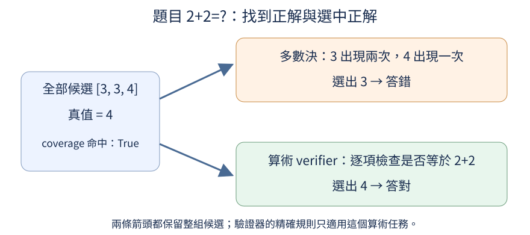

## C.4 找得到也選得中嗎？

對「2+2=?」生成三份候選 `[3,3,4]`，正解4已在清單裡。如果選出現最多的答案，最後卻會交3。前置是[候選包含正解的比例](0C.md#C.3)與[驗證器的範圍](0C.md#C.2)。本節固定同一份候選，實際比較多數決與算術驗證，讓「找到」和「選中」各自有可觀察的結果。

多數決不理解算術，只數相同答案出現幾次：3有兩次、4有一次，所以3獲選。另一個選擇器用精確規則檢查候選是否等於2+2，第一個3失敗，第二個3也失敗，最後4通過。後者稱verifier，因本例題目本身能用加法得到真值，它有很強的判準；這種優勢不能直接假設存在於未知事實或開放題。

下圖兩條箭頭都從完整候選集合出發。上方數次數而選3，下方查算術而選4，表示平行比較兩種方法；不是先把候選縮成3，再神奇地補出4。左框的coverage命中True，只說集合含正解，無法單獨決定哪條分支最後答對。



```python
from collections import Counter

candidates = [3, 3, 4]
majority = Counter(candidates).most_common(1)[0][0]
verified = next((x for x in candidates if x == 2 + 2), None)
print("集合包含正解", 4 in candidates)
print("多數決", majority, "答對", majority == 4)
print("驗證器", verified, "答對", verified == 4)
```

`Counter`把答案及次數對應起來，`most_common(1)`取最多次的一項，兩個`[0]`分別取那一筆與其中的答案值。`next`取第一個通過條件的候選；第二參數None代表全部不通過時，回傳「沒有找到」，而非捏造一個候選。輸出依序為True；3、False；4、True，與圖完全一致。

真實評估需要多個問題：先統計各題的候選集合是否含正解，再統計最後選出的答案是否正確。也可以在「確有正解的集合」內，另外統計選中正解的比例，但必須說清楚分母；否則把不同數字都叫selection accuracy會混淆。多數決會在同一誤解大量重複時失敗，驗證器也可能因規則不完整、資料過時或錯讀題目而誤判。

本例能直接算2+2，因此主要目的不是替這道簡單題節省工作，而是核對選擇流程。若改成尚未確認的書店地址，寫一個固定返回「青街8號」的驗證器，只是把答案預埋在程式裡，不能證明一般任務都能選對。選擇能力也需要在獨立題目上測試。

實際短答候選也重現了選錯：`(3+3)+0=?`在k=4時生成`[5,7,5,6]`，真值6已在集合，多數決仍交5而答錯。精確算術驗證器才選到6。下表都使用各k保存的同一批候選，各欄的分母是完整24題：

| k | 短答多數決 | 短答驗證器 | 步驟多數決 | 步驟驗證器 |
| --- | --- | --- | --- | --- |
| 1 | 1/24 | 1/24 | 11/24 | 11/24 |
| 2 | 1/24 | 1/24 | 12/24 | 13/24 |
| 4 | 1/24 | 2/24 | 12/24 | 13/24 |
| 8 | 1/24 | 1/24 | 12/24 | 14/24 |

這份多數決取最多次的可解析最後整數，平票則取先出現者；不是要求超過一半票數。步驟k=2的`(5+0)+3=?`先生成10，再生成8，平票取10而錯，驗證器檢查等式後選8。步驟k=8若只看已有正解的14題，多數決選對12/14；它與全體12/24回答的是不同問題。

本輪精確驗證器選第一份全部檢查通過的候選，沒有教師模型幫忙挑答案；它能直接計算這個窄任務的真值，因此選擇成績和oracle coverage相同。這個很強的條件不能延伸到未知事實與開放論證。多份候選同意，或可見等式都正確，也不足以證明內部chain of thought的忠實性。

練習只把candidates改成 `[3,3]`，其餘程式不變。先預測集合命中False、多數決仍選3、驗證器返回None且答對False，再執行核對。驗證器無法從沒有正解的清單選出正解；明確保留None，才不會把這種失敗誤記成成功。

