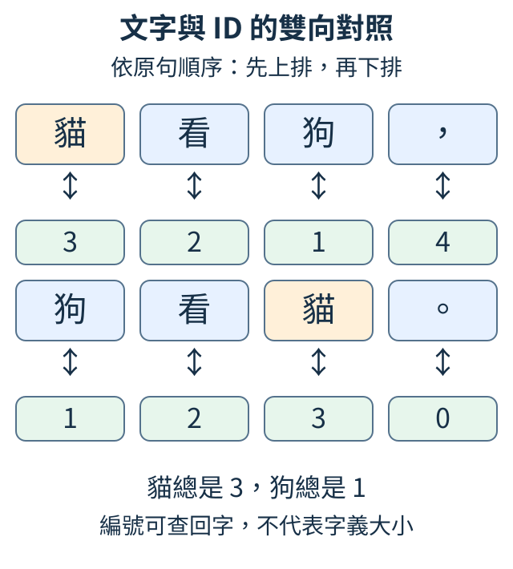

# 第 1 章：從猜下一個字開始

在輸入法裡打出「貓」，下一字候選可能有「看」或「吃」。文字模型也在做這種接字工作：根據已經給出的字，替下一字的候選打分。本章先用短句建立字與編號、問題與答案的對應，再讓一張可調的數字表改變猜法。最後把猜出的字接回去，看看一個接字規則怎樣變成一段新文字。

## 1.1 文字怎麼變成可還原的編號？

我們要讓程式看到「貓」時猜下一字。先準備一句材料：**貓看狗，狗看貓。** 希望程式既能記錄這些字，又能在猜完後把結果寫回人能讀的文字，所以需要一張雙向對照表。

替每種字安排一個整數，這個數叫 ID，也就是識別編號。本例的約定如下；標點也是句子的一部分，照樣編號。

| 字 | 。 | 狗 | 看 | 貓 | ， |
| --- | --- | --- | --- | --- | --- |
| ID | 0 | 1 | 2 | 3 | 4 |

因此原句可記成 `[3,2,1,4,1,2,3,0]`。兩次「貓」都用 3，兩次「狗」都用 1。ID 像書的索書號，只用來找同一項：3 不表示貓比狗大三倍，也不表示意思更接近哪個字。



圖中的上下兩格是一個字與它的 ID。電腦往下查得到編號，往上查能還原文字；現在還沒有任何猜字能力。

下面讓 Python 建立這張表。包含所有可用字的清單叫**字表**；`set(text)` 去除重複字，`sorted` 再按電腦的文字編碼順序排列。這個順序是約定，不是按字義或筆畫排列。

```python
text = "貓看狗，狗看貓。"
chars = sorted(set(text))
to_id = {}
for i, char in enumerate(chars):
    to_id[char] = i
ids = [to_id[char] for char in text]
restored = "".join(chars[i] for i in ids)
print(chars)
print(ids)
print(restored)
assert restored == text
```

`enumerate(chars)` 逐項提供「位置、字」，迴圈將它存入字典 `to_id`。`[to_id[char] for char in text]` 則按原句順序逐字查編號。三行輸出依序是 `['。','狗','看','貓','，']`、`[3,2,1,4,1,2,3,0]` 和原句。

最後的 `chars[i]` 由編號查回字，`"".join(...)` 把字接起來。文字變編號叫**編碼**，編號變文字叫**解碼**；`assert restored == text` 檢查來回後仍是同一句，通過時沒有額外輸出。這個檢查證明記錄可還原，不表示程式懂了貓或狗。

練習把建立字表那行改成 `chars = sorted(set(text), reverse=True)`。先預測 ID 和還原文字各會怎樣，再執行：字表順序與 ID 都改變，但編碼、解碼使用同一張新表，仍能得到原句。

<details>
<summary>補充與重做</summary>

Python 清單、字典與方括號可回看 [W.2](../first-steps.md#W.2)。排序依 Unicode 的字元編碼；本例只處理字表已有的字。若拿同一張表編碼「貓看鳥」，因為沒有「鳥」，會出現 `KeyError`。第 6 章會處理字表涵蓋範圍與更實用的拆字方法。

</details>

## 1.2 怎樣留下真正沒練過的題目？

如果學生練習「貓看狗。」後，考試又出完全相同的一句，高分可能只表示背熟了。要檢查新材料，先把文字分成不同用途，再讓模型接觸其中的一部分。

本節的材料有五筆文字，其中「貓看狗。」重複一次：

`貓看狗。／狗看貓。／鳥看魚。／魚看鳥。／貓看狗。`

希望得到三份互不重複的材料。**訓練資料**用來調整模型內的可調數字，這些數字叫參數；**驗證資料**用來選設定；**測試資料**留到設定選完後，作最後檢查。例如在驗證資料上比較看一字與看三字的模型，就是選設定；測試資料這時仍保留。

專案的 `split_documents` 先移除完全一樣的文字，再打亂與分組。這五筆只有四份不同文字，結果會是訓練兩份、驗證一份、測試一份。

```python
from tiny_perceptron.data import split_documents

docs = ["貓看狗。", "狗看貓。", "鳥看魚。", "魚看鳥。", "貓看狗。"]
parts = split_documents(docs, seed=42)
for name, documents in parts.items():
    print(name, len(documents), documents)
assert not (set(parts["train"]) & set(parts["validation"]))
```

每行輸出都列出組名、份數與實際文字，先逐句核對沒有同一句跨組。`seed=42` 固定打亂順序的起點，方便重現這次分組；42 本身沒有語言意義。最後的 `&` 找訓練與驗證共有的文字，`not` 要求它為空。

只查字串完全相等仍不夠。若先把「貓看狗。狗看貓。」切成視窗，再把相鄰的「貓看狗。」與「看狗。狗」分到兩組，它們共享「看狗。」。模型已練過其中的連續內容，卻又被當作新材料考一次，這叫**資料洩漏**。所以通常先按完整來源分組，再在各組內切片；同一篇的改寫、同一段對話的版本也應一起分。

共用「貓、看、狗」這些字沒有問題：新文章本來就使用舊字。需要避免的是把同一來源的複本或高度重疊片段當成新題。

練習再加一份「貓看狗。」。不同材料總數應仍是四；把新增那份改成「鳥看貓。」，總數才變五。這次沒有訓練模型，只是在確認以後的評分能回答「遇到新材料會怎樣」。

<details>
<summary>補充與重做</summary>

執行環境見 [W.1](../first-steps.md#W.1)，`.items()`、集合與字典見 [W.2](../first-steps.md#W.2)。本例的斷言只查訓練與驗證之間的完全重複，不是所有來源洩漏的自動證明。反覆看驗證結果會影響選擇，因此設定挑好後仍需保留的測試資料。

</details>

## 1.3 「猜下一字」該配哪個答案？

材料是「貓看狗。」。我們希望看到「貓」就猜「看」，看到「看」就猜「狗」，看到「狗」就猜句號，而不是看到什麼就照抄什麼。

| 目前提供的字 | 貓 | 看 | 狗 |
| --- | --- | --- | --- |
| 希望猜出的下一字 | 看 | 狗 | 。 |

句號後沒有提供下一字，因此本例不把句號當問題。先只看目前一字，後續再擴大能讀的前文；答案始終是目前位置右邊一格。

把原句拆成清單 `s`，`s[:-1]` 取掉最後一項作問題，`s[1:]` 取掉第一項作答案。切片右端不包含在結果裡；`-1` 表示最後一項。

```python
s = list("貓看狗。")
x = s[:-1]
y = s[1:]
print(x)
print(y)
for current, answer in zip(x, y, strict=True):
    print("看到", current, "下一字", answer)
assert len(x) == len(y) == 3
```

前兩行分別印 `['貓','看','狗']` 和 `['看','狗','。']`。`zip` 按相同位置配對，再印出表中的三道題；`strict=True` 要求兩份長度相同。圖裡每條向下箭頭就是一題。


這種錯開一格的對齊常叫 **shift**。它沒有修改原文，而是建立兩份切片。若誤把 `y` 也寫成 `s[:-1]`，題目就變成「貓→貓、看→看、狗→狗」；長度仍正確，學的工作卻變了。

練習先手寫「鳥飛。」的問題與答案，再改程式和長度檢查。應得到「鳥→飛、飛→。」兩題。接著故意令 `y=s[:-1]`，看看為什麼長度檢查無法發現照抄問題。

<details>
<summary>補充與重做</summary>

切片背景見 [W.2](../first-steps.md#W.2)。shift 決定答案配對；當整段文字同時輸入模型時，還需禁止較早位置讀後面，見 [3.6](03.md#3.6)。兩項檢查各有用途，不能互相代替。

</details>

## 1.4 完全不讀前文，能用什麼猜法？

先準備一袋下一字候選：三個「貓」、一個「狗」、一個「鳥」。如果完全不知道前文，至少能讓常見字取得較多機會：貓佔五份中的三份，機率是 3/5=0.6；狗與鳥各 0.2。

這種只數單字的方法叫 **unigram**。它提供一個容易理解的**基準**，也就是之後拿來比較的簡單起點。次數回答「出現幾次」，機率回答「佔全部的多少比例」；三個候選的機率加總應是 1。

```python
from collections import Counter

text = "貓貓貓狗鳥"
counts = Counter(text)
total = sum(counts.values())
probability = {}
for char, count in counts.items():
    probability[char] = count / total
print(counts)
print(probability)
assert abs(sum(probability.values()) - 1) < 1e-6
```

`Counter` 替每種字計數，第一行會印貓 3、狗 1、鳥 1。`sum(counts.values())` 得到總數 5；迴圈把各次數除以 5，第二行得到 `{'貓':0.6,'狗':0.2,'鳥':0.2}`。最後確認加總接近 1。

這張分配沒有收到前文。因此問「貓看」後面接什麼，或問「狗吃」後面接什麼，它都給貓 0.6。猜貓可能經常碰巧正確，卻不能說抓住了前後字的關係。

拿到分配後還要選字：永遠取最高者，本例每次都是貓；按機率抽選，狗與鳥仍有機會。計算分配與使用分配是兩步，這裡先完成第一步。

練習把材料換成「貓貓貓狗狗狗鳥」。貓的次數仍是 3，但總數變 7，機率降至 3/7≈0.429。先手算，再核對程式，分清次數沒有減少與佔比下降。

<details>
<summary>補充與重做</summary>

`abs` 取絕對值，`1e-6` 是 0.000001。電腦儲存小數有微小誤差，因此用這個容忍範圍檢查總和，並非允許漏掉候選。機率見 [W.4](../first-steps.md#W.4)，字典迴圈見 [W.2](../first-steps.md#W.2)。

</details>

## 1.5 知道前一字，怎樣改變下一字的機率？

讀這段材料：「貓看狗。狗吃魚。貓看鳥。」其中貓後面兩次都是「看」。如果知道目前是貓，應比完全不讀前文更偏向看；問題是怎樣把這條關係記成可計算的表。

一對相鄰字叫 **bigram**。我們讓列代表目前字、欄代表下一字：「貓→看」每出現一次，貓列、看欄就加 1。再讓每列除以自己的總數，得到「目前是這個字時」的下一字機率。這叫**條件機率**；`p(看|貓)` 讀作「在目前是貓的條件下，下一字為看的機率」。

材料少時，沒看過的組合不一定不可能。我們先給每格 1，再加入觀察次數，這叫**加一平滑**。本例字表有七種字，因此貓列的總數是七份起始支援加兩次觀察，共 9。

下面用數值工具庫 PyTorch 保存與運算這張表；它裝數字的容器叫 tensor，這裡是一張七列七欄的表。

```python
import torch

text = "貓看狗。狗吃魚。貓看鳥。"
chars = sorted(set(text))
ids = [chars.index(char) for char in text]
counts = torch.ones(len(chars), len(chars))
for current, answer in zip(ids[:-1], ids[1:]):
    counts[current, answer] += 1
probability = counts / counts.sum(dim=1, keepdim=True)
row = chars.index("貓")
print(chars)
print(counts[row])
print(probability[row])
assert torch.allclose(probability.sum(dim=1), torch.ones(len(chars)))
```

`chars.index(char)` 查字的 ID。`counts[current,answer]` 按目前字與答案選中一格，與上一節的全部字計數不同。字表為 `['。','吃','狗','看','貓','魚','鳥']`，貓列的「看」格是 1+2=3，其餘六格都是 1。


圖中橘格的 3/9≈0.333 就是 `p(看|貓)`，其餘各 1/9。它不等於 1，因為我們仍給未見候選留一點機會。`sum(dim=1,keepdim=True)` 把每列的欄加起來並保留一欄；除法便讓同一列每格共用自己的分母。每列機率加總為 1，整張表卻不是總和為 1：它包含七道不同的「目前字」問題。

練習把每格起始值改成 0.1，也就是 `torch.full((len(chars),len(chars)),0.1)`。貓列總數變 `2+7×0.1=2.7`，看的機率為 `2.1/2.7≈0.778`。先算再跑，看看為什麼支援減少會讓已見組合更佔優勢。

<details>
<summary>補充與重做</summary>

列、欄和 `dim` 見 [W.3](../first-steps.md#W.3)。讓一欄分母配到整列的運算叫廣播。若字表大小是 V、某列觀察次數是 N，加一平滑的分母是 N+V；不是把整張表除以全部觀察數。

</details>

## 1.6 怎樣把接字偏好存成可調的數字？

為了逐格看清可調表，我們將字表縮成三個候選：「貓、看、狗」，本節重新約定 ID 依序是 0、1、2。看到貓時，我們先給下一字分數 `[0,2,0]`：看得分最高，貓與狗相同。這樣存偏好的好處是，以後可依答案調整分數，不必每次重數整段文字。

這些可調數字叫**參數**。表的列仍是目前字，欄是候選下一字；分數能正、能負，不要求總和為 1。ID 對照固定，訓練時要改的是表格裡的分數。

PyTorch 的 `nn.Embedding` 是可調的查表工具。`nn.Embedding(3,3)` 建立三列、每列三數；這裡直接用三數當候選分數。先手動填表，再查貓與狗兩列。

```python
import torch
from torch import nn

scores = nn.Embedding(3, 3)
with torch.no_grad():
    scores.weight.zero_()
    scores.weight[0, 1] = 2.0
inputs = torch.tensor([0, 2])
output = scores(inputs)
print(scores.weight)
print(output)
```

整張 `scores.weight` 是 `[[0,2,0],[0,0,0],[0,0,0]]`。`inputs=[0,2]` 要求取第 0 與第 2 列，所以 `output` 是 `[[0,2,0],[0,0,0]]`，形狀 `[2,3]`：兩道目前字問題，每題三個候選。

`zero_()` 清零，接著只把貓列、看欄設成 2；尾端底線表示直接改原物件。`torch.no_grad()` 包住這次手動填表，免得把設定初值記成需要求導的運算。查表之後並沒有做參數更新，這裡所有偏好都由我們指定。

分數表需要 V×V 格：V 種目前字，每種都有 V 個下一字候選。它能給分也能被調整，但仍只看最近一字；看到「顏色=」與「形狀=」時，最後一字同為等號，仍會取同一列。

練習在填表區加入 `scores.weight[2,0]=3.0`。預測貓那題保持 `[0,2,0]`，狗那題變成 `[3,0,0]`，再核對。你改了哪一列，就先影響使用那列的輸入。

<details>
<summary>補充與重做</summary>

輸出可能附 `Parameter containing`、`requires_grad=True` 與 `grad_fn=<EmbeddingBackward0>`。前兩者表示這張表是日後可求導的參數，後者表示查表留下運算記錄；它們都不表示已訓練。tensor 見 [W.3](../first-steps.md#W.3)。第 2 章會用同一查表工具取得中間特徵，再計算候選分數。

</details>

## 1.7 候選分數怎麼變成機率？

沿用「貓、看、狗」三個候選，假設分數為 `[1,2,-1]`。我們想保留「看最高、狗最低」的偏好，又希望得到能拿來抽字的比例。原分數有負數、總和不為 1，不能直接當機率。

先用指數函式 `exp` 把每個分數換成正數，再除以正數的總和，這一整套叫 **softmax**。`exp(z)` 是 e 的 z 次方，e 約 2.718；三個正數約為 `[2.718,7.389,0.368]`，總和 10.475。逐個相除，得到約 `[0.2595,0.7054,0.0351]`，看仍最受偏好。

把全部分數加同一常數，指數只會共同多一個乘數，比例化時會抵消。因此可以先減最高分 2，使分數成 `[-1,0,-3]`，避免指數過大，再得到相同機率。

```python
import torch

z = torch.tensor([1.0, 2.0, -1.0])
weights = (z - z.max()).exp()
p = weights / weights.sum()
print(weights)
print(p, p.sum().item())
print((z + 100).softmax(dim=0))
assert torch.allclose(p, z.softmax(dim=0))
```

第一行印約 `[0.368,1,0.050]`，第二行是三個機率與總和 1，第三行將全部分數加 100 後，仍得到同一分配。最後將手算與內建 `softmax` 核對。

`dim=0` 指本例唯一的候選軸。若有多筆分數 `[筆數,候選數]`，應沿最後的候選軸換算，讓每題各自加總為 1。不同題目不能共用一份機率總額。

softmax 只整理偏好，沒有讀正確答案。若狗的錯誤分數最高，它仍會給狗最多機會。下一節才用答案判定這份機率好不好。

練習把貓的分數 1 改成 3，其他不動。三機率變成約 `[0.7214,0.2654,0.0132]`：看的分數沒改，機率卻降低，因為大家共用同一個分母。

<details>
<summary>補充與重做</summary>

機率和對數背景見 [W.4](../first-steps.md#W.4)。`allclose` 容許很小的浮點誤差；`assert` 通過時不印額外訊息。此段沒有改任何參數，只把同一組分數換成比例。

</details>

## 1.8 怎樣用正確答案評分這次猜法？

答案是「看」。兩份預測都將看排第一，但一份給它 0.5，另一份給 0.9。只算「第一名有沒有對」會把它們當一樣；訓練時我們希望第二份付出的代價較低，才能看出微調分數是否有幫助。

取正確字那一格的機率 p，算 `-log(p)`，得到**代價**，也叫 **loss**。`log` 是自然對數：p=0.5 時代價約 0.693，p=0.9 時約 0.105，p=0.1 時約 2.303。正確答案得到的機率越少，代價越大；代價不是猜錯題數。

把多題的這種代價取平均，這裡稱**交叉熵**。先用「貓、看、狗」分數 `[0,2,0]` 算一題：答案 ID 為 1，即第二個候選「看」。

```python
import torch
from torch.nn import functional as F

p = torch.tensor([0.1, 0.5, 0.9])
print("正確機率", p, "代價", -p.log())
logits = torch.tensor([[0.0, 2.0, 0.0]])
target = torch.tensor([1])
probabilities = logits.softmax(dim=-1)
manual = -probabilities[0, 1].log()
loss = F.cross_entropy(logits, target)
print(probabilities, manual.item(), loss.item())
assert torch.allclose(loss, manual)
```

第一段列出三種正確機率的代價。第二段的 `logits` 是原始候選分數，形狀 `[1,3]`；`target=[1]` 是一題的答案位置。softmax 後約為 `[0.1065,0.7870,0.1065]`，`probabilities[0,1]` 取看的機率，手算與 `F.cross_entropy` 都約 0.2395。

`F.cross_entropy` 接收原始分數和答案 ID，內部已完成穩定的比例化與對數計算。因此交給它的是 `logits`；若交入機率，機率又被當成分數轉換一次，會算成另一個代價。

練習把答案改成 `[0]`，手算索引也改成 `[0,0]`。分數完全相同，但答案換成貓，代價便升到約 2.2395。這讓你看見：判定好壞要同時有預測與答案，不能只看最高分。

<details>
<summary>補充與重做</summary>

`F` 是 `torch.nn.functional` 的短名字。自然對數見 [W.4](../first-steps.md#W.4)，本例代價單位是 nat，除以 `log(2)` 可換成 bit。比較平均代價需固定資料及文字拆分方式；第 6 章會說明不同拆分如何影響比較。

</details>

## 1.9 參數微動時，代價會改多少？

代價高並未告訴我們哪個參數應該增大。先把文字表縮成一個能手算的旋鈕 w：希望它靠近 3，代價 `L=(w-3)²`。現在 w=1，L=4。

| w | 代價 L | 相對於 w=1 的改變 |
| --- | ---: | --- |
| 1 | 4 | 原位置 |
| 1.1 | 3.61 | w 增 0.1，L 減 0.39 |
| 1.01 | 3.9601 | w 增 0.01，L 減 0.0399 |

「代價改變÷參數改變」分別為 -3.9、-3.99。步子越小，比例越接近 -4；這個在目前位置的極限比例叫**導數**，表示附近的敏感度。對每個參數都算一個導數，再排回原位置，就叫**梯度**。

下面在左右各試很小一步：用 w+h 與 w-h 的代價差，除以兩點距離 2h。這種估算叫**有限差分**。

```python
def loss(w):
    return (w - 3) ** 2


w = 1.0
h = 0.001
left = loss(w - h)
right = loss(w + h)
gradient = (right - left) / (2 * h)
print(left, right)
print(gradient, "公式計算", 2 * (w - 3))
```

h=0.001 時，左點 0.999 的代價為 4.004001，右點 1.001 的代價為 3.996001。從左往右，代價減 0.008、w 增 0.002，相除得到 -4。平方代價的導數公式 `2*(w-3)` 也給 -4。

負號表示「現在稍微增加 w，代價會下降」，不是要把 w 改成 -4。大小 4 表示附近 w 增加 0.001 時，代價約減少 0.004。它描述微小改變，不能保證跳很遠也變好。

練習改 w=5：左側更靠近目標，梯度為 +4，所以希望往減少 w 的方向走。再試 w=3，兩側代價都約 0.000001，梯度為 0。程式只測敏感度，w 還沒有被更新。

<details>
<summary>補充與重做</summary>

函式和科學記號見 [W.2](../first-steps.md#W.2)、[W.4](../first-steps.md#W.4)；求導暖身見 [W.6](../first-steps.md#W.6)。h 太大可能不能代表附近，太小則兩個近似小數相減的誤差會被除法放大。大型模型不逐格試左右兩次，下一節會用運算關係算導數。

</details>

## 1.10 參數的影響怎樣穿過兩段計算？

接字表的分數要先變成機率，再變成代價；參數與代價中間可能隔很多運算。先用兩段透明的材料看影響怎麼傳：`u=2*w`，接著 `L=u²`。當 w=3，前向得到 u=6、L=36。

如果 w 微增 0.001，第一段讓 u 增 0.002。第二段在 u=6 附近，每增加一單位 u，L 約增加 `2*u=12` 單位；所以 L 約增 `12×0.002=0.024`。相對原來的 w 小步，總敏感度為 `0.024/0.001≈24`。

每段的敏感度相乘，就是**鏈式法則**：`dL/dw=(dL/du)×(du/dw)=12×2=24`。符號 `dL/du` 是「對 u 的每單位變化，L 如何變」，不是把 L 除以 u。


圖上方的 3→6→36 是數值；下方的 12×2=24 才是敏感度。兩者不能混讀。下面用 PyTorch 自動核對這條運算關係。

```python
import torch

w = torch.tensor(3.0, requires_grad=True)
u = 2 * w
loss = u.square()
loss.backward()
print("中間值", u.item(), "代價", loss.item())
print("兩段敏感度", 2 * u.detach().item(), 2)
print("合成梯度", w.grad.item())
assert w.grad.item() == 24
```

`requires_grad=True` 要求儲存 w 參與的運算關係。先計算 u 與 L 的方向叫**前向計算**；`loss.backward()` 沿關係反向求導，把 24 存到 `w.grad`。輸出依序是中間值 6、代價 36，兩段敏感度 12 與 2，總梯度 24。

PyTorch 這套工具叫 **autograd**，儲存的運算連線叫**計算圖**。它用每個運算已知的求導規則往回算，不是靠左右試參數。`.item()` 取出單個普通數字；`.detach()` 只在顯示時停止追蹤這份值的求導關係，不會改 w。

現在 w 仍是 3：`backward()` 算出影響量，沒有把參數搬到新位置。

練習將 `u=2*w` 改成 `u=3*w`，顯示的第一段敏感度 2 也改成 3。w=3 時，u=9、L=81，梯度應為 `18×3=54`，把斷言同步改成 54 再核對。不能只把舊梯度乘 1.5，因為第二段所在的 u 也變了。

<details>
<summary>補充與重做</summary>

本例只有一條路。若同一參數沿兩條路影響同一結果，各路用鏈式法則求出影響後還要相加；[4.2](04.md#4.2) 會看一個例子。這裡的平方代價是手算材料，文字模型則仍使用 [1.8](#1.8) 的答案代價。

</details>

## 1.11 很多參數各自該往哪邊動？

兩個旋鈕目前是 `[1,2]`。第一個 w0 希望靠近 3，第二個 w1 希望靠近 0，但第二個誤差只計半份。代價是 `(w0-3)²+0.5*w1²`，目前兩項為 4 與 2，總代價 6。

我們希望拿到每格自己的調整方向。只微動一格、其餘不動，得到的敏感度叫**偏導數**。沿用[1.9](#1.9)的平方距離算例：距離若是 d，微增 h 時，代價改變為 `(d+h)²-d²=2*d*h+h²`；除以步子 h，得到 `2*d+h`。h 越接近零，這個比例越接近 `2*d`，所以平方距離的敏感度是目前距離的兩倍。代價前若有常數權重，也要把敏感度乘上同一權重。

第一格距離是 `1-3=-2`，敏感度為 `2*(1-3)=-4`。第二格距離是 `2-0=2`，但代價只計半份，敏感度為 `0.5*2*2=2`；按參數位置排成梯度 `[-4,2]`。

| 參數 | 目前值 | 梯度 | 希望降低代價時的小步方向 |
| --- | ---: | ---: | --- |
| w0 | 1 | -4 | 增加 |
| w1 | 2 | +2 | 減少 |

```python
import torch

w = torch.tensor([1.0, 2.0], requires_grad=True)
first_cost = (w[0] - 3).square()
second_cost = 0.5 * w[1].square()
loss = first_cost + second_cost
loss.backward()
print("參數", w.detach())
print("各項與總代價", first_cost.item(), second_cost.item(), loss.item())
print("梯度", w.grad)
assert torch.allclose(w.grad, torch.tensor([-4.0, 2.0]))
```

程式先分別算兩項再加總，列印可核對 4、2、6。對總代價做 `backward()` 後，參數仍 `[1,2]`，`.grad` 是 `[-4,2]`。它與參數形狀相同，每格敏感度都有自己的參數可對應。

為什麼一個總數可得出不同方向？計算圖記住 w0 影響第一項，w1 影響第二項；求導沿各自的路往回算。總代價 6 本身沒有這些方向資訊，不能拿 6 當成每格共同的更新量。

梯度也不是新參數。不能直接令 `w=[-4,2]`；我們會沿梯度的反方向走一小步，下一節再決定步子的比例。

練習只把第二項係數 0.5 改成 2，預期總代價變 12、梯度變 `[-4,8]`。將斷言的第二格同步改成 8 再核對：第一格沒變，第二項的重要程度增加四倍，其梯度也增加四倍。

<details>
<summary>補充與重做</summary>

這裡的 w 是直接建立的可調來源，常叫葉節點。通常在這些參數的 `.grad` 讀更新所需梯度，中間結果的 `.grad` 不一定自動儲存。`allclose` 作逐格近似比較，`assert` 只檢查，不調參數。

</details>

## 1.12 真的更新一次，代價會怎樣？

回到一個旋鈕：w=1，目標是 3，代價 `(w-3)²=4`。剛才我們會算梯度 -4，現在才真正改參數。

更新規則是 `新參數=舊參數−學習率×梯度`。**學習率**是每次步子的比例；用 0.1，新 w 為 `1−0.1×(-4)=1.4`。再用新位置重算，代價是 `(1.4-3)²=2.56`。這叫**梯度下降**：希望下降的是代價，參數本身可能增加。


圖把三個動作分開。梯度 -4 和參數 1 是兩份數字；先有梯度，再按指定學習率把參數改成 1.4，最後才得到新代價。

```python
import torch

w = torch.tensor(1.0, requires_grad=True)
before = (w - 3).square()
before.backward()
print("更新前", w.item(), before.item(), w.grad.item())
with torch.no_grad():
    w -= 0.1 * w.grad
after = (w - 3).square()
print("更新後", w.item(), after.item())
assert after.item() < before.item()
```

第一行印更新前的 `1、4、-4`。`w -= 0.1*w.grad` 真正改 w；它放在 `torch.no_grad()` 裡，明確把這次調參數排除在求導記錄之外。離開區塊後，`after` 用新 w 重新算代價，所以第二行約為 `1.4、2.56`。

舊的 `before` 儲存的是原來算出的 4，不會因為 w 改了就自動變 2.56。要觀察更新效果，一定得重新前向計算。

正確方向配太大步子仍可能變差：學習率 2 會讓 w 跳到 9，代價 36。練習先改成 0.6，手算 w=3.4、代價 0.16，再執行；接著改成 2，原本「代價下降」的斷言應失敗。這個反例是在檢查步子，而不是宣稱求導算錯。

同樣規則可更新 [1.6](#1.6) 的接字分數。現有小實驗讓一張接字表在 9 篇短文上更新 200 次，平均訓練代價由 3.7733 降到 1.0568。它顯示多次更新改變了猜法；能否接出合適新句，還需要生成與留出材料的檢查。

<details>
<summary>補充與重做</summary>

接字表實驗的資料、命令與未教過短文見 [T.3](../training.md#T.3)。本節只做一次求導，沒有清梯度的問題；下一節會看重複求導。PyTorch 不允許在一般求導模式下直接改需追蹤的葉參數，拿掉 `no_grad()` 會在原地更新處報錯。

</details>

## 1.13 沒更新參數，第二次梯度為什麼變大？

w=2，代價 w²，每次求導應得 `2*w=4`。如果 w 沒改，第二次不應突然更敏感；但 PyTorch 的 `.grad` 可能由 4 變 8，原因是它儲存的是**累積值**。

回顧兩個動作：前向算出代價，`backward()` 算敏感度並放入 `.grad`；更新則另用敏感度改參數。這裡故意只做前兩個動作。把 `.grad` 想成收集桶，每次倒入新梯度，不會自動清空。

```python
import torch
from torch import nn

w = nn.Parameter(torch.tensor(2.0))
(w.square()).backward()
first = w.grad.clone()
(w.square()).backward()
second = w.grad.clone()
w.grad = None
(w.square()).backward()
print(first.item(), second.item(), w.grad.item(), w.item())
assert second.item() == 2 * first.item()
```

`nn.Parameter` 把 w 標成可調參數並預設追蹤梯度。每次 `w.square()` 都重新做一份前向計算；`clone()` 儲存當次讀到的梯度副本。最後印 `4、8、4、2`：

| 動作 | 這次新梯度 | 桶中的 `.grad` | w |
| --- | ---: | ---: | ---: |
| 第一次求導 | 4 | 4 | 2 |
| 未清除，第二次求導 | 4 | 8 | 2 |
| 設 `.grad=None` 後再求導 | 4 | 4 | 2 |

w 一直是 2，所以變的是記錄方式。若每輪只想用當前資料更新，應先清舊梯度，再算新代價、求導與更新。管理更新的工具叫**最佳化器**；之後會用它的 `zero_grad()` 清梯度、`step()` 更新參數。

練習註釋掉 `w.grad=None`。第三次桶裡變 12，w 仍 2；舊斷言只檢查前兩次，所以仍透過。讀取全部輸出，才能知道清除是否如預期。

<details>
<summary>補充與重做</summary>

這不是對同一個 loss 物件連續求導：PyTorch 預設第一次後釋放部分計算圖材料。本例每次重新計算 w²，不需保留舊圖。刻意累積數份小批資料的梯度也是合理做法，見 [16.6](16.md#16.6)；它需要明確安排清除與更新時機。

</details>

## 1.14 下一字怎樣接成一段新文字？

給一個開頭「貓」，希望接出後續文字。這時沒有真實答案可對照：先算下一字分配、選一字、接回句尾，再把新字當下一次前文。重複接字就是**生成**。

為了只觀察這個流程，我們手動指定四字機率表，沒有訓練。字表為 `['貓','看','狗','。']`，ID 為 0、1、2、3。看到貓時取第 0 列，看的機率為 0.85；若選到看，下次就取第 1 列，而不是繼續用貓那列。

```python
import torch

chars = ["貓", "看", "狗", "。"]
p = torch.tensor(
    [
        [0.05, 0.85, 0.05, 0.05],
        [0.40, 0.05, 0.50, 0.05],
        [0.05, 0.70, 0.05, 0.20],
        [0.50, 0.05, 0.40, 0.05],
    ]
)
g = torch.Generator().manual_seed(42)
current = 0
output = [chars[current]]
for _ in range(12):
    current = torch.multinomial(p[current], 1, generator=g).item()
    output.append(chars[current])
print("".join(output))
assert len(output) == 13
```

`torch.multinomial(p[current],1)` 按目前列的比例抽一個 ID。`.item()` 取出整數，`append` 把對應字加到文字尾端；新 ID 也成為下一輪的 `current`。開頭已有一字，再抽十二次，結果共十三字。

表裡低機率組合仍可能被抽中，因此可出現「貓看狗」，也可出現連續貓或句號。這段指定抽十二次才結束，句號只是普通候選，沒有自動停止功能。後面做對話時會另教結束標記。

生成也能暴露只看一字的限制。現有接字表實驗用 12 篇「顏色=紅；形狀=圓。」這類短文，拿 9 篇訓練。給開頭 `顏色=`，每步選最高分，它接出 `三角。`，合起來是「顏色=三角。」：三角是形狀，填錯欄位。

原因不是少算一次：顏色欄與形狀欄都以等號結尾，只看最近一字的表收到相同輸入，自然給相同分配。訓練代價下降仍可能伴隨這種生成錯誤。下一章將更多前文送入模型，讓它有機會分清兩個欄位。

練習把種子 42 改成 7，字表、機率、開頭和總長度都不變，抽到的文字可能改變。再把十二次改成三次，斷言長度也改成四，核對每輪只新增一字。

<details>
<summary>補充與重做</summary>

`torch.Generator().manual_seed(42)` 固定本段抽樣工具的起點，通常能在相同軟體與裝置重現序列；不保證跨版本完全一樣。`range(12)` 重複十二次，`_` 表示不用那個迴圈編號。接字表的完整配方與輸出見 [T.3](../training.md#T.3)。

</details>

## 1.15 參數不動，選字規則怎樣改變輸出？

同一題得到「貓、看、狗」分數 `[3,1,0]`。如果永遠取最高分，就選貓；如果按機率抽，另外兩字仍可能出現。這是使用同一模型的兩種選字規則，並沒有學到新參數。

總選最高者叫 **greedy**，即貪婪選取；`argmax` 給最高分的 ID。按分配隨機抽叫 **sampling**。還可以先用正數 T 除原分數，再做 softmax；T 叫**溫度**，只是控制分配尖銳程度的名稱。

T=0.5 使分數變 `[6,2,0]`，差距變大，最高者更佔優勢；T=2 使分數變 `[1.5,0.5,0]`，機率更平均。

```python
import torch

z = torch.tensor([3.0, 1.0, 0.0])
for temperature in [0.5, 1.0, 2.0]:
    probability = (z / temperature).softmax(dim=0)
    print(temperature, probability)
print("greedy的候選ID", z.argmax().item())
```

三行分配中，最高候選機率依序約 0.980、0.844、0.629。最後的 `argmax` 印 ID 0；用任何正溫度都不改分數排序，所以本例 greedy 仍選貓。溫度主要改抽樣時各字的機會。

用現在的參數算候選分數叫**推論**；生成反覆推論，再選字接回。改溫度改的是推論時使用的機率，更新參數才是訓練。高溫度可能增加多樣性，也可能增加不通順結果；低溫度也不保證正確。

練習只把第三個分數 0 改成 2。它的機率增加，三個溫度下最高者約為 0.867、0.665、0.506，greedy 仍選 ID 0。比較溫度時固定分數；比較模型訓練效果時，則固定溫度與選字方式，才能知道差別從哪裡來。

<details>
<summary>補充與重做</summary>

T 必須大於 0；「趨近 0」不等於直接設 0，除以 0 無法使用。若最高分並列，還要由實際取最大值規則處理。更換抽樣種子也可改文字，見 [1.14](#1.14)。

</details>
